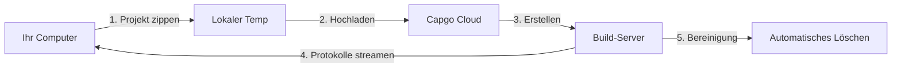

import { Steps, Card, CardGrid } from '@astrojs/starlight/components';

Beginnen Sie mit Capgo Cloud Build und erstellen Sie Ihren ersten iOS- oder Android-nativen Build in Minuten.

## Was Sie benötigen

Bevor Sie beginnen, stellen Sie sicher, dass Sie Folgendes haben:

- Eine Capacitor-App, die lokal erfolgreich erstellt wird
- Node.js 20 oder höher installiert
- Ein Capgo-Konto mit aktivem Abonnement
- Ihre App bereits in Capgo registriert (führen Sie `npx @capgo/cli@latest app add` aus, falls nicht)
- **Build-Zugangsdaten konfiguriert** (Zertifikate, Keystores) - siehe unten

## Vor Ihrem ersten Build

<CardGrid>
  <Card title="⚠️ Richten Sie zuerst Zugangsdaten ein" icon="warning">
    **Erforderlich vor dem Erstellen:** Sie müssen Ihre Build-Zugangsdaten konfigurieren (Zertifikate für iOS, Keystores für Android).

    [Zugangsdaten einrichten →](/docs/cli/cloud-build/credentials/)
  </Card>
</CardGrid>

## Schnellstart

<Steps>

1. **Build-Zugangsdaten einrichten**

   Bevor Sie erstellen können, müssen Sie Ihre Zugangsdaten lokal speichern:

   **Für iOS:**
   ```bash
   npx @capgo/cli build credentials save \
     --platform ios \
     --certificate ./cert.p12 \
     --p12-password "password" \
     --provisioning-profile ./profile.mobileprovision \
     --apple-key ./AuthKey.p8 \
     --apple-key-id "KEY123" \
     --apple-issuer-id "issuer-uuid" \
     --apple-team-id "team-id"
   ```

   **Für Android:**
   ```bash
   npx @capgo/cli build credentials save \
     --platform android \
     --keystore ./release.keystore \
     --keystore-alias "my-key" \
     --keystore-key-password "key-pass" \
     --keystore-store-password "store-pass"
   ```

   Siehe die [vollständige Zugangsdatenanleitung](/docs/cli/cloud-build/credentials/) für Details.

2. **Lokalen Build überprüfen**

   Stellen Sie zunächst sicher, dass Ihre App lokal ohne Fehler erstellt wird:

   ```bash
   # Erstellen Sie Ihre Web-Assets
   npm run build

   # Mit Capacitor synchronisieren
   npx cap sync

   # Lokalen Build testen (optional, aber empfohlen)
   npx cap open ios    # Für iOS
   npx cap open android # Für Android
   ```

3. **Bei Capgo authentifizieren**

   Legen Sie Ihren Capgo API-Schlüssel fest (falls noch nicht konfiguriert):

   ```bash
   npx @capgo/cli@latest login
   ```

   Oder setzen Sie die Umgebungsvariable:
   ```bash
   export CAPGO_TOKEN=your_api_key_here
   ```

4. **Führen Sie Ihren ersten Build aus**

   Beginnen Sie mit einem Android-Debug-Build (am schnellsten zum Testen):

   ```bash
   npx @capgo/cli@latest build com.example.app \
     --platform android \
     --build-mode debug
   ```

   Sie sehen Echtzeit-Protokolle, während Ihr Build fortschreitet:
   ```
   ✔ Creating build job...
   ✔ Uploading project (15.2 MB)...
   ✔ Build started

   📝 Build logs:
   → Installing dependencies...
   → Running Gradle build...
   → Signing APK...
   ✔ Build succeeded in 3m 42s
   ```

5. **Build-Status überprüfen**

   Die CLI fragt automatisch ab und zeigt den Build-Status an. Sobald abgeschlossen, sehen Sie:

   - Build-Zeit
   - Erfolgs-/Fehlerstatus
   - App an App Store/Play Store übermittelt (falls Zugangsdaten konfiguriert)

</Steps>

## Den Build-Prozess verstehen

Wenn Sie den Build-Befehl ausführen, passiert Folgendes:



1. **Lokale Vorbereitung** - Ihr Projekt wird gezippt (ohne `node_modules` und Dotfiles)
2. **Upload** - Das Zip wird zu sicherem Cloud-Speicher hochgeladen (Cloudflare R2)
3. **Build-Ausführung** - Ihre App wird auf dedizierter Infrastruktur erstellt
4. **Protokoll-Streaming** - Echtzeit-Protokolle werden über Server-Sent Events zu Ihrem Terminal gestreamt
5. **Automatische Bereinigung** - Build-Artefakte werden gelöscht (Android: sofort, iOS: 24 Stunden)

## Ihr erster Produktions-Build

Sobald Sie überprüft haben, dass der Prozess funktioniert, erstellen Sie einen Produktions-Build:

### Android

```bash
npx @capgo/cli@latest build com.example.app \
  --platform android \
  --build-mode release
```

Sie müssen zuerst Signaturzugangsdaten konfigurieren. Siehe [Android Build-Konfiguration](/docs/cli/cloud-build/android/).

### iOS

```bash
npx @capgo/cli@latest build com.example.app \
  --platform ios \
  --build-mode release
```

iOS-Builds erfordern Signaturzertifikate und Bereitstellungsprofile. Siehe [iOS Build-Konfiguration](/docs/cli/cloud-build/ios/).

## Was wird erstellt

**Wichtig:** Capgo Cloud Build erstellt nur die **nativen Teile** Ihrer App (nativer iOS- und Android-Code).

Sie sind verantwortlich für:
- Erstellen Ihrer Web-Assets (`npm run build`)
- Ausführen von `npx cap sync` vor dem Build
- Sicherstellen, dass alle Abhängigkeiten in `package.json` sind

Wir kümmern uns um:
- Native iOS-Kompilierung (Xcode, Fastlane)
- Native Android-Kompilierung (Gradle)
- Code-Signatur
- App Store-Übermittlung (falls konfiguriert)

## Build-Zeit & Kosten

Die Build-Zeit wird vom Start bis zur Fertigstellung gemessen:

- **Android**: Typischerweise 3-5 Minuten (1× Abrechnungsmultiplikator)
- **iOS**: Typischerweise 5-10 Minuten (2× Abrechnungsmultiplikator aufgrund von Mac-Hardwarekosten)

Sie zahlen nur für die tatsächlich genutzte Build-Zeit. Keine versteckten Gebühren.

## Häufige Anwendungsfälle

### CI/CD-Integration

Zu Ihrem GitHub Actions-Workflow hinzufügen:

```yaml
- name: Build native app
  env:
    CAPGO_TOKEN: ${{ secrets.CAPGO_TOKEN }}
  run: |
    npm run build
    npx cap sync
    npx @capgo/cli@latest build ${{ secrets.APP_ID }} \
      --platform both \
      --build-mode release
```

### Lokale Entwicklung

Builds lokal testen, bevor Sie committen:

```bash
# Schneller Debug-Build zum Testen
npm run build && npx cap sync
npx @capgo/cli@latest build com.example.app \
  --platform android \
  --build-mode debug
```

### Multi-Plattform-Builds

Gleichzeitig für beide Plattformen erstellen:

```bash
npx @capgo/cli@latest build com.example.app \
  --platform both \
  --build-mode release
```

## Nächste Schritte

Nachdem Sie Ihren ersten Build erstellt haben:

- [iOS-Builds konfigurieren](/docs/cli/cloud-build/ios/) - Zertifikate und Profile einrichten
- [Android-Builds konfigurieren](/docs/cli/cloud-build/android/) - Keystores und Play Store einrichten
- [Fehlerbehebung](/docs/cli/cloud-build/troubleshooting/) - Häufige Probleme und Lösungen
- [CLI-Referenz](/docs/cli/reference/build/) - Vollständige Befehlsdokumentation

## Brauchen Sie Hilfe?

- Lesen Sie die [Fehlerbehebungsanleitung](/docs/cli/cloud-build/troubleshooting/)
- Treten Sie unserer [Discord-Community](https://discord.com/invite/VnYRvBfgA6) bei
- E-Mail-Support unter support@capgo.app
