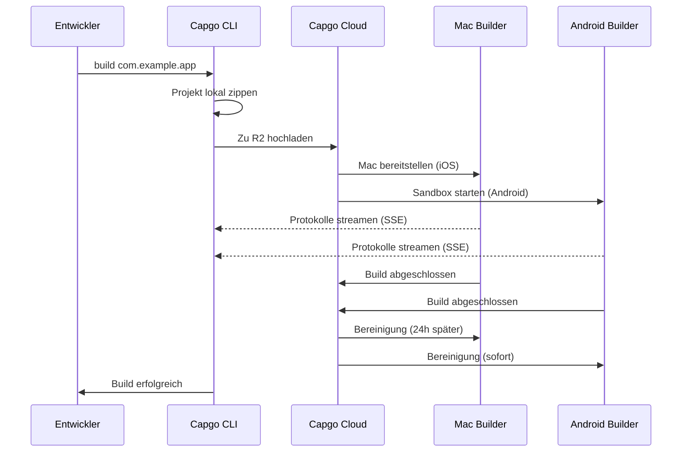

import { Card, CardGrid } from '@astrojs/starlight/components';

🏗️ Erstellen Sie native Mobile Apps in der Cloud und übermitteln Sie sie automatisch an den App Store und Play Store.

## Übersicht

Der `build`-Befehl ermöglicht es Ihnen, Ihre Capacitor-App für iOS und Android in der Cloud-Infrastruktur von Capgo zu erstellen, ähnlich wie Expo Builds handhabt. Ihre App wird auf dedizierter Infrastruktur erstellt und kann automatisch an die App Stores übermittelt werden.

**Aktueller Status:** Öffentliche Beta

## Warum Cloud Build verwenden?

Das traditionelle Erstellen nativer mobiler Apps erfordert:
- **Mac-Hardware** für iOS-Builds ($1000+ oder teure CI-Minuten)
- **Komplexe CI/CD**-Einrichtung mit Caching und Zugangsdaten
- **Wartungsaufwand** für Xcode, Android Studio und SDKs

Mit Capgo Cloud Build erhalten Sie:
- ✅ **Kein Mac erforderlich** - Erstellen Sie iOS-Apps von jedem Gerät aus
- ✅ **Keine Einrichtung** - Keine CI/CD-Konfiguration erforderlich
- ✅ **Kampferprobt** - Basiert auf 3 Jahren interner Produktionsnutzung
- ✅ **Sicher** - Keine Protokollspeicherung, automatische Bereinigung
- ✅ **Nur nativ** - Ihr JavaScript bleibt privat

## Schnellstart

```bash
npx @capgo/cli@latest build com.example.app
```

Das ist alles! Ihre App wird in der Cloud erstellt und Sie sehen Echtzeit-Protokolle.

## Dokumentationsabschnitte

<CardGrid>
  <Card title="⚠️ Richten Sie ZUERST Zugangsdaten ein" icon="warning">
    **Erforderlich vor dem Erstellen:** Speichern Sie Ihre iOS/Android-Zugangsdaten lokal.

    [Zugangsdaten einrichten →](/docs/cli/cloud-build/credentials/)
  </Card>

  <Card title="Erste Schritte" icon="rocket">
    Erstellen Sie Ihren ersten nativen Build in Minuten.

    [Anleitung lesen →](/docs/cli/cloud-build/getting-started/)
  </Card>

  <Card title="iOS Builds" icon="seti:apple">
    Konfigurieren Sie Zertifikate und erstellen Sie für den App Store.

    [iOS konfigurieren →](/docs/cli/cloud-build/ios/)
  </Card>

  <Card title="Android Builds" icon="seti:android">
    Richten Sie Keystores ein und erstellen Sie für den Play Store.

    [Android konfigurieren →](/docs/cli/cloud-build/android/)
  </Card>

  <Card title="Fehlerbehebung" icon="warning">
    Lösungen für häufige Build-Probleme.

    [Hilfe erhalten →](/docs/cli/cloud-build/troubleshooting/)
  </Card>
</CardGrid>

## Befehlsreferenz

### Grundlegende Verwendung

```bash
npx @capgo/cli@latest build [appId] [optionen]
```

### Beispiele

Für beide Plattformen erstellen:
```bash
npx @capgo/cli@latest build com.example.app
```

Nur für iOS erstellen:
```bash
npx @capgo/cli@latest build com.example.app --platform ios
```

Für Android im Debug-Modus erstellen:
```bash
npx @capgo/cli@latest build com.example.app --platform android --build-mode debug
```

Aus einem bestimmten Verzeichnis erstellen:
```bash
npx @capgo/cli@latest build com.example.app --path ./my-app
```

### Optionen

| Option | Typ | Standard | Beschreibung |
|--------|------|---------|-------------|
| `appId` | string | capacitor.config | Anwendungs-ID (z. B. com.example.app) |
| `--path <pfad>` | string | Aktuelles Verzeichnis | Pfad zu Ihrem Projektverzeichnis |
| `--platform <plattform>` | string | both | Zielplattform: `ios`, `android` oder `both` |
| `--build-mode <modus>` | string | release | Build-Modus: `debug` oder `release` |
| `--build-config <config>` | string | - | Zusätzliche Build-Konfiguration als JSON-String |
| `-a, --apikey <apikey>` | string | - | API-Schlüssel (oder `CAPGO_TOKEN` Umgebungsvariable verwenden) |
| `--supa-host <url>` | string | https://api.capgo.app | Benutzerdefinierte Supabase-Host-URL |
| `--supa-anon <key>` | string | - | Benutzerdefinierter Supabase-Anon-Schlüssel |

## Wie es funktioniert



### Build-Prozess

1. **Lokale Vorbereitung** - Ihr Projekt wird lokal gezippt (ohne `node_modules`, Dotfiles)
2. **Upload** - Zip-Datei wird zu sicherem Cloud-Speicher hochgeladen (Cloudflare R2)
3. **Build-Ausführung**:
   - **iOS**: Dedizierte Mac-Maschine bereitgestellt, Fastlane erstellt und signiert
   - **Android**: Sichere Sandbox erstellt, Gradle kompiliert und signiert
4. **Protokoll-Streaming** - Echtzeit-Protokolle über Server-Sent Events (nicht gespeichert!)
5. **Automatische Bereinigung**:
   - **iOS**: Dateien nach 24 Stunden gelöscht, wenn Maschine freigegeben wird
   - **Android**: Alles sofort nach Build gelöscht

## Unsere Expertise

Capgo Cloud Build ist keine neue Infrastruktur - wir nutzen sie seit **3 Jahren** intern:

- ✅ **Benutzerdefiniertes Fastlane** - Speziell für Capacitor-Apps entwickelt
- ✅ **Tausende von Builds** - Kampferprobt in Produktion
- ✅ **Capacitor-Experten** - Tiefes Wissen über das Wesentliche
- ✅ **Nur-nativ-Fokus** - Ihr JavaScript berührt nie unsere Server

## Sicherheit & Datenschutz

- **Keine Protokollspeicherung** - Protokolle streamen nur zu Ihrem Terminal, werden niemals gespeichert
- **Keine Artefaktspeicherung** - Apps werden direkt an App Store/Play Store gesendet, wir behalten nichts
- **Zugangsdaten automatisch gelöscht** - Nur während Build verwendet, danach gelöscht (max. 24h)
- **Isolierte Builds** - Jeder Build läuft isoliert
- **Ihr Code bleibt Ihrer** - Wir erstellen nur native Teile, JavaScript bleibt lokal

## CI/CD-Integration

Funktioniert überall - GitHub Actions, GitLab CI oder jede CI/CD-Plattform:

```yaml
- name: Build native app
  env:
    CAPGO_TOKEN: ${{ secrets.CAPGO_TOKEN }}
  run: |
    npm run build
    npx cap sync
    npx @capgo/cli@latest build com.example.app \
      --platform both \
      --build-mode release
```

Nicht erforderlich:
- Mac-Runner
- Android SDK-Installation
- Xcode-Installation
- Komplexes Caching
- Zugangsdatenverwaltung

## Preisgestaltung

Build-Zeit wird basierend auf tatsächlicher Nutzung abgerechnet:

- **Android**: 1× Multiplikator (~$0.XX pro Minute)
- **iOS**: 2× Multiplikator (~$0.XX pro Minute, aufgrund von Mac-Hardware)

**Typische Kosten:**
- Android Debug: 3 min × 1× = ~$X.XX
- iOS Release: 7 min × 2× = ~$X.XX

Zahlen Sie nur für das, was Sie nutzen. Keine Mindestbeträge, keine Überraschungen.

## Vergleich mit anderen Lösungen

| Funktion | Capgo Cloud Build | GitHub Actions (Mac) | Expo EAS |
|---------|------------------|---------------------|----------|
| **Mac lokal erforderlich** | ❌ Nein | ✅ Ja | ❌ Nein |
| **Einrichtungskomplexität** | ⭐ Einzelner Befehl | ⭐⭐⭐ Komplexes YAML | ⭐⭐ Config-Dateien |
| **Capacitor nativ** | ✅ Optimiert | ⚠️ Generisch | ❌ Nur Expo |
| **Ihr Code-Datenschutz** | ✅ Niemals gespeichert | ⚠️ In Runnern | ⚠️ Hochgeladen |
| **Kosten (iOS)** | 💰 2× Basis | 💰💰💰 10× teuer | 💰💰 Premium |

## Was wird erstellt

**Wichtig:** Capgo erstellt **nur native Teile**.

✅ **Wir erstellen:**
- iOS-nativer Code (Swift, Objective-C, Xcode-Projekte)
- Android-nativer Code (Java, Kotlin, Gradle-Projekte)
- Code-Signatur und App Store-Übermittlung

❌ **Sie erstellen (lokal):**
- JavaScript, HTML, CSS (`npm run build`)
- Capacitor-Sync (`npx cap sync`)
- Ihre Web-Assets

Diese Trennung gewährleistet:
- **Bessere Sicherheit** - Ihre App-Logik bleibt privat
- **Schnellere Builds** - Keine doppelten Web-Builds
- **Klare Verantwortung** - Sie kontrollieren Ihren Code

## Einschränkungen

Aktuelle Einschränkungen während der öffentlichen Beta:

- **Build-Timeout**: 10 Minuten maximal
- **Upload-Timeout**: 1 Stunde für Upload-URL
- **iOS-Maschine**: 24-Stunden-Lease-Anforderung, Build auf Mac wird in Warteschlange gestellt, um optimale Nutzung sicherzustellen
- **Zugriff**: Nur öffentliche Beta

## Erste Schritte

Bereit, ohne Aufwand zu erstellen?

<CardGrid>
  <Card title="Erstellen Sie Ihren ersten Build" icon="rocket">
    Schritt-für-Schritt-Anleitung für Ihren ersten Cloud-Build.

    [Jetzt starten →](/docs/cli/cloud-build/getting-started/)
  </Card>

  <Card title="An öffentlicher Beta teilnehmen" icon="star">
    Cloud Build ist in der öffentlichen Beta. Treten Sie unserer Community bei, um Zugriff zu erhalten.

    [Discord beitreten →](https://discord.com/invite/VnYRvBfgA6)
  </Card>
</CardGrid>

## Mehr erfahren

- [Erste-Schritte-Anleitung](/docs/cli/cloud-build/getting-started/) - Erstellen Sie Ihren ersten Build
- [iOS-Konfiguration](/docs/cli/cloud-build/ios/) - iOS-Builds einrichten
- [Android-Konfiguration](/docs/cli/cloud-build/android/) - Android-Builds einrichten
- [Fehlerbehebung](/docs/cli/cloud-build/troubleshooting/) - Häufige Probleme und Lösungen
- [Blog: Cloud Build vorstellen](/blog/introducing-capgo-cloud-build/) - Feature-Ankündigung

## Brauchen Sie Hilfe?

- 📚 [Fehlerbehebungsanleitung](/docs/cli/cloud-build/troubleshooting/)
- 💬 [Discord-Community](https://discord.com/invite/VnYRvBfgA6)
- 📧 E-Mail: support@capgo.app
