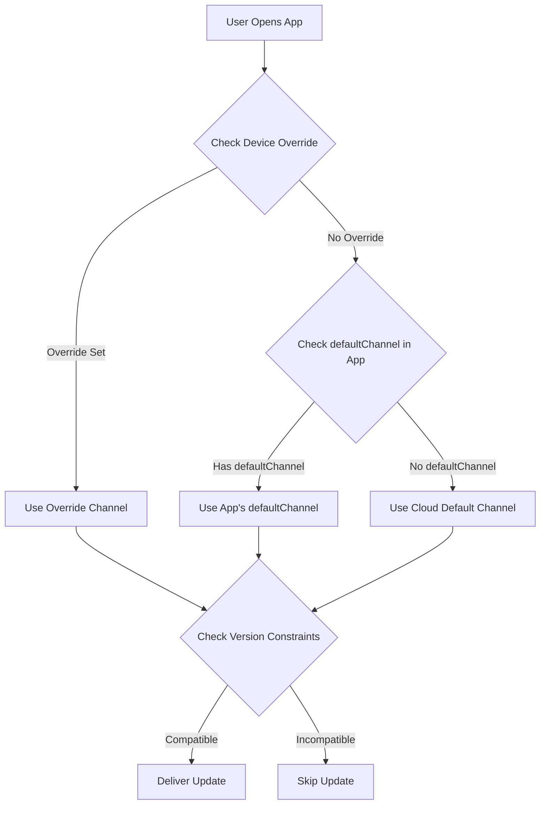

import { Aside } from '@astrojs/starlight/components';

Diese Anleitung erklärt, wie Sie automatisch das neueste kompatible Bundle für Benutzer basierend auf ihrer nativen App-Version bereitstellen, **ähnlich wie bei Ionic AppFlow**. Dies gewährleistet vereinfachte Update-Verwaltung und schnellere Rollouts bei gleichzeitiger Vermeidung von Kompatibilitätsproblemen.

<Aside type="tip" title="Migration von Ionic AppFlow?">
  Falls Sie von Ionic AppFlow migrieren, ist diese Anleitung besonders wichtig für Sie. AppFlow hat Updates automatisch nativen Versionen zugeordnet, und Capgo bietet die gleiche Möglichkeit mit noch mehr Kontrolle und Flexibilität. Siehe den [AppFlow-Migrationsleitfaden](/docs/upgrade/from-appflow-to-capgo) für schrittweise Migrationsanweisungen.
</Aside>

## Übersicht

Das Version-Targeting-System von Capgo ermöglicht es Ihnen zu:

- **Automatisch kompatible Updates** für Benutzer basierend auf ihrer nativen App-Version bereitzustellen
- **Brechende Änderungen** daran zu hindern, inkompatible App-Versionen zu erreichen
- **Mehrere App-Versionen** gleichzeitig zu verwalten ohne komplexe Logik
- **Updates nahtlos** für spezifische Benutzergruppen bereitzustellen

### Warum Version Targeting wichtig ist (besonders für AppFlow-Benutzer)

Falls Sie mit **Ionic AppFlow** vertraut sind, wissen Sie, wie wichtig es ist, sicherzustellen, dass Benutzer nur kompatible Updates erhalten. AppFlow hat Live-Update-Bundles automatisch nativen App-Versionen zugeordnet, um zu verhindern, dass inkompatibles JavaScript an ältere native Codes geliefert wird.

**Capgo bietet die gleichen Sicherheitsgarantien**, mit zusätzlichen Funktionen:
- Granularere Kontrolle über das Versions-Matching
- Mehrere Strategien (Kanäle, Semver, native Einschränkungen)
- Bessere Sichtbarkeit der Versionsverteilung
- API- und CLI-Kontrolle neben Dashboard-Verwaltung

Dieser Ansatz ist besonders nützlich, wenn:
- Sie Benutzer auf verschiedenen Hauptversionen Ihrer App haben (z. B. v1.x, v2.x, v3.x)
- Sie Abwärtskompatibilität aufrechterhalten müssen, während Sie brechende Änderungen einführen
- Sie verhindern möchten, dass neuere Bundles älteren nativen Code beschädigen
- Sie Benutzer graduell von einer Version zu einer anderen migrieren
- **Sie von AppFlow migrieren** und die gleiche Update-Sicherheit beibehalten möchten

## Wie es funktioniert

Capgo verwendet einen mehrschichtigen Ansatz, um Benutzer mit kompatiblen Updates zu vergleichen:

1. **Native Versionsbeschränkungen**: Verhindern Sie, dass Bundles an inkompatible native Versionen geliefert werden
2. **Kanalbasiertes Routing**: Leiten Sie verschiedene App-Versionen an verschiedene Update-Kanäle weiter
3. **Semantische Versionierungskontrollen**: Blockieren Sie Updates automatisch über Major-/Minor-/Patch-Grenzen
4. **Geräteebene-Overrides**: Zielbenutzer spezifische Geräte oder Benutzergruppen an

### Version-Matching-Fluss



## Strategie 1: Kanalbasiertes Versions-Routing

Dies ist der **empfohlene Ansatz** zum Verwalten von brechenden Änderungen und Hauptversions-Updates. Es ähnelt AppFlow's Liefermodell.

### Beispielszenario

- **App v1.x** (100.000 Benutzer) → `production` Kanal
- **App v2.x** (50.000 Benutzer mit brechenden Änderungen) → `v2` Kanal
- **App v3.x** (10.000 Beta-Benutzer) → `v3` Kanal

### Implementierung

#### Schritt 1: Kanäle für jede Hauptversion konfigurieren

```typescript
// capacitor.config.ts für Version 1.x Builds
import { CapacitorConfig } from '@capacitor/cli';

const config: CapacitorConfig = {
  appId: 'com.example.app',
  appName: 'Example App',
  plugins: {
    CapacitorUpdater: {
      autoUpdate: true,
      defaultChannel: 'production', // oder weglassen für Standard
    }
  }
};

export default config;
```

```typescript
// capacitor.config.ts für Version 2.x Builds
const config: CapacitorConfig = {
  appId: 'com.example.app',
  appName: 'Example App',
  plugins: {
    CapacitorUpdater: {
      autoUpdate: true,
      defaultChannel: 'v2', // Leitet v2-Benutzer automatisch weiter
    }
  }
};
```

```typescript
// capacitor.config.ts für Version 3.x Builds
const config: CapacitorConfig = {
  appId: 'com.example.app',
  appName: 'Example App',
  plugins: {
    CapacitorUpdater: {
      autoUpdate: true,
      defaultChannel: 'v3', // Leitet v3-Benutzer automatisch weiter
    }
  }
};
```

#### Schritt 2: Kanäle erstellen

```bash
# Erstellen Sie Kanäle für jede Hauptversion
npx @capgo/cli channel create production
npx @capgo/cli channel create v2
npx @capgo/cli channel create v3

# Aktivieren Sie die Selbstzuweisung, damit Apps Kanäle wechseln können
npx @capgo/cli channel set production --self-assign
npx @capgo/cli channel set v2 --self-assign
npx @capgo/cli channel set v3 --self-assign
```

#### Schritt 3: Versionsspezifische Bundles hochladen

```bash
# Für v1.x Benutzer (von v1-maintenance Branch)
git checkout v1-maintenance
npm run build
npx @capgo/cli bundle upload --channel production

# Für v2.x Benutzer (von v2-maintenance oder main Branch)
git checkout main
npm run build
npx @capgo/cli bundle upload --channel v2

# Für v3.x Benutzer (von beta/v3 Branch)
git checkout beta
npm run build
npx @capgo/cli bundle upload --channel v3
```

<Aside type="tip" title="Automatisches Routing">
  Wenn Benutzer die App öffnen, stellen sie automatisch eine Verbindung zu ihrem designierten Kanal basierend auf dem `defaultChannel` in ihrem installierten App-Bundle her. Keine JavaScript-Codeänderungen erforderlich!
</Aside>

### Vorteile

- **Null Code-Änderungen** - Kanalrouting erfolgt automatisch
- **Klare Trennung** - Jede Version hat ihre eigene Update-Pipeline
- **Flexible Targeting** - Pushen Sie Updates an spezifische Versionsgruppen
- **Sichere Rollouts** - Brechende Änderungen erreichen nie inkompatible Versionen

## Strategie 2: Semantische Versionierungskontrollen

Verwenden Sie die integrierten semantischen Versionierungskontrollen von Capgo, um Updates über Versionsgrenzen hinweg zu verhindern.

### Deaktivieren Sie Auto-Update über Hauptversionen hinweg

```bash
# Erstellen Sie einen Kanal, der Update über Hauptversionen blockiert
npx @capgo/cli channel create stable --disable-auto-update major
```

Diese Konfiguration bedeutet:
- Benutzer mit App-Version **1.2.3** erhalten Updates bis zu **1.9.9**
- Benutzer erhalten **NICHT** Version **2.0.0** automatisch
- Verhindert, dass brechende Änderungen älteren nativen Code erreichen

### Granulare Steuerungsoptionen

```bash
# Blockieren Sie Update über Minor-Versionen (1.2.x erhält 1.3.0 nicht)
npx @capgo/cli channel set stable --disable-auto-update minor

# Blockieren Sie Patch-Updates (1.2.3 erhält 1.2.4 nicht)
npx @capgo/cli channel set stable --disable-auto-update patch

# Erlauben Sie alle Updates
npx @capgo/cli channel set stable --disable-auto-update none
```

<Aside type="caution" title="Semantische Versionierung erforderlich">
  Diese Strategie funktioniert nur, wenn Sie semantische Versionierung (Semver) für Ihre App-Versionen befolgen. Stellen Sie sicher, dass Ihre Versionsnummern das `MAJOR.MINOR.PATCH` Format befolgen.
</Aside>

## Strategie 3: Native Versionsbeschränkungen

Geben Sie die Mindestanforderungen für native Versionen für Bundles an, um die Lieferung an inkompatible Geräte zu verhindern.

### Verwenden der nativeVersion Verzögerungsbedingung

Beim Hochladen eines Bundles können Sie eine Mindest-Native-Version angeben:

```bash
# Dieses Bundle erfordert native Version 2.0.0 oder höher
npx @capgo/cli bundle upload \
  --channel production \
  --native-version "2.0.0"
```

<Aside type="note" title="Wie es funktioniert">
  Geräte mit nativer Version 1.x erhalten dieses Bundle NICHT. Nur Geräte mit 2.0.0+ erhalten es. Dies ist perfekt für Updates, die neue native APIs oder Plugins erfordern.
</Aside>

### Anwendungsfälle

1. **Neues Native Plugin erforderlich**
   ```bash
   # Bundle benötigt Camera-Plugin in v2.0.0 hinzugefügt
   npx @capgo/cli bundle upload --native-version "2.0.0"
   ```

2. **Breaking Native API-Änderungen**
   ```bash
   # Bundle verwendet neue Capacitor 6 APIs
   npx @capgo/cli bundle upload --native-version "3.0.0"
   ```

3. **Graduelle Migration**
   ```bash
   # Test Bundle nur auf neuester nativer Version
   npx @capgo/cli bundle upload \
     --channel beta \
     --native-version "2.5.0"
   ```

## Strategie 4: Prävention von Auto-Downgrade

Verhindern Sie, dass Benutzer Bundles erhalten, die älter als ihre aktuelle native Version sind.

### In Kanaleinstellungen aktivieren

Im Capgo-Dashboard:
1. Gehen Sie zu **Kanäle** → Wählen Sie Ihren Kanal
2. Aktivieren Sie **"Deaktivieren Sie automatisches Downgrade unter native"**
3. Speichern Sie die Änderungen

Oder über CLI:
```bash
npx @capgo/cli channel set production --disable-downgrade
```

### Beispiel

- Geräteversion des Benutzers: Native Version **1.2.5**
- Kanal Bundle: Version **1.2.3**
- **Ergebnis**: Update wird blockiert (wäre ein Downgrade)

Dies ist nützlich, wenn:
- Benutzer eine neuere Version manuell aus dem App-Store installiert haben
- Sie sicherstellen müssen, dass Benutzer immer die neuesten Sicherheits-Patches haben
- Sie Regressionsfehler verhindern möchten

## Strategie 5: Geräteebene-Targeting

Überschreiben Sie die Kanalzuweisung für spezifische Geräte oder Benutzergruppen.

### Erzwinge spezifische Version zum Testen

```typescript
import { CapacitorUpdater } from '@capgo/capacitor-updater'

// Erzwinge Beta-Tester zur Verwendung des v3-Kanals
async function assignBetaTesters() {
  const deviceId = await CapacitorUpdater.getDeviceId()

  // Überprüfen Sie, ob Benutzer Beta-Tester ist
  if (isBetaTester(userId)) {
    await CapacitorUpdater.setChannel({ channel: 'v3' })
  }
}
```

### Dashboard-Geräte-Override

Im Capgo-Dashboard:
1. Gehen Sie zu **Geräte** → Finden Sie Gerät
2. Klicken Sie auf **Set Channel** oder **Set Version**
3. Überschreiben Sie mit spezifischem Kanal oder Bundle-Version
4. Gerät erhält Updates von der überschriebenen Quelle

<Aside type="tip" title="Testing Updates">
  Verwenden Sie Geräte-Overrides, um Updates auf Ihrem eigenen Gerät zu testen, bevor Sie sie für alle Benutzer einführen.
</Aside>

## Kompletter AppFlow-ähnlicher Workflow

Hier ist ein vollständiges Beispiel, das alle Strategien kombiniert:

### 1. Initiales Setup (App v1.0.0)

```bash
# Erstellen Sie Production-Kanal mit Semver-Kontrollen
npx @capgo/cli channel create production \
  --disable-auto-update major \
  --disable-downgrade
```

```typescript
// capacitor.config.ts
const config: CapacitorConfig = {
  plugins: {
    CapacitorUpdater: {
      autoUpdate: true,
      defaultChannel: 'production',
    }
  }
};
```

### 2. Brechende Änderung freigeben (App v2.0.0)

```bash
# Erstellen Sie v2 Kanal für neue Version
npx @capgo/cli channel create v2 \
  --disable-auto-update major \
  --disable-downgrade \
  --self-assign

# Erstellen Sie Git-Branch für v1 Wartung
git checkout -b v1-maintenance
git push origin v1-maintenance
```

```typescript
// capacitor.config.ts für v2.0.0
const config: CapacitorConfig = {
  plugins: {
    CapacitorUpdater: {
      autoUpdate: true,
      defaultChannel: 'v2', // Neue Benutzer erhalten v2 Kanal
    }
  }
};
```

### 3. Updates für beide Versionen pushen

```bash
# Update v1.x Benutzer (Fehlerbehebung)
git checkout v1-maintenance
# Vornehmen von Änderungen
npx @capgo/cli bundle upload \
  --channel production \
  --native-version "1.0.0"

# Update v2.x Benutzer (neues Feature)
git checkout main
# Vornehmen von Änderungen
npx @capgo/cli bundle upload \
  --channel v2 \
  --native-version "2.0.0"
```

### 4. Versionsverteilung überwachen

Verwenden Sie das Capgo-Dashboard zum Verfolgen von:
- Wie viele Benutzer auf v1 vs v2 sind
- Bundle-Adoptionsraten pro Version
- Fehler oder Abstürze pro Version

### 5. Alte Version abschaffen

Sobald v1-Nutzung unter Schwellenwert fällt:

```bash
# Stopfen Sie das Hochladen zum Production-Kanal
# Optional: Löschen Sie v1 Maintenance-Branch
git branch -d v1-maintenance

# Verschieben Sie alle verbleibenden Benutzer zum Standard
# (Sie müssen über App-Store aktualisieren)
```

## Kanal-Priorität

Wenn mehrere Kanalkonfigurationen vorhanden sind, verwendet Capgo diese Prioritätsreihenfolge:

1. **Geräte-Override** (Dashboard oder API) - Höchste Priorität
2. **Cloud Override** via `setChannel()` Aufruf
3. **defaultChannel** in capacitor.config.ts
4. **Standard Kanal** (Cloud-Einstellung) - Niedrigste Priorität

<Aside type="note" title="Prioritäts-Beispiel">
  Wenn die App eines Benutzers `defaultChannel: 'v2'` hat, aber Sie ihr Gerät im Dashboard zu `'beta'` überschreiben, erhalten sie Updates vom `'beta'` Kanal.
</Aside>

## Best Practices

### 1. Setzen Sie immer defaultChannel für Hauptversionen

```typescript
// ✅ Gut: Jede Hauptversion hat expliziten Kanal
// v1.x → production
// v2.x → v2
// v3.x → v3

// ❌ Schlecht: Verlassen Sie sich auf dynamischen Kanalwechsel
// Alle Versionen → production, Manueller Wechsel
```

### 2. Verwenden Sie semantische Versionierung

```bash
# ✅ Gut
1.0.0 → 1.0.1 → 1.1.0 → 2.0.0

# ❌ Schlecht
1.0 → 1.1 → 2 → 2.5
```

### 3. Behalten Sie separate Branches bei

```bash
# ✅ Gut: Separate Branches pro Hauptversion
main (v3.x)
v2-maintenance (v2.x)
v1-maintenance (v1.x)

# ❌ Schlecht: Einzelner Branch für alle Versionen
```

### 4. Testen Sie vor dem Rollout

```bash
# Testen Sie zuerst auf Beta-Kanal
npx @capgo/cli bundle upload --channel beta

# Überwachen Sie Probleme, dann fördern Sie zur Production
npx @capgo/cli bundle upload --channel production
```

### 5. Versionsverteilung überwachen

Überprüfen Sie regelmäßig Ihr Dashboard:
- Aktualisieren Benutzer auf neuere native Versionen?
- Erhalten alte Versionen noch hohen Verkehr?
- Sollten Sie alte Kanäle abschaffen?

## Vergleich mit Ionic AppFlow

Für Teams, die von **Ionic AppFlow** migrieren, ist hier ein Vergleich des Version-Targetings von Capgo:

| Feature | Ionic AppFlow | Capgo |
|---------|---------------|-------|
| **Versionsbasiertes Routing** | Automatisch basierend auf nativer Version | Automatisch via `defaultChannel` + mehrere Strategien |
| **Semantische Versionierung** | Grundlegende Unterstützung | Erweitert mit `--disable-auto-update` (major/minor/patch) |
| **Native Versionsbeschränkungen** | Manuelle Konfiguration im AppFlow-Dashboard | Eingebautes `--native-version` Flag in CLI |
| **Kanal-Management** | Web UI + CLI | Web UI + CLI + API |
| **Geräte-Overrides** | Begrenzte Geräteebene-Kontrolle | Vollständige Kontrolle via Dashboard/API |
| **Auto-Downgrade-Prävention** | Ja | Ja via `--disable-downgrade` |
| **Multi-Versions-Wartung** | Manuelle Branch-/Kanal-Verwaltung | Automatisiert mit Kanal-Priorität |
| **Self-Hosting** | Nein | Ja (vollständige Kontrolle) |
| **Versions-Analytik** | Grundlegend | Detailliert pro-Version Metriken |

<Aside type="note" title="AppFlow-Parität und darüber hinaus">
  Capgo bietet **alle Version-Targeting-Fähigkeiten**, die AppFlow angeboten hat, plus zusätzliche Kontrollmechanismen. Wenn Sie sich auf AppFlow's automatisches Versions-Matching verlassen haben, werden Sie feststellen, dass Capgo gleich sicher ist mit mehr Flexibilität.
</Aside>

## Fehlerbehebung

### Benutzer erhalten Updates nicht

Überprüfen Sie Folgendes:

1. **Kanal-Zuordnung**: Überprüfen Sie, dass Gerät auf korrektem Kanal ist
   ```typescript
   const channel = await CapacitorUpdater.getChannel()
   console.log('Current channel:', channel)
   ```

2. **Versions-Einschränkungen**: Überprüfen Sie, ob Bundle native Versionsanforderungen hat
   - Dashboard → Bundles → Überprüfen Sie "Native Version" Spalte

3. **Semver-Einstellungen**: Überprüfen Sie die `disable-auto-update` Einstellung des Kanals
   ```bash
   npx @capgo/cli channel list
   ```

4. **Geräte-Override**: Überprüfen Sie, ob Gerät manuellen Override hat
   - Dashboard → Geräte → Suchen Sie nach Gerät → Überprüfen Sie Kanal/Version

### Bundle wird an falsche Version geliefert

1. **Überprüfen Sie defaultChannel**: Stellen Sie sicher, korrekter Kanal in `capacitor.config.ts`
2. **Überprüfen Sie Bundle-Upload**: Verifizieren Sie, dass Bundle zum beabsichtigten Kanal hochgeladen wurde
3. **Überprüfen Sie Native-Version**: Bestätigen Sie, dass `--native-version` Flag korrekt verwendet wurde

### Brechende Änderungen beeinflussen alte Versionen

1. **Sofort-Fix**: Überschreiben Sie betroffene Geräte zum sicheren Bundle
   - Dashboard → Geräte → Mehrfach auswählen → Set Version
2. **Langfristig-Fix**: Erstellen Sie versionierte Kanäle und behalten Sie separate Branches
3. **Prävention**: Testen Sie immer Updates auf repräsentativen Geräten vor dem Rollout

## Migration von Ionic AppFlow

Falls Sie von **Ionic AppFlow** migrieren, funktioniert Version-Targeting in Capgo sehr ähnlich, mit verbesserter Flexibilität:

### Konzept-Mapping

| AppFlow Concept | Capgo Equivalent | Notes |
|-----------------|------------------|-------|
| **Deploy Channel** | Capgo Channel | Gleiches Konzept, leistungsreicher |
| **Native Version Lock** | `--native-version` flag | Granularere Kontrolle |
| **Channel Priority** | Channel Priorität (override → cloud → default) | Transparentere Priorität |
| **Deployment Target** | Channel + Semver-Kontrollen | Mehrere Strategien verfügbar |
| **Production Channel** | `production` Kanal (oder beliebiger Name) | Flexible Benennung |
| **Git-based deployment** | CLI Bundle-Upload von Branch | Gleicher Workflow |
| **Automatic version matching** | `defaultChannel` + Versions-Einschränkungen | Erweitert mit mehreren Strategien |

### Schlüsseldifferenzen für AppFlow-Benutzer

1. **Mehr Kontrolle**: Capgo gibt Ihnen mehrere Strategien (Kanäle, Semver, native Version), die kombiniert werden können
2. **Bessere Sichtbarkeit**: Dashboard zeigt Versionsverteilung und Kompatibilitätsprobleme
3. **API-Zugriff**: Vollständige programmatische Kontrolle über Version-Targeting
4. **Self-Hosting**: Option, Ihren eigenen Update-Server mit gleicher Versionslogik zu betreiben

### Migrations-Schritte

1. **Ordnen Sie Ihre AppFlow-Kanäle** Capgo-Kanälen zu (üblicherweise 1:1)
2. **Setzen Sie `defaultChannel`** in `capacitor.config.ts` für jede Hauptversion
3. **Konfigurieren Sie Semver-Regeln**, wenn Sie automatisches Blockieren auf Versionsgrenzen wünschen
4. **Laden Sie versionsspezifische Bundles** mit `--native-version` Flag hoch
5. **Überwachen Sie Versionsverteilung** im Capgo-Dashboard

<Aside type="tip" title="Kompletter Migrations-Leitfaden">
  Für vollständige Migrationsanweisungen einschließlich SDK-Ersatz und API-Zuordnung, siehe den [AppFlow zu Capgo Migrations-Leitfaden](/docs/upgrade/from-appflow-to-capgo).
</Aside>

## Erweiterte Muster

### Gradueller Rollout nach Version

```typescript
// Migrieren Sie v1-Benutzer graduell zu v2
async function migrateUsers() {
  const deviceId = await CapacitorUpdater.getDeviceId()
  const rolloutPercentage = 10 // Beginnen Sie mit 10%

  // Hash Device-ID zum Abrufen deterministischen Prozentsatz
  const hash = hashCode(deviceId) % 100

  if (hash < rolloutPercentage) {
    // Benutzer ist in Rollout-Gruppe - Migrieren Sie zu v2
    await CapacitorUpdater.setChannel({ channel: 'v2' })
  }
}
```

### Feature-Flags nach Version

```typescript
// Aktivieren Sie Features basierend auf nativer Version
async function checkFeatureAvailability() {
  const info = await CapacitorUpdater.getDeviceId()
  const nativeVersion = info.nativeVersion

  if (compareVersions(nativeVersion, '2.0.0') >= 0) {
    // Aktivieren Sie Features, die v2.0.0+ erfordern
    enableNewCameraFeature()
  }
}
```

### A/B-Tests über Versionen hinweg

```typescript
// Führen Sie A/B-Tests innerhalb gleicher nativer Version aus
async function assignABTest() {
  const nativeVersion = await getNativeVersion()

  if (nativeVersion.startsWith('2.')) {
    // Nur A/B-Test auf v2-Benutzern
    const variant = Math.random() < 0.5 ? 'v2-test-a' : 'v2-test-b'
    await CapacitorUpdater.setChannel({ channel: variant })
  }
}
```

## Zusammenfassung

Capgo bietet mehrere Strategien für versionsspezifische Update-Lieferung:

1. **Kanalbasiertes Routing**: Automatische Versionsaufteilung via `defaultChannel`
2. **Semantische Versionierung**: Verhindern Sie Updates über Major-/Minor-/Patch-Grenzen
3. **Native Versionsbeschränkungen**: Erfordern Sie Mindest-Native-Version für Bundles
4. **Auto-Downgrade-Prävention**: Liefern Sie nie ältere Bundles an neuere native Versionen
5. **Geräte-Overrides**: Manuelle Kontrolle zum Testen und Targeting

Durch das Kombinieren dieser Strategien können Sie AppFlow-ähnliche automatische Update-Lieferung mit noch mehr Flexibilität und Kontrolle erreichen. Wählen Sie den Ansatz, der am besten zu Ihrem App's Versionierung und Deployment-Workflow passt.

Für mehr Details zu spezifischen Funktionen:
- [Leitfaden zu brechenden Änderungen](/docs/live-updates/breaking-changes) - Detaillierte Kanal-Versionierungs-Strategie
- [Kanal-Verwaltung](/docs/live-updates/channels) - Vollständige Kanal-Konfigurationsreferenz
- [Update-Verhalten](/docs/live-updates/update-behavior) - Native Versions-Verzögerungen und Bedingungen
