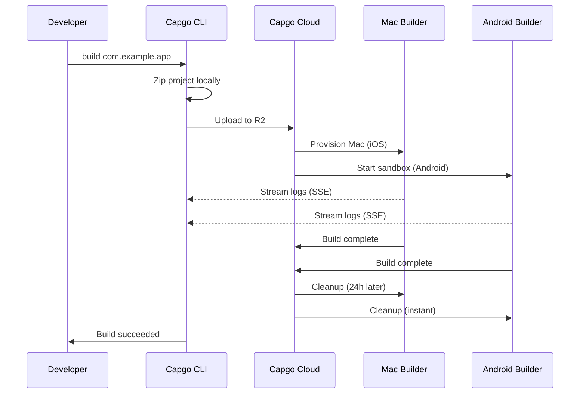

import { Card, CardGrid } from '@astrojs/starlight/components';

🏗️ Build native mobile apps in the cloud and automatically submit them to the App Store and Play Store.

## Overview

The `build` command allows you to build your Capacitor app for iOS and Android in Capgo's cloud infrastructure, similar to how Expo handles builds. Your app is built on dedicated infrastructure and can be automatically submitted to the app stores.

**Current Status:** Public Beta

## Why Use Cloud Build?

Building native mobile apps traditionally requires:
- **Mac hardware** for iOS builds ($1000+ or expensive CI minutes)
- **Complex CI/CD** setup with caching and credentials
- **Maintenance overhead** for Xcode, Android Studio, and SDKs

With Capgo Cloud Build, you get:
- ✅ **No Mac required** - Build iOS apps from any machine
- ✅ **Zero setup** - No CI/CD configuration needed
- ✅ **Battle-tested** - Built on 3 years of internal production use
- ✅ **Secure** - No log storage, automatic cleanup
- ✅ **Native-only** - Your JavaScript stays private

## Quick Start

```bash
npx @capgo/cli@latest build com.example.app
```

That's it! Your app will be built in the cloud and you'll see real-time logs.

## Documentation Sections

<CardGrid>
  <Card title="⚠️ Setup Credentials FIRST" icon="warning">
    **Required before building:** Save your iOS/Android credentials locally.

    [Setup Credentials →](/docs/cli/cloud-build/credentials/)
  </Card>

  <Card title="Getting Started" icon="rocket">
    Create your first native build in minutes.

    [Read guide →](/docs/cli/cloud-build/getting-started/)
  </Card>

  <Card title="iOS Builds" icon="seti:apple">
    Configure certificates and build for App Store.

    [Configure iOS →](/docs/cli/cloud-build/ios/)
  </Card>

  <Card title="Android Builds" icon="seti:android">
    Set up keystores and build for Play Store.

    [Configure Android →](/docs/cli/cloud-build/android/)
  </Card>

  <Card title="Troubleshooting" icon="warning">
    Solutions to common build issues.

    [Get help →](/docs/cli/cloud-build/troubleshooting/)
  </Card>
</CardGrid>

## Command Reference

### Basic Usage

```bash
npx @capgo/cli@latest build [appId] [options]
```

### Examples

Build for both platforms:
```bash
npx @capgo/cli@latest build com.example.app
```

Build for iOS only:
```bash
npx @capgo/cli@latest build com.example.app --platform ios
```

Build for Android in debug mode:
```bash
npx @capgo/cli@latest build com.example.app --platform android --build-mode debug
```

Build from a specific directory:
```bash
npx @capgo/cli@latest build com.example.app --path ./my-app
```

### Options

| Option | Type | Default | Description |
|--------|------|---------|-------------|
| `appId` | string | capacitor.config | Application ID (e.g., com.example.app) |
| `--path <path>` | string | Current directory | Path to your project directory |
| `--platform <platform>` | string | both | Target platform: `ios`, `android`, or `both` |
| `--build-mode <mode>` | string | release | Build mode: `debug` or `release` |
| `--build-config <config>` | string | - | Additional build configuration as JSON string |
| `-a, --apikey <apikey>` | string | - | API key (or use `CAPGO_TOKEN` env var) |
| `--supa-host <url>` | string | https://api.capgo.app | Custom Supabase host URL |
| `--supa-anon <key>` | string | - | Custom Supabase anon key |

## How It Works



### Build Process

1. **Local Preparation** - Your project is zipped locally (excluding `node_modules`, dotfiles)
2. **Upload** - Zip file uploaded to secure cloud storage (Cloudflare R2)
3. **Build Execution**:
   - **iOS**: Dedicated Mac machine provisioned, Fastlane builds and signs
   - **Android**: Secure sandbox created, Gradle compiles and signs
4. **Log Streaming** - Real-time logs via Server-Sent Events (not stored!)
5. **Automatic Cleanup**:
   - **iOS**: Files deleted after 24 hours when machine is dismissed
   - **Android**: Everything deleted instantly after build

## Our Expertise

Capgo Cloud Build isn't new infrastructure - we've been using it internally for **3 years**:

- ✅ **Custom Fastlane** - Built specifically for Capacitor apps
- ✅ **Thousands of builds** - Battle-tested in production
- ✅ **Capacitor experts** - Deep knowledge of what matters
- ✅ **Native-only focus** - Your JavaScript never touches our servers

## Security & Privacy

- **No log storage** - Logs only stream to your terminal, never saved
- **No artifact storage** - Apps sent directly to App Store/Play Store, we keep nothing
- **Credentials auto-deleted** - Used only during build, deleted after (max 24h)
- **Isolated builds** - Each build runs in isolation
- **Your code stays yours** - We only build native parts, JavaScript stays local

## CI/CD Integration

Works everywhere - GitHub Actions, GitLab CI, or any CI/CD platform:

```yaml
- name: Build native app
  env:
    CAPGO_TOKEN: ${{ secrets.CAPGO_TOKEN }}
  run: |
    npm run build
    npx cap sync
    npx @capgo/cli@latest build com.example.app \
      --platform both \
      --build-mode release
```

No need for:
- Mac runners
- Android SDK installation
- Xcode installation
- Complex caching
- Credential management

## Pricing

Build time is billed based on actual usage:

- **Android**: 1× multiplier (~$0.XX per minute)
- **iOS**: 2× multiplier (~$0.XX per minute, due to Mac hardware)

**Typical costs:**
- Android debug: 3 min × 1× = ~$X.XX
- iOS release: 7 min × 2× = ~$X.XX

Only pay for what you use. No minimums, no surprises.

## Comparison to Other Solutions

| Feature | Capgo Cloud Build | GitHub Actions (Mac) | Expo EAS |
|---------|------------------|---------------------|----------|
| **Mac required locally** | ❌ No | ✅ Yes | ❌ No |
| **Setup complexity** | ⭐ Single command | ⭐⭐⭐ Complex YAML | ⭐⭐ Config files |
| **Capacitor native** | ✅ Optimized | ⚠️ Generic | ❌ Expo only |
| **Your code privacy** | ✅ Never stored | ⚠️ In runners | ⚠️ Uploaded |
| **Cost (iOS)** | 💰 2× base | 💰💰💰 10× expensive | 💰💰 Premium |

## What Gets Built

**Important:** Capgo builds **native parts only**.

✅ **We build:**
- iOS native code (Swift, Objective-C, Xcode projects)
- Android native code (Java, Kotlin, Gradle projects)
- Code signing and app store submission

❌ **You build (locally):**
- JavaScript, HTML, CSS (`npm run build`)
- Capacitor sync (`npx cap sync`)
- Your web assets

This separation ensures:
- **Better security** - Your app logic stays private
- **Faster builds** - No duplicate web builds
- **Clear responsibility** - You control your code

## Limitations

Current limitations during public beta:

- **Build timeout**: 10 minutes maximum
- **Upload timeout**: 1 hour for upload URL
- **iOS machine**: 24-hour lease requirement, build on Mac will enqueue to ensure optimal usage
- **Access**: Public beta only

## Get Started

Ready to build without the hassle?

<CardGrid>
  <Card title="Create Your First Build" icon="rocket">
    Step-by-step guide to your first cloud build.

    [Get started →](/docs/cli/cloud-build/getting-started/)
  </Card>

  <Card title="Join Public Beta" icon="star">
    Cloud Build is in public beta. Join our community to get access.

    [Join Discord →](https://discord.com/invite/VnYRvBfgA6)
  </Card>
</CardGrid>

## Learn More

- [Getting Started Guide](/docs/cli/cloud-build/getting-started/) - Create your first build
- [iOS Configuration](/docs/cli/cloud-build/ios/) - Set up iOS builds
- [Android Configuration](/docs/cli/cloud-build/android/) - Set up Android builds
- [Troubleshooting](/docs/cli/cloud-build/troubleshooting/) - Common issues and solutions
- [Blog: Introducing Cloud Build](/blog/introducing-capgo-cloud-build/) - Feature announcement

## Need Help?

- 📚 [Troubleshooting guide](/docs/cli/cloud-build/troubleshooting/)
- 💬 [Discord community](https://discord.com/invite/VnYRvBfgA6)
- 📧 Email: support@capgo.app
