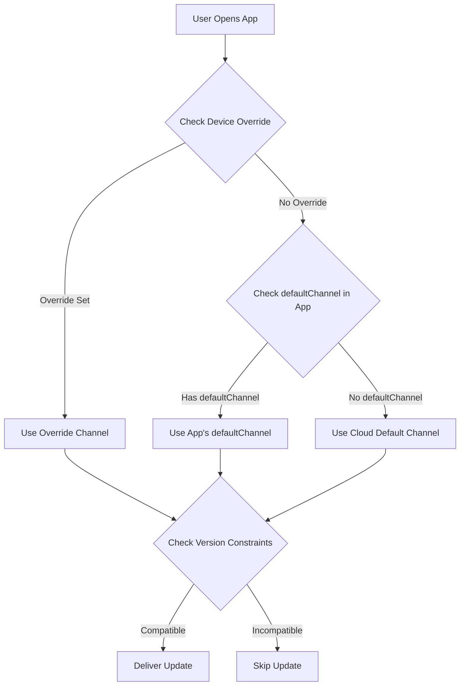

import { Aside } from '@astrojs/starlight/components';

This guide explains how to automatically deliver the latest compatible bundle to users based on their native app version, **similar to Ionic AppFlow's approach**. This ensures simplified update management and faster rollouts while preventing compatibility issues.

<Aside type="tip" title="Migrating from Ionic AppFlow?">
  If you're coming from Ionic AppFlow, this guide is especially important for you. AppFlow automatically matched updates to native versions, and Capgo provides the same capability with even more control and flexibility. See the [AppFlow Migration Guide](/docs/upgrade/from-appflow-to-capgo) for step-by-step migration instructions.
</Aside>

## Overview

Capgo's version targeting system allows you to:

- **Automatically deliver compatible updates** to users based on their native app version
- **Prevent breaking changes** from reaching incompatible app versions
- **Manage multiple app versions** simultaneously without complex logic
- **Seamlessly roll out updates** to specific user segments

### Why Version Targeting Matters (Especially for AppFlow Users)

If you're familiar with **Ionic AppFlow**, you know how critical it is to ensure users receive only compatible updates. AppFlow automatically matched live update bundles to native app versions, preventing incompatible JavaScript from being delivered to older native code.

**Capgo provides the same safety guarantees**, with additional features:
- More granular control over version matching
- Multiple strategies (channels, semver, native constraints)
- Better visibility into version distribution
- API and CLI control alongside dashboard management

This approach is particularly useful when:
- You have users on different major versions of your app (e.g., v1.x, v2.x, v3.x)
- You need to maintain backward compatibility while rolling out breaking changes
- You want to prevent newer bundles from breaking older native code
- You're migrating users gradually from one version to another
- **You're migrating from AppFlow** and want to maintain the same update safety

## How It Works

Capgo uses a multi-layered approach to match users with compatible updates:

1. **Native Version Constraints**: Prevent bundles from being delivered to incompatible native versions
2. **Channel-Based Routing**: Route different app versions to different update channels
3. **Semantic Versioning Controls**: Automatically block updates across major/minor/patch boundaries
4. **Device-Level Overrides**: Target specific devices or user groups

### Version Matching Flow



## Strategy 1: Channel-Based Version Routing

This is the **recommended approach** for managing breaking changes and major version updates. It's similar to AppFlow's delivery model.

### Example Scenario

- **App v1.x** (100,000 users) → `production` channel
- **App v2.x** (50,000 users with breaking changes) → `v2` channel
- **App v3.x** (10,000 beta users) → `v3` channel

### Implementation

#### Step 1: Configure Channels for Each Major Version

```typescript
// capacitor.config.ts for version 1.x builds
import { CapacitorConfig } from '@capacitor/cli';

const config: CapacitorConfig = {
  appId: 'com.example.app',
  appName: 'Example App',
  plugins: {
    CapacitorUpdater: {
      autoUpdate: true,
      defaultChannel: 'production', // or omit for default
    }
  }
};

export default config;
```

```typescript
// capacitor.config.ts for version 2.x builds
const config: CapacitorConfig = {
  appId: 'com.example.app',
  appName: 'Example App',
  plugins: {
    CapacitorUpdater: {
      autoUpdate: true,
      defaultChannel: 'v2', // Routes v2 users automatically
    }
  }
};
```

```typescript
// capacitor.config.ts for version 3.x builds
const config: CapacitorConfig = {
  appId: 'com.example.app',
  appName: 'Example App',
  plugins: {
    CapacitorUpdater: {
      autoUpdate: true,
      defaultChannel: 'v3', // Routes v3 users automatically
    }
  }
};
```

#### Step 2: Create Channels

```bash
# Create channels for each major version
npx @capgo/cli channel create production
npx @capgo/cli channel create v2
npx @capgo/cli channel create v3

# Enable self-assignment so apps can switch channels
npx @capgo/cli channel set production --self-assign
npx @capgo/cli channel set v2 --self-assign
npx @capgo/cli channel set v3 --self-assign
```

#### Step 3: Upload Version-Specific Bundles

```bash
# For v1.x users (from v1-maintenance branch)
git checkout v1-maintenance
npm run build
npx @capgo/cli bundle upload --channel production

# For v2.x users (from v2-maintenance or main branch)
git checkout main
npm run build
npx @capgo/cli bundle upload --channel v2

# For v3.x users (from beta/v3 branch)
git checkout beta
npm run build
npx @capgo/cli bundle upload --channel v3
```

<Aside type="tip" title="Automatic Routing">
  When users open the app, they automatically connect to their designated channel based on the `defaultChannel` in their installed app bundle. No JavaScript code changes required!
</Aside>

### Benefits

- **Zero code changes** - Channel routing happens automatically
- **Clear separation** - Each version has its own update pipeline
- **Flexible targeting** - Push updates to specific version groups
- **Safe rollouts** - Breaking changes never reach incompatible versions

## Strategy 2: Semantic Versioning Controls

Use Capgo's built-in semantic versioning controls to prevent updates across version boundaries.

### Disable Auto-Update Across Major Versions

```bash
# Create a channel that blocks major version updates
npx @capgo/cli channel create stable --disable-auto-update major
```

This configuration means:
- Users on app version **1.2.3** will receive updates up to **1.9.9**
- Users will **NOT** receive version **2.0.0** automatically
- Prevents breaking changes from reaching older native code

### Granular Control Options

```bash
# Block minor version updates (1.2.x won't get 1.3.0)
npx @capgo/cli channel set stable --disable-auto-update minor

# Block patch updates (1.2.3 won't get 1.2.4)
npx @capgo/cli channel set stable --disable-auto-update patch

# Allow all updates
npx @capgo/cli channel set stable --disable-auto-update none
```

<Aside type="caution" title="Semantic Versioning Required">
  This strategy only works if you follow semantic versioning (semver) for your app versions. Ensure your version numbers follow the `MAJOR.MINOR.PATCH` format.
</Aside>

## Strategy 3: Native Version Constraints

Specify minimum native version requirements for bundles to prevent delivery to incompatible devices.

### Using nativeVersion Delay Condition

When uploading a bundle, you can specify a minimum native version:

```bash
# This bundle requires native version 2.0.0 or higher
npx @capgo/cli bundle upload \
  --channel production \
  --native-version "2.0.0"
```

<Aside type="note" title="How It Works">
  Devices on native version 1.x will NOT receive this bundle. Only devices on 2.0.0+ will get it. This is perfect for updates that require new native APIs or plugins.
</Aside>

### Use Cases

1. **New Native Plugin Required**
   ```bash
   # Bundle needs Camera plugin added in v2.0.0
   npx @capgo/cli bundle upload --native-version "2.0.0"
   ```

2. **Breaking Native API Changes**
   ```bash
   # Bundle uses new Capacitor 6 APIs
   npx @capgo/cli bundle upload --native-version "3.0.0"
   ```

3. **Gradual Migration**
   ```bash
   # Test bundle only on latest native version
   npx @capgo/cli bundle upload \
     --channel beta \
     --native-version "2.5.0"
   ```

## Strategy 4: Auto-Downgrade Prevention

Prevent users from receiving bundles older than their current native version.

### Enable in Channel Settings

In the Capgo dashboard:
1. Go to **Channels** → Select your channel
2. Enable **"Disable auto downgrade under native"**
3. Save changes

Or via CLI:
```bash
npx @capgo/cli channel set production --disable-downgrade
```

### Example

- User's device: Native version **1.2.5**
- Channel bundle: Version **1.2.3**
- **Result**: Update is blocked (would be a downgrade)

This is useful when:
- Users manually installed a newer version from the app store
- You need to ensure users always have the latest security patches
- You want to prevent regression bugs

## Strategy 5: Device-Level Targeting

Override channel assignment for specific devices or user groups.

### Force Specific Version for Testing

```typescript
import { CapacitorUpdater } from '@capgo/capacitor-updater'

// Force beta testers to use v3 channel
async function assignBetaTesters() {
  const deviceId = await CapacitorUpdater.getDeviceId()

  // Check if user is beta tester
  if (isBetaTester(userId)) {
    await CapacitorUpdater.setChannel({ channel: 'v3' })
  }
}
```

### Dashboard Device Override

In the Capgo dashboard:
1. Go to **Devices** → Find device
2. Click **Set Channel** or **Set Version**
3. Override with specific channel or bundle version
4. Device will receive updates from overridden source

<Aside type="tip" title="Testing Updates">
  Use device overrides to test updates on your own device before rolling out to all users.
</Aside>

## Complete AppFlow-Style Workflow

Here's a complete example combining all strategies:

### 1. Initial Setup (App v1.0.0)

```bash
# Create production channel with semver controls
npx @capgo/cli channel create production \
  --disable-auto-update major \
  --disable-downgrade
```

```typescript
// capacitor.config.ts
const config: CapacitorConfig = {
  plugins: {
    CapacitorUpdater: {
      autoUpdate: true,
      defaultChannel: 'production',
    }
  }
};
```

### 2. Release Breaking Change (App v2.0.0)

```bash
# Create v2 channel for new version
npx @capgo/cli channel create v2 \
  --disable-auto-update major \
  --disable-downgrade \
  --self-assign

# Create git branch for v1 maintenance
git checkout -b v1-maintenance
git push origin v1-maintenance
```

```typescript
// capacitor.config.ts for v2.0.0
const config: CapacitorConfig = {
  plugins: {
    CapacitorUpdater: {
      autoUpdate: true,
      defaultChannel: 'v2', // New users get v2 channel
    }
  }
};
```

### 3. Push Updates to Both Versions

```bash
# Update v1.x users (bug fix)
git checkout v1-maintenance
# Make changes
npx @capgo/cli bundle upload \
  --channel production \
  --native-version "1.0.0"

# Update v2.x users (new feature)
git checkout main
# Make changes
npx @capgo/cli bundle upload \
  --channel v2 \
  --native-version "2.0.0"
```

### 4. Monitor Version Distribution

Use the Capgo dashboard to track:
- How many users are on v1 vs v2
- Bundle adoption rates per version
- Errors or crashes per version

### 5. Deprecate Old Version

Once v1 usage drops below threshold:

```bash
# Stop uploading to production channel
# Optional: Delete v1 maintenance branch
git branch -d v1-maintenance

# Move all remaining users to default
# (They'll need to update via app store)
```

## Channel Precedence

When multiple channel configurations exist, Capgo uses this precedence order:

1. **Device Override** (Dashboard or API) - Highest priority
2. **Cloud Override** via `setChannel()` call
3. **defaultChannel** in capacitor.config.ts
4. **Default Channel** (Cloud setting) - Lowest priority

<Aside type="note" title="Precedence Example">
  If a user's app has `defaultChannel: 'v2'` but you override their device to `'beta'` in the dashboard, they'll receive updates from the `'beta'` channel.
</Aside>

## Best Practices

### 1. Always Set defaultChannel for Major Versions

```typescript
// ✅ Good: Each major version has explicit channel
// v1.x → production
// v2.x → v2
// v3.x → v3

// ❌ Bad: Relying on dynamic channel switching
// All versions → production, switch manually
```

### 2. Use Semantic Versioning

```bash
# ✅ Good
1.0.0 → 1.0.1 → 1.1.0 → 2.0.0

# ❌ Bad
1.0 → 1.1 → 2 → 2.5
```

### 3. Maintain Separate Branches

```bash
# ✅ Good: Separate branches per major version
main (v3.x)
v2-maintenance (v2.x)
v1-maintenance (v1.x)

# ❌ Bad: Single branch for all versions
```

### 4. Test Before Rollout

```bash
# Test on beta channel first
npx @capgo/cli bundle upload --channel beta

# Monitor for issues, then promote to production
npx @capgo/cli bundle upload --channel production
```

### 5. Monitor Version Distribution

Regularly check your dashboard:
- Are users upgrading to newer native versions?
- Are old versions still getting high traffic?
- Should you deprecate old channels?

## Comparison with Ionic AppFlow

For teams migrating from **Ionic AppFlow**, here's how Capgo's version targeting compares:

| Feature | Ionic AppFlow | Capgo |
|---------|---------------|-------|
| **Version-based routing** | Automatic based on native version | Automatic via `defaultChannel` + multiple strategies |
| **Semantic versioning** | Basic support | Advanced with `--disable-auto-update` (major/minor/patch) |
| **Native version constraints** | Manual configuration in AppFlow dashboard | Built-in `--native-version` flag in CLI |
| **Channel management** | Web UI + CLI | Web UI + CLI + API |
| **Device overrides** | Limited device-level control | Full control via Dashboard/API |
| **Auto-downgrade prevention** | Yes | Yes via `--disable-downgrade` |
| **Multi-version maintenance** | Manual branch/channel management | Automated with channel precedence |
| **Self-hosting** | No | Yes (full control) |
| **Version analytics** | Basic | Detailed per-version metrics |

<Aside type="note" title="AppFlow Parity and Beyond">
  Capgo provides **all the version targeting capabilities** that AppFlow offered, plus additional control mechanisms. If you relied on AppFlow's automatic version matching, you'll find Capgo equally safe with more flexibility.
</Aside>

## Troubleshooting

### Users Not Receiving Updates

Check the following:

1. **Channel Assignment**: Verify device is on correct channel
   ```typescript
   const channel = await CapacitorUpdater.getChannel()
   console.log('Current channel:', channel)
   ```

2. **Version Constraints**: Check if bundle has native version requirements
   - Dashboard → Bundles → Check "Native Version" column

3. **Semver Settings**: Verify channel's `disable-auto-update` setting
   ```bash
   npx @capgo/cli channel list
   ```

4. **Device Override**: Check if device has manual override
   - Dashboard → Devices → Search for device → Check channel/version

### Bundle Delivered to Wrong Version

1. **Review defaultChannel**: Ensure correct channel in `capacitor.config.ts`
2. **Check Bundle Upload**: Verify bundle was uploaded to intended channel
3. **Inspect Native Version**: Confirm `--native-version` flag was used correctly

### Breaking Changes Affecting Old Versions

1. **Immediate Fix**: Override affected devices to safe bundle
   - Dashboard → Devices → Bulk select → Set Version
2. **Long-term Fix**: Create versioned channels and maintain separate branches
3. **Prevention**: Always test updates on representative devices before rollout

## Migration from Ionic AppFlow

If you're migrating from **Ionic AppFlow**, version targeting works very similarly in Capgo, with improved flexibility:

### Concept Mapping

| AppFlow Concept | Capgo Equivalent | Notes |
|-----------------|------------------|-------|
| **Deploy Channel** | Capgo Channel | Same concept, more powerful |
| **Native Version Lock** | `--native-version` flag | More granular control |
| **Channel Priority** | Channel precedence (override → cloud → default) | More transparent precedence |
| **Deployment Target** | Channel + semver controls | Multiple strategies available |
| **Production Channel** | `production` channel (or any name) | Flexible naming |
| **Git-based deployment** | CLI bundle upload from branch | Same workflow |
| **Automatic version matching** | `defaultChannel` + version constraints | Enhanced with multiple strategies |

### Key Differences for AppFlow Users

1. **More Control**: Capgo gives you multiple strategies (channels, semver, native version) that can be combined
2. **Better Visibility**: Dashboard shows version distribution and compatibility issues
3. **API Access**: Full programmatic control over version targeting
4. **Self-Hosting**: Option to run your own update server with same version logic

### Migration Steps

1. **Map your AppFlow channels** to Capgo channels (usually 1:1)
2. **Set `defaultChannel`** in `capacitor.config.ts` for each major version
3. **Configure semver rules** if you want automatic blocking at version boundaries
4. **Upload version-specific bundles** using `--native-version` flag
5. **Monitor version distribution** in Capgo dashboard

<Aside type="tip" title="Complete Migration Guide">
  For complete migration instructions including SDK replacement and API mapping, see the [AppFlow to Capgo Migration Guide](/docs/upgrade/from-appflow-to-capgo).
</Aside>

## Advanced Patterns

### Gradual Rollout by Version

```typescript
// Gradually migrate v1 users to v2
async function migrateUsers() {
  const deviceId = await CapacitorUpdater.getDeviceId()
  const rolloutPercentage = 10 // Start with 10%

  // Hash device ID to get deterministic percentage
  const hash = hashCode(deviceId) % 100

  if (hash < rolloutPercentage) {
    // User is in rollout group - migrate to v2
    await CapacitorUpdater.setChannel({ channel: 'v2' })
  }
}
```

### Feature Flags by Version

```typescript
// Enable features based on native version
async function checkFeatureAvailability() {
  const info = await CapacitorUpdater.getDeviceId()
  const nativeVersion = info.nativeVersion

  if (compareVersions(nativeVersion, '2.0.0') >= 0) {
    // Enable features requiring v2.0.0+
    enableNewCameraFeature()
  }
}
```

### A/B Testing Across Versions

```typescript
// Run A/B tests within same native version
async function assignABTest() {
  const nativeVersion = await getNativeVersion()

  if (nativeVersion.startsWith('2.')) {
    // Only A/B test on v2 users
    const variant = Math.random() < 0.5 ? 'v2-test-a' : 'v2-test-b'
    await CapacitorUpdater.setChannel({ channel: variant })
  }
}
```

## Summary

Capgo provides multiple strategies for version-specific update delivery:

1. **Channel-Based Routing**: Automatic version separation via `defaultChannel`
2. **Semantic Versioning**: Prevent updates across major/minor/patch boundaries
3. **Native Version Constraints**: Require minimum native version for bundles
4. **Auto-Downgrade Prevention**: Never deliver older bundles to newer native versions
5. **Device Overrides**: Manual control for testing and targeting

By combining these strategies, you can achieve AppFlow-style automatic update delivery with even more flexibility and control. Choose the approach that best fits your app's versioning and deployment workflow.

For more details on specific features:
- [Breaking Changes Guide](/docs/live-updates/breaking-changes) - Detailed channel versioning strategy
- [Channel Management](/docs/live-updates/channels) - Complete channel configuration reference
- [Update Behavior](/docs/live-updates/update-behavior) - Native version delays and conditions
