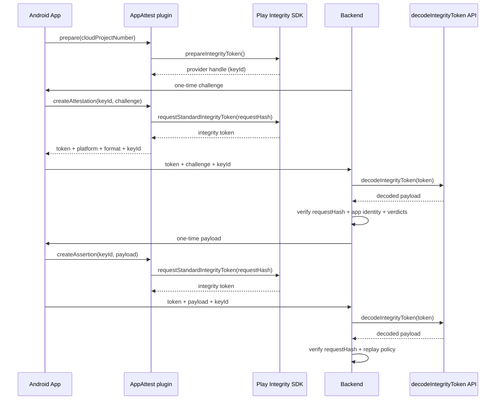

## Android native system used

On Android, this plugin uses **Google Play Integrity Standard API**:

- `prepareIntegrityToken` during `prepare()`
- `requestStandardIntegrityToken` for `createAttestation()` and `createAssertion()`

## Requirements

- Android app distributed through Google Play ecosystem
- Google Play services available on device
- Play Integrity API enabled for your app
- Google Cloud project number configured

## Google setup

1. Enable **Play Integrity API** in your Google Cloud project.
2. Open Play Console and configure Play Integrity access for your app.
3. Provide `cloudProjectNumber` to the plugin.

## Capacitor config

```ts
// capacitor.config.ts
plugins: {
  AppAttest: {
    cloudProjectNumber: '123456789012',
  },
}
```

You can also pass `cloudProjectNumber` per call in method options.

## Client flow

```typescript
import { AppAttest } from '@capgo/capacitor-app-attest';

const { keyId } = await AppAttest.prepare({
  cloudProjectNumber: '123456789012',
});

const attestation = await AppAttest.createAttestation({
  keyId,
  challenge: 'backend-registration-challenge',
});

const assertion = await AppAttest.createAssertion({
  keyId,
  payload: 'backend-request-payload',
});
```

`token` is a Play Integrity token and must be decoded server-side.

## Backend workflow (Android)

### Registration (`createAttestation`)

1. Backend creates one-time `challenge`.
2. App calls `createAttestation({ keyId, challenge })`.
3. Backend calls Google `decodeIntegrityToken` API.
4. Backend verifies at minimum:
   - `requestDetails.requestHash === base64url(SHA256(challenge))`
   - `appIntegrity.packageName` equals your Android application id
   - `appIntegrity.certificateSha256Digest` contains your release signing cert digest
   - integrity verdicts match your security policy

### Request protection (`createAssertion`)

1. Backend creates one-time `payload`.
2. App calls `createAssertion({ keyId, payload })`.
3. Backend decodes token and checks `requestHash === base64url(SHA256(payload))`.
4. Enforce replay prevention (single-use + TTL) and integrity verdict policy.

## Android schema



## Minimal backend payload contract

Registration:

```json
{
  "platform": "android",
  "format": "google-play-integrity-standard",
  "keyId": "string",
  "challenge": "string",
  "token": "string"
}
```

Assertion:

```json
{
  "platform": "android",
  "format": "google-play-integrity-standard",
  "keyId": "string",
  "payload": "string",
  "token": "string"
}
```
