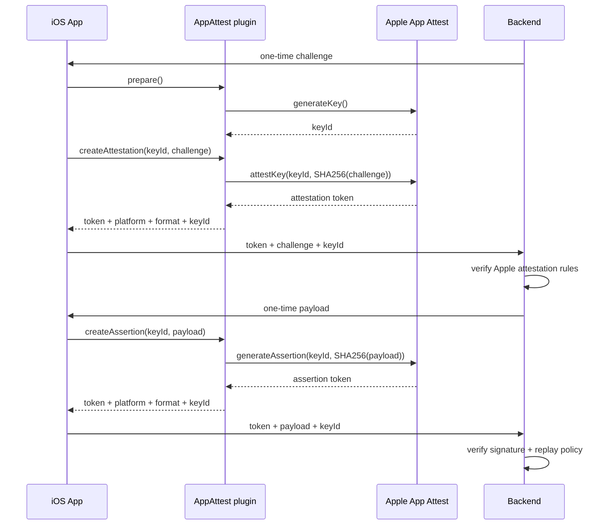

## iOS native system used

On iOS, this plugin uses **Apple App Attest** from the `DeviceCheck` framework.

## Requirements

- iOS 14+
- Physical device recommended for real validation flows
- Xcode target with App Attest capability enabled

## Xcode setup

1. Open your iOS app target in Xcode.
2. Go to **Signing & Capabilities**.
3. Click **+ Capability** and add **App Attest**.

No custom iOS permissions are required in `Info.plist` for App Attest itself.

## Client flow

```typescript
import { AppAttest } from '@capgo/capacitor-app-attest';

const { keyId } = await AppAttest.prepare();

const attestation = await AppAttest.createAttestation({
  keyId,
  challenge: 'backend-registration-challenge',
});

const assertion = await AppAttest.createAssertion({
  keyId,
  payload: 'backend-request-payload',
});
```

Send `attestation.token` and `assertion.token` to your backend. Do not validate them in the app.

## Backend workflow (iOS)

### Registration (`createAttestation`)

1. Backend creates one-time `challenge`.
2. App calls `createAttestation({ keyId, challenge })`.
3. Backend verifies App Attest attestation:
   - certificate chain is valid and anchored to Apple App Attest
   - app identity matches your app (`bundleId`, team)
   - `clientDataHash` matches `SHA256(challenge)`
4. Store device key state (`keyId`, public key, and verifier metadata).

### Request protection (`createAssertion`)

1. Backend creates one-time `payload` (or canonical request hash input).
2. App calls `createAssertion({ keyId, payload })`.
3. Backend verifies assertion signature with previously stored key material.
4. Enforce replay protection and nonce TTL checks.

## iOS schema



## Minimal backend payload contract

Registration:

```json
{
  "platform": "ios",
  "format": "apple-app-attest",
  "keyId": "string",
  "challenge": "string",
  "token": "string"
}
```

Assertion:

```json
{
  "platform": "ios",
  "format": "apple-app-attest",
  "keyId": "string",
  "payload": "string",
  "token": "string"
}
```
