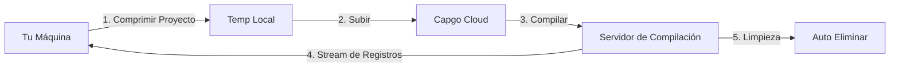

import { Pasos, Card, CardGrid } from '@astrojs/starlight/components';

Comienza con Capgo Construcción en la nube y crea tu primera compilación nativa iOS o Android en minutos.

## Lo Que Necesitarás

Antes de comenzar, asegúrate de tener:

- Una aplicación Capacitor que compile exitosamente localmente
- Node.js 20 o superior instalado
- Una cuenta Capgo con una suscripción activa
- Tu aplicación ya registrada en Capgo (ejecuta `npx @capgo/cli@latest app add` si no lo está)
- **Credenciales de compilación configuradas** (certificados, keystores) - ver abajo

## Antes de Tu Primera Compilación

<CardGrid>
  <Card title="⚠️ Configura las Credenciales Primero" icon="Advertencia">
    **Requerido antes de compilar:** Debes configurar tus credenciales de compilación (certificados para iOS, keystores para Android).

    [Configurar Credenciales →](/docs/cli/cloud-build/credentials/)
  </Card>
</CardGrid>

## Inicio Rápido

<Pasos>

1. **Configurar Credenciales de Compilación**

   Antes de poder compilar, necesitas guardar tus credenciales localmente:

   **Para iOS:**
   ```bash
   npx @capgo/cli build credentials save \
     --platform ios \
     --certificate ./cert.p12 \
     --p12-password "password" \
     --provisioning-profile ./profile.mobileprovision \
     --apple-key ./AuthKey.p8 \
     --apple-key-id "KEY123" \
     --apple-issuer-id "issuer-uuid" \
     --apple-team-id "team-id"
   ```

   **Para Android:**
   ```bash
   npx @capgo/cli build credentials save \
     --platform android \
     --keystore ./release.keystore \
     --keystore-alias "my-key" \
     --keystore-key-password "key-pass" \
     --keystore-store-password "store-pass"
   ```

   Consulta la [guía completa de credenciales](/docs/cli/cloud-build/credentials/) para más detalles.

2. **Verificar Compilación Local**

   Primero, asegúrate de que tu aplicación compile localmente sin errores:

   ```bash
   # Compila tus recursos web
   npm run build

   # Sincroniza con Capacitor
   npx cap sync

   # Prueba compilación local (opcional pero recomendado)
   npx cap open ios    # Para iOS
   npx cap open android # Para Android
   ```

3. **Autenticarse con Capgo**

   Configura tu clave API de Capgo (si no está ya configurada):

   ```bash
   npx @capgo/cli@latest login
   ```

   O configura la Variable de entorno:
   ```bash
   export CAPGO_TOKEN=tu_clave_api_aquí
   ```

4. **Ejecutar Tu Primera Compilación**

   Comienza con una compilación de Depuración de Android (la más rápida para probar):

   ```bash
   npx @capgo/cli@latest build com.example.app \
     --platform android \
     --build-mode debug
   ```

   Verás registros en tiempo real a medida que progresa tu compilación:
   ```
   ✔ Creando trabajo de compilación...
   ✔ Subiendo proyecto (15.2 MB)...
   ✔ Compilación iniciada

   📝 Registros de compilación:
   → Instalando dependencias...
   → Ejecutando compilación Gradle...
   → Firmando APK...
   ✔ Compilación exitosa en 3m 42s
   ```

5. **Verificar Estado de Compilación**

   El CLI automáticamente encuestará y mostrará el estado de compilación. Una vez completado, verás:

   - Tiempo de compilación
   - Estado de éxito/fallo
   - Aplicación enviada a Aplicación Store/Play Store (si las credenciales están configuradas)

</Pasos>

## Entendiendo el Proceso de Compilación

Cuando ejecutas el comando de compilación, esto es lo que sucede:



1. **Preparación Local** - Tu proyecto se comprime (excluyendo `node_modules` y archivos ocultos)
2. **Subida** - El zip se sube a almacenamiento en la nube seguro (Cloudflare R2)
3. **Ejecución de Compilación** - Tu aplicación se compila en infraestructura dedicada
4. **Streaming de Registros** - Los registros en tiempo real se transmiten a tu terminal vía Server-Sent Events
5. **Limpieza Automática** - Los artefactos de compilación se eliminan (Android: instantáneo, iOS: 24 horas)

## Tu Primera Compilación de Producción

Una vez que hayas verificado que el proceso funciona, crea una compilación de producción:

### Android

```bash
npx @capgo/cli@latest build com.example.app \
  --platform android \
  --build-mode release
```

Necesitarás configurar primero las credenciales de firma. Consulta [Configuración de Compilación Android](/docs/cli/cloud-build/android/).

### iOS

```bash
npx @capgo/cli@latest build com.example.app \
  --platform ios \
  --build-mode release
```

Las compilaciones iOS requieren certificados de firma y perfiles de aprovisionamiento. Consulta [Configuración de Compilación iOS](/docs/cli/cloud-build/ios/).

## Qué se Compila

**Importante:** Capgo Construcción en la nube solo compila las **partes nativas** de tu aplicación (código nativo iOS y Android).

Tú eres responsable de:
- Compilar tus recursos web (`npm run build`)
- Ejecutar `npx cap sync` antes de la compilación
- Asegurar que todas las dependencias estén en `package.json`

Nosotros nos encargamos de:
- Compilación nativa iOS (Xcode, Fastlane)
- Compilación nativa Android (Gradle)
- Firma de código
- Envío a tiendas de aplicaciones (si está configurado)

## Tiempo y Costos de Compilación

El tiempo de compilación se mide desde el inicio hasta la finalización:

- **Android**: Típicamente 3-5 minutos (multiplicador de facturación 1×)
- **iOS**: Típicamente 5-10 minutos (multiplicador de facturación 2× debido a costos de hardware Mac)

Solo pagas por el tiempo de compilación real usado. Sin cargos ocultos.

## Casos de Uso Comunes

### Integración CI/CD

Agregar a tu flujo de trabajo de GitHub Actions:

```yaml
- name: Build native app
  env:
    CAPGO_TOKEN: ${{ secrets.CAPGO_TOKEN }}
  run: |
    npm run build
    npx cap sync
    npx @capgo/cli@latest build ${{ secrets.APP_ID }} \
      --platform both \
      --build-mode release
```

### Desarrollo Local

Probar compilaciones localmente antes de confirmar:

```bash
# Compilación de debug rápida para pruebas
npm run build && npx cap sync
npx @capgo/cli@latest build com.example.app \
  --platform android \
  --build-mode debug
```

### Compilaciones Multi-Plataforma

Compilar para ambas plataformas simultáneamente:

```bash
npx @capgo/cli@latest build com.example.app \
  --platform both \
  --build-mode release
```

## Próximos Pasos

Ahora que has creado tu primera compilación:

- [Configurar compilaciones iOS](/docs/cli/cloud-build/ios/) - Configurar certificados y perfiles
- [Configurar compilaciones Android](/docs/cli/cloud-build/android/) - Configurar keystores y Play Store
- [Solución de problemas](/docs/cli/cloud-build/troubleshooting/) - Problemas comunes y soluciones
- [Referencia CLI](/docs/cli/reference/build/) - Documentación completa de comandos

## ¿Necesitas Ayuda?

- Consulta la [guía de solución de problemas](/docs/cli/cloud-build/troubleshooting/)
- Únete a nuestra [comunidad Discord](https://discord.com/invite/VnYRvBfgA6)
- Envía un correo a soporte en support@Capgo.Aplicación
