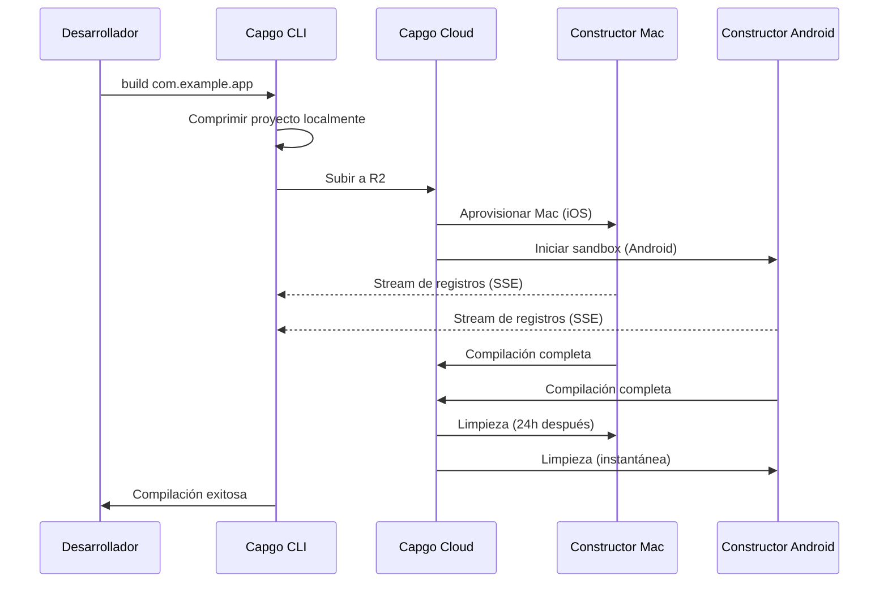

import { Card, CardGrid } from '@astrojs/starlight/components';

🏗️ Compila aplicaciones móviles nativas en la nube y envíalas automáticamente a Aplicación Store y Play Store.

## Descripción General

El comando `build` te permite compilar tu aplicación Capacitor para iOS y Android en la infraestructura en la nube de Capgo, similar a cómo Expo maneja las compilaciones. Tu aplicación se compila en infraestructura dedicada y puede enviarse automáticamente a las tiendas de aplicaciones.

**Estado Actual:** Beta Pública

## ¿Por Qué Usar Construcción en la nube?

Compilar aplicaciones móviles nativas tradicionalmente requiere:
- **Hardware Mac** para compilaciones iOS ($1000+ o costosos minutos de CI)
- **Configuración compleja de CI/CD** con caché y credenciales
- **Sobrecarga de mantenimiento** para Xcode, Android Studio y SDKs

Con Capgo Construcción en la nube, obtienes:
- ✅ **No se requiere Mac** - Compila aplicaciones iOS desde cualquier máquina
- ✅ **Sin configuración** - No se necesita configuración de CI/CD
- ✅ **Probado en batalla** - Construido sobre 3 años de uso interno en producción
- ✅ **Seguro** - Sin almacenamiento de registros, limpieza automática
- ✅ **Solo nativo** - Tu JavaScript se mantiene privado

## Inicio Rápido

```bash
npx @capgo/cli@latest build com.example.app
```

¡Eso es todo! Tu aplicación se compilará en la nube y verás registros en tiempo real.

## Secciones de Documentación

<CardGrid>
  <Card title="⚠️ Configura las Credenciales PRIMERO" icon="Advertencia">
    **Requerido antes de compilar:** Guarda tus credenciales iOS/Android localmente.

    [Configurar Credenciales →](/docs/cli/cloud-build/credentials/)
  </Card>

  <Card title="Comenzar" icon="rocket">
    Crea tu primera compilación nativa en minutos.

    [Leer guía →](/docs/cli/cloud-build/getting-started/)
  </Card>

  <Card title="Compilaciones iOS" icon="seti:apple">
    Configura certificados y compila para Aplicación Store.

    [Configurar iOS →](/docs/cli/cloud-build/ios/)
  </Card>

  <Card title="Compilaciones Android" icon="seti:android">
    Configura keystores y compila para Play Store.

    [Configurar Android →](/docs/cli/cloud-build/android/)
  </Card>

  <Card title="Solución de Problemas" icon="Advertencia">
    Soluciones a problemas comunes de compilación.

    [Obtener ayuda →](/docs/cli/cloud-build/troubleshooting/)
  </Card>
</CardGrid>

## Referencia de Comandos

### Uso Básico

```bash
npx @capgo/cli@latest build [appId] [opciones]
```

### Ejemplos

Compilar para ambas plataformas:
```bash
npx @capgo/cli@latest build com.example.app
```

Compilar solo para iOS:
```bash
npx @capgo/cli@latest build com.example.app --platform ios
```

Compilar para Android en modo Depuración:
```bash
npx @capgo/cli@latest build com.example.app --platform android --build-mode debug
```

Compilar desde un directorio específico:
```bash
npx @capgo/cli@latest build com.example.app --path ./my-app
```

### Opciones

| Opción | Tipo | Por Defecto | Descripción |
|--------|------|---------|-------------|
| `appId` | string | Capacitor.config | ID de Aplicación (ej., com.Ejemplo.Aplicación) |
| `--path <ruta>` | string | Directorio actual | Ruta al directorio de tu proyecto |
| `--platform <plataforma>` | string | both | Plataforma objetivo: `ios`, `android`, o `both` |
| `--build-mode <modo>` | string | Lanzamiento | Modo de compilación: `debug` o `release` |
| `--build-config <config>` | string | - | Configuración adicional de compilación como cadena JSON |
| `-a, --apikey <apikey>` | string | - | Clave API (o usa la Variable de entorno `CAPGO_TOKEN`) |
| `--supa-host <url>` | string | https://API.Capgo.Aplicación | URL personalizada del host Supabase |
| `--supa-anon <key>` | string | - | Clave anon personalizada de Supabase |

## Cómo Funciona



### Proceso de Compilación

1. **Preparación Local** - Tu proyecto se comprime localmente (excluyendo `node_modules`, archivos ocultos)
2. **Subida** - El archivo zip se sube a almacenamiento en la nube seguro (Cloudflare R2)
3. **Ejecución de Compilación**:
   - **iOS**: Se aprovisiona máquina Mac dedicada, Fastlane compila y firma
   - **Android**: Se crea sandbox seguro, Gradle compila y firma
4. **Streaming de Registros** - Registros en tiempo real vía Server-Sent Events (¡no se almacenan!)
5. **Limpieza Automática**:
   - **iOS**: Archivos eliminados después de 24 horas cuando se libera la máquina
   - **Android**: Todo se elimina instantáneamente después de la compilación

## Nuestra Experiencia

Capgo Construcción en la nube no es infraestructura nueva - la hemos estado usando internamente durante **3 años**:

- ✅ **Fastlane Personalizado** - Construido específicamente para aplicaciones Capacitor
- ✅ **Miles de compilaciones** - Probado en batalla en producción
- ✅ **Expertos en Capacitor** - Conocimiento profundo de lo que importa
- ✅ **Enfoque solo en nativo** - Tu JavaScript nunca toca nuestros servidores

## Seguridad y Privacidad

- **Sin almacenamiento de registros** - Los registros solo se transmiten a tu terminal, nunca se guardan
- **Sin almacenamiento de artefactos** - Las aplicaciones se envían directamente a Aplicación Store/Play Store, no guardamos nada
- **Credenciales auto-eliminadas** - Solo se usan durante la compilación, eliminadas después (máx. 24h)
- **Compilaciones aisladas** - Cada compilación se ejecuta en aislamiento
- **Tu código sigue siendo tuyo** - Solo compilamos partes nativas, JavaScript permanece local

## Integración CI/CD

Funciona en todas partes - GitHub Actions, GitLab CI, o cualquier plataforma CI/CD:

```yaml
- name: Build native app
  env:
    CAPGO_TOKEN: ${{ secrets.CAPGO_TOKEN }}
  run: |
    npm run build
    npx cap sync
    npx @capgo/cli@latest build com.example.app \
      --platform both \
      --build-mode release
```

No necesitas:
- Runners Mac
- Instalación de Android SDK
- Instalación de Xcode
- Caché complejo
- Gestión de credenciales

## Precios

El tiempo de compilación se factura según el uso real:

- **Android**: Multiplicador 1× (~$0.XX por minuto)
- **iOS**: Multiplicador 2× (~$0.XX por minuto, debido al hardware Mac)

**Costos típicos:**
- Depuración Android: 3 min × 1× = ~$X.XX
- Lanzamiento iOS: 7 min × 2× = ~$X.XX

Solo pagas por lo que usas. Sin mínimos, sin sorpresas.

## Comparación con Otras Soluciones

| Característica | Capgo Construcción en la nube | GitHub Actions (Mac) | Expo EAS |
|---------|------------------|---------------------|----------|
| **Mac requerido localmente** | ❌ No | ✅ Sí | ❌ No |
| **Complejidad de configuración** | ⭐ Comando único | ⭐⭐⭐ YAML complejo | ⭐⭐ Archivos de config |
| **Nativo Capacitor** | ✅ Optimizado | ⚠️ Genérico | ❌ Solo Expo |
| **Privacidad de tu código** | ✅ Nunca almacenado | ⚠️ En runners | ⚠️ Subido |
| **Costo (iOS)** | 💰 2× base | 💰💰💰 10× costoso | 💰💰 Premium |

## Qué se Compila

**Importante:** Capgo compila **solo partes nativas**.

✅ **Nosotros compilamos:**
- Código nativo iOS (Swift, Objective-C, proyectos Xcode)
- Código nativo Android (Java, Kotlin, proyectos Gradle)
- Firma de código y envío a tiendas de aplicaciones

❌ **Tú compilas (localmente):**
- JavaScript, HTML, CSS (`npm run build`)
- Sincronización Capacitor (`npx cap sync`)
- Tus recursos web

Esta separación asegura:
- **Mejor seguridad** - La lógica de tu aplicación permanece privada
- **Compilaciones más rápidas** - Sin compilaciones web duplicadas
- **Responsabilidad clara** - Tú controlas tu código

## Limitaciones

Limitaciones actuales durante la beta pública:

- **Tiempo de espera de compilación**: Máximo 10 minutos
- **Tiempo de espera de subida**: 1 hora para URL de subida
- **Máquina iOS**: Requisito de arrendamiento de 24 horas, la compilación en Mac se pondrá en cola para asegurar un uso óptimo
- **Acceso**: Solo beta pública

## Comenzar

¿Listo para compilar sin complicaciones?

<CardGrid>
  <Card title="Crea Tu Primera Compilación" icon="rocket">
    Guía paso a paso para tu primera compilación en la nube.

    [Comenzar →](/docs/cli/cloud-build/getting-started/)
  </Card>

  <Card title="Únete a la Beta Pública" icon="star">
    Construcción en la nube está en beta pública. Únete a nuestra comunidad para obtener acceso.

    [Únete a Discord →](https://discord.com/invite/VnYRvBfgA6)
  </Card>
</CardGrid>

## Aprende Más

- [Guía de Comenzar](/docs/cli/cloud-build/getting-started/) - Crea tu primera compilación
- [Configuración iOS](/docs/cli/cloud-build/ios/) - Configura compilaciones iOS
- [Configuración Android](/docs/cli/cloud-build/android/) - Configura compilaciones Android
- [Solución de Problemas](/docs/cli/cloud-build/troubleshooting/) - Problemas comunes y soluciones
- [Blog: Presentamos Cloud Build](/blog/introducing-capgo-cloud-build/) - Anuncio de característica

## ¿Necesitas Ayuda?

- 📚 [Guía de solución de problemas](/docs/cli/cloud-build/troubleshooting/)
- 💬 [Comunidad Discord](https://discord.com/invite/VnYRvBfgA6)
- 📧 Email: support@Capgo.Aplicación
