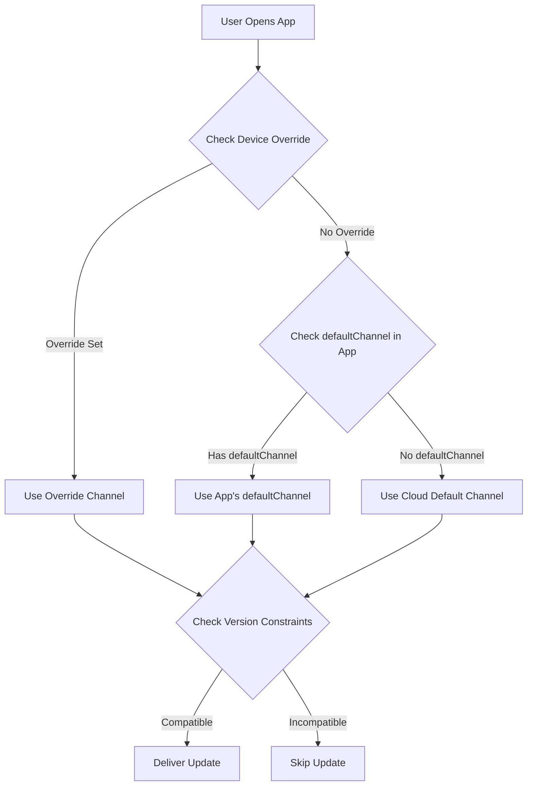

import { Aside } from '@astrojs/starlight/components';

Esta guía explica cómo entregar automáticamente el último bundle compatible a los usuarios en función de su versión de aplicación nativa, **similar al enfoque de Ionic AppFlow**. Esto garantiza una gestión simplificada de actualizaciones y lanzamientos más rápidos mientras se evitan problemas de compatibilidad.

<Aside type="tip" title="¿Migrando desde Ionic AppFlow?">
  Si está migrando desde Ionic AppFlow, esta guía es especialmente importante para usted. AppFlow asociaba automáticamente las actualizaciones con versiones nativas, y Capgo proporciona la misma capacidad con aún más control y flexibilidad. Consulte la [Guía de migración de AppFlow](/docs/upgrade/from-appflow-to-capgo) para obtener instrucciones paso a paso sobre la migración.
</Aside>

## Descripción General

El sistema de targeting de versiones de Capgo le permite:

- **Entregar automáticamente actualizaciones compatibles** a los usuarios en función de su versión de aplicación nativa
- **Prevenir cambios bruscos** de llegar a versiones de aplicación incompatibles
- **Gestionar múltiples versiones de aplicaciones** simultáneamente sin lógica compleja
- **Lanzar actualizaciones sin problemas** para segmentos específicos de usuarios

### Por Qué el Targeting de Versiones es Importante (Especialmente para Usuarios de AppFlow)

Si está familiarizado con **Ionic AppFlow**, sabe lo crítico que es asegurar que los usuarios reciban solo actualizaciones compatibles. AppFlow asociaba automáticamente bundles de actualización en vivo con versiones de aplicaciones nativas, evitando que JavaScript incompatible se entregara a código nativo más antiguo.

**Capgo proporciona las mismas garantías de seguridad**, con características adicionales:
- Control más granular sobre la coincidencia de versiones
- Múltiples estrategias (canales, semver, restricciones nativas)
- Mejor visibilidad en la distribución de versiones
- Control de API y CLI junto con administración de panel

Este enfoque es particularmente útil cuando:
- Tiene usuarios en diferentes versiones principales de su aplicación (p. ej., v1.x, v2.x, v3.x)
- Necesita mantener compatibilidad con versiones anteriores mientras implementa cambios bruscos
- Desea evitar que bundles más nuevos rompan código nativo más antiguo
- Está migrando gradualmente a los usuarios de una versión a otra
- **Está migrando desde AppFlow** y desea mantener la misma seguridad de actualización

## Cómo Funciona

Capgo utiliza un enfoque de múltiples capas para hacer coincidir a los usuarios con actualizaciones compatibles:

1. **Restricciones de Versión Nativa**: Evite que los bundles se entreguen a versiones nativas incompatibles
2. **Enrutamiento Basado en Canales**: Enrute diferentes versiones de aplicaciones a diferentes canales de actualización
3. **Controles de Versión Semántica**: Bloquee automáticamente actualizaciones a través de límites principales/menores/parche
4. **Anulaciones a Nivel de Dispositivo**: Usuarios específicos de destino o grupos de usuarios

### Flujo de Coincidencia de Versiones



## Estrategia 1: Enrutamiento de Versiones Basado en Canales

Este es el **enfoque recomendado** para gestionar cambios bruscos y actualizaciones de versiones principales. Es similar al modelo de entrega de AppFlow.

### Escenario de Ejemplo

- **App v1.x** (100.000 usuarios) → canal `production`
- **App v2.x** (50.000 usuarios con cambios bruscos) → canal `v2`
- **App v3.x** (10.000 usuarios beta) → canal `v3`

### Implementación

#### Paso 1: Configurar Canales para Cada Versión Principal

```typescript
// capacitor.config.ts para compilaciones de versión 1.x
import { CapacitorConfig } from '@capacitor/cli';

const config: CapacitorConfig = {
  appId: 'com.example.app',
  appName: 'Example App',
  plugins: {
    CapacitorUpdater: {
      autoUpdate: true,
      defaultChannel: 'production', // u omitir para predeterminado
    }
  }
};

export default config;
```

```typescript
// capacitor.config.ts para compilaciones de versión 2.x
const config: CapacitorConfig = {
  appId: 'com.example.app',
  appName: 'Example App',
  plugins: {
    CapacitorUpdater: {
      autoUpdate: true,
      defaultChannel: 'v2', // Enruta a los usuarios de v2 automáticamente
    }
  }
};
```

```typescript
// capacitor.config.ts para compilaciones de versión 3.x
const config: CapacitorConfig = {
  appId: 'com.example.app',
  appName: 'Example App',
  plugins: {
    CapacitorUpdater: {
      autoUpdate: true,
      defaultChannel: 'v3', // Enruta a los usuarios de v3 automáticamente
    }
  }
};
```

#### Paso 2: Crear Canales

```bash
# Crear canales para cada versión principal
npx @capgo/cli channel create production
npx @capgo/cli channel create v2
npx @capgo/cli channel create v3

# Habilitar la asignación automática para que las aplicaciones cambien de canal
npx @capgo/cli channel set production --self-assign
npx @capgo/cli channel set v2 --self-assign
npx @capgo/cli channel set v3 --self-assign
```

#### Paso 3: Cargar Bundles Específicos de Versión

```bash
# Para usuarios de v1.x (desde rama v1-maintenance)
git checkout v1-maintenance
npm run build
npx @capgo/cli bundle upload --channel production

# Para usuarios de v2.x (desde rama v2-maintenance o main)
git checkout main
npm run build
npx @capgo/cli bundle upload --channel v2

# Para usuarios de v3.x (desde rama beta/v3)
git checkout beta
npm run build
npx @capgo/cli bundle upload --channel v3
```

<Aside type="tip" title="Enrutamiento Automático">
  Cuando los usuarios abren la aplicación, se conectan automáticamente a su canal designado en función del `defaultChannel` en su bundle de aplicación instalado. ¡No se requieren cambios de código JavaScript!
</Aside>

### Beneficios

- **Cero cambios de código** - El enrutamiento de canales ocurre automáticamente
- **Separación clara** - Cada versión tiene su propio pipeline de actualización
- **Targeting flexible** - Empuje actualizaciones a grupos de versiones específicos
- **Lanzamientos seguros** - Los cambios bruscos nunca llegan a versiones incompatibles

## Estrategia 2: Controles de Versión Semántica

Utilice los controles de versión semántica integrados de Capgo para evitar actualizaciones a través de límites de versión.

### Deshabilitar Auto-Actualización a Través de Versiones Principales

```bash
# Crear un canal que bloquee actualizaciones de versión principal
npx @capgo/cli channel create stable --disable-auto-update major
```

Esta configuración significa:
- Los usuarios en la versión de aplicación **1.2.3** recibirán actualizaciones hasta **1.9.9**
- Los usuarios **NO** recibirán la versión **2.0.0** automáticamente
- Evita que cambios bruscos lleguen a código nativo más antiguo

### Opciones de Control Granular

```bash
# Bloquear actualizaciones de versión menor (1.2.x no obtendrá 1.3.0)
npx @capgo/cli channel set stable --disable-auto-update minor

# Bloquear actualizaciones de parche (1.2.3 no obtendrá 1.2.4)
npx @capgo/cli channel set stable --disable-auto-update patch

# Permitir todas las actualizaciones
npx @capgo/cli channel set stable --disable-auto-update none
```

<Aside type="caution" title="Versión Semántica Requerida">
  Esta estrategia solo funciona si sigue versión semántica (semver) para sus versiones de aplicación. Asegúrese de que sus números de versión sigan el formato `MAJOR.MINOR.PATCH`.
</Aside>

## Estrategia 3: Restricciones de Versión Nativa

Especifique requisitos de versión nativa mínimos para los bundles para evitar la entrega a dispositivos incompatibles.

### Usando Condición de Retraso de nativeVersion

Al cargar un bundle, puede especificar una versión nativa mínima:

```bash
# Este bundle requiere versión nativa 2.0.0 o superior
npx @capgo/cli bundle upload \
  --channel production \
  --native-version "2.0.0"
```

<Aside type="note" title="Cómo Funciona">
  Los dispositivos en la versión nativa 1.x NO recibirán este bundle. Solo los dispositivos en 2.0.0+ lo obtendrán. Esto es perfecto para actualizaciones que requieren nuevas APIs o complementos nativos.
</Aside>

### Casos de Uso

1. **Nuevo Complemento Nativo Requerido**
   ```bash
   # El bundle necesita complemento de cámara añadido en v2.0.0
   npx @capgo/cli bundle upload --native-version "2.0.0"
   ```

2. **Cambios de API Nativa de Ruptura**
   ```bash
   # El bundle utiliza nuevas APIs de Capacitor 6
   npx @capgo/cli bundle upload --native-version "3.0.0"
   ```

3. **Migración Gradual**
   ```bash
   # Pruebe bundle solo en la última versión nativa
   npx @capgo/cli bundle upload \
     --channel beta \
     --native-version "2.5.0"
   ```

## Estrategia 4: Prevención de Degradación Automática

Evite que los usuarios reciban bundles más antiguos que su versión nativa actual.

### Habilitar en Configuración de Canal

En el panel de control de Capgo:
1. Vaya a **Canales** → Seleccione su canal
2. Habilite **"Deshabilitar degradación automática bajo nativa"**
3. Guardar cambios

O a través de CLI:
```bash
npx @capgo/cli channel set production --disable-downgrade
```

### Ejemplo

- Versión del dispositivo del usuario: Versión nativa **1.2.5**
- Bundle de canal: Versión **1.2.3**
- **Resultado**: La actualización se bloquea (sería una degradación)

Esto es útil cuando:
- Los usuarios instalaron manualmente una versión más nueva desde la tienda de aplicaciones
- Necesita asegurar que los usuarios siempre tengan los últimos parches de seguridad
- Desea evitar errores de regresión

## Estrategia 5: Targeting a Nivel de Dispositivo

Anule la asignación de canal para dispositivos específicos o grupos de usuarios.

### Forzar Versión Específica para Pruebas

```typescript
import { CapacitorUpdater } from '@capgo/capacitor-updater'

// Forzar a los probadores beta a usar el canal v3
async function assignBetaTesters() {
  const deviceId = await CapacitorUpdater.getDeviceId()

  // Verificar si el usuario es probador beta
  if (isBetaTester(userId)) {
    await CapacitorUpdater.setChannel({ channel: 'v3' })
  }
}
```

### Anulación de Dispositivo de Panel

En el panel de control de Capgo:
1. Vaya a **Dispositivos** → Busque dispositivo
2. Haga clic en **Establecer canal** o **Establecer versión**
3. Anule con canal o versión de bundle específico
4. El dispositivo recibirá actualizaciones de la fuente anulada

<Aside type="tip" title="Prueba de Actualizaciones">
  Utilice anulaciones de dispositivos para probar actualizaciones en su propio dispositivo antes de implementar para todos los usuarios.
</Aside>

## Flujo de Trabajo Completo en Estilo AppFlow

Aquí hay un ejemplo completo que combina todas las estrategias:

### 1. Configuración Inicial (App v1.0.0)

```bash
# Crear canal de producción con controles semver
npx @capgo/cli channel create production \
  --disable-auto-update major \
  --disable-downgrade
```

```typescript
// capacitor.config.ts
const config: CapacitorConfig = {
  plugins: {
    CapacitorUpdater: {
      autoUpdate: true,
      defaultChannel: 'production',
    }
  }
};
```

### 2. Lanzar Cambio Brusco (App v2.0.0)

```bash
# Crear canal v2 para nueva versión
npx @capgo/cli channel create v2 \
  --disable-auto-update major \
  --disable-downgrade \
  --self-assign

# Crear rama git para mantenimiento v1
git checkout -b v1-maintenance
git push origin v1-maintenance
```

```typescript
// capacitor.config.ts para v2.0.0
const config: CapacitorConfig = {
  plugins: {
    CapacitorUpdater: {
      autoUpdate: true,
      defaultChannel: 'v2', // Los nuevos usuarios obtienen el canal v2
    }
  }
};
```

### 3. Empujar Actualizaciones a Ambas Versiones

```bash
# Actualizar usuarios de v1.x (corrección de error)
git checkout v1-maintenance
# Hacer cambios
npx @capgo/cli bundle upload \
  --channel production \
  --native-version "1.0.0"

# Actualizar usuarios de v2.x (nueva característica)
git checkout main
# Hacer cambios
npx @capgo/cli bundle upload \
  --channel v2 \
  --native-version "2.0.0"
```

### 4. Monitorear Distribución de Versiones

Utilice el panel de control de Capgo para rastrear:
- Cuántos usuarios están en v1 vs v2
- Tasas de adopción de bundles por versión
- Errores o fallos por versión

### 5. Deprecar Versión Anterior

Una vez que el uso de v1 cae por debajo del umbral:

```bash
# Deja de cargar en el canal de producción
# Opcional: Eliminar rama de mantenimiento v1
git branch -d v1-maintenance

# Mover todos los usuarios restantes al predeterminado
# (Necesitarán actualizar a través de la tienda de aplicaciones)
```

## Precedencia de Canal

Cuando existen múltiples configuraciones de canal, Capgo utiliza este orden de precedencia:

1. **Anulación de dispositivo** (Panel o API) - Mayor prioridad
2. **Anulación de nube** a través de llamada `setChannel()`
3. **defaultChannel** en capacitor.config.ts
4. **Canal predeterminado** (Configuración en la nube) - Menor prioridad

<Aside type="note" title="Ejemplo de Precedencia">
  Si la aplicación de un usuario tiene `defaultChannel: 'v2'` pero anula su dispositivo a `'beta'` en el panel, recibirá actualizaciones del canal `'beta'`.
</Aside>

## Mejores Prácticas

### 1. Siempre Establecer defaultChannel para Versiones Principales

```typescript
// ✅ Bien: Cada versión principal tiene canal explícito
// v1.x → production
// v2.x → v2
// v3.x → v3

// ❌ Mal: Depender del cambio de canal dinámico
// Todas las versiones → production, cambiar manualmente
```

### 2. Usar Versión Semántica

```bash
# ✅ Bien
1.0.0 → 1.0.1 → 1.1.0 → 2.0.0

# ❌ Mal
1.0 → 1.1 → 2 → 2.5
```

### 3. Mantener Ramas Separadas

```bash
# ✅ Bien: Ramas separadas por versión principal
main (v3.x)
v2-maintenance (v2.x)
v1-maintenance (v1.x)

# ❌ Mal: Rama única para todas las versiones
```

### 4. Probar Antes del Lanzamiento

```bash
# Probar primero en canal beta
npx @capgo/cli bundle upload --channel beta

# Monitorear problemas, luego promover a producción
npx @capgo/cli bundle upload --channel production
```

### 5. Monitorear Distribución de Versiones

Verifique regularmente su panel:
- ¿Están los usuarios actualizando a versiones nativas más nuevas?
- ¿Las versiones antiguas aún reciben mucho tráfico?
- ¿Debería deprecar canales antiguos?

## Comparación con Ionic AppFlow

Para equipos que migran desde **Ionic AppFlow**, aquí hay una comparación del targeting de versiones de Capgo:

| Característica | Ionic AppFlow | Capgo |
|---------|---------------|-------|
| **Enrutamiento basado en versión** | Automático basado en versión nativa | Automático vía `defaultChannel` + múltiples estrategias |
| **Versión semántica** | Soporte básico | Avanzado con `--disable-auto-update` (major/minor/patch) |
| **Restricciones de versión nativa** | Configuración manual en panel AppFlow | Indicador `--native-version` integrado en CLI |
| **Gestión de canales** | UI web + CLI | UI web + CLI + API |
| **Anulaciones de dispositivo** | Control limitado a nivel de dispositivo | Control completo vía Panel/API |
| **Prevención de degradación automática** | Sí | Sí vía `--disable-downgrade` |
| **Mantenimiento de múltiples versiones** | Gestión manual de rama/canal | Automatizado con precedencia de canal |
| **Auto-hospedaje** | No | Sí (control total) |
| **Análisis de versiones** | Básico | Métricas detalladas por versión |

<Aside type="note" title="Paridad AppFlow y Más Allá">
  Capgo proporciona **todas las capacidades de targeting de versiones** que AppFlow ofreció, más mecanismos de control adicionales. Si confiaba en la coincidencia automática de versiones de AppFlow, encontrará que Capgo es igualmente seguro con más flexibilidad.
</Aside>

## Solución de Problemas

### Los Usuarios No Reciben Actualizaciones

Verifique lo siguiente:

1. **Asignación de canal**: Verifique que el dispositivo esté en el canal correcto
   ```typescript
   const channel = await CapacitorUpdater.getChannel()
   console.log('Current channel:', channel)
   ```

2. **Restricciones de versión**: Verifique si el bundle tiene requisitos de versión nativa
   - Panel → Bundles → Verifique columna "Versión nativa"

3. **Configuración de Semver**: Verifique la configuración `disable-auto-update` del canal
   ```bash
   npx @capgo/cli channel list
   ```

4. **Anulación de dispositivo**: Verifique si el dispositivo tiene anulación manual
   - Panel → Dispositivos → Busque dispositivo → Verifique canal/versión

### Bundle Entregado a Versión Incorrecta

1. **Revisar defaultChannel**: Asegúrese de canal correcto en `capacitor.config.ts`
2. **Verificar carga de bundle**: Verifique que el bundle se cargó en el canal deseado
3. **Inspeccionar versión nativa**: Confirme que el indicador `--native-version` se utilizó correctamente

### Cambios Bruscos Afectando Versiones Antiguas

1. **Corrección inmediata**: Anule dispositivos afectados a bundle seguro
   - Panel → Dispositivos → Seleccionar múltiples → Establecer versión
2. **Corrección a largo plazo**: Crear canales versionados y mantener ramas separadas
3. **Prevención**: Siempre pruebe actualizaciones en dispositivos representativos antes del lanzamiento

## Migración desde Ionic AppFlow

Si está migrando desde **Ionic AppFlow**, el targeting de versiones funciona de manera muy similar en Capgo, con mayor flexibilidad:

### Mapeo de Conceptos

| Concepto AppFlow | Equivalente Capgo | Notas |
|-----------------|------------------|-------|
| **Canal de implementación** | Canal Capgo | Mismo concepto, más poderoso |
| **Bloqueo de versión nativa** | indicador `--native-version` | Control más granular |
| **Prioridad de canal** | Precedencia de canal (override → cloud → default) | Precedencia más transparente |
| **Objetivo de implementación** | Canal + controles semver | Múltiples estrategias disponibles |
| **Canal de producción** | canal `production` (o cualquier nombre) | Nombre flexible |
| **Implementación basada en git** | Carga de bundle CLI desde rama | Mismo flujo de trabajo |
| **Coincidencia automática de versiones** | `defaultChannel` + restricciones de versión | Mejorado con múltiples estrategias |

### Diferencias Clave para Usuarios de AppFlow

1. **Más control**: Capgo le proporciona múltiples estrategias (canales, semver, versión nativa) que se pueden combinar
2. **Mejor visibilidad**: El panel muestra distribución de versiones y problemas de compatibilidad
3. **Acceso de API**: Control programático completo sobre targeting de versiones
4. **Auto-hospedaje**: Opción para ejecutar su propio servidor de actualización con la misma lógica de versión

### Pasos de Migración

1. **Asigne sus canales de AppFlow** a canales de Capgo (generalmente 1:1)
2. **Establezca `defaultChannel`** en `capacitor.config.ts` para cada versión principal
3. **Configure reglas semver** si desea bloqueo automático en límites de versión
4. **Cargue bundles específicos de versión** utilizando el indicador `--native-version`
5. **Monitoree distribución de versiones** en el panel de Capgo

<Aside type="tip" title="Guía Completa de Migración">
  Para instrucciones completas de migración incluyendo reemplazo de SDK y mapeo de API, consulte la [Guía de migración de AppFlow a Capgo](/docs/upgrade/from-appflow-to-capgo).
</Aside>

## Patrones Avanzados

### Lanzamiento Gradual por Versión

```typescript
// Migrar gradualmente usuarios de v1 a v2
async function migrateUsers() {
  const deviceId = await CapacitorUpdater.getDeviceId()
  const rolloutPercentage = 10 // Comenzar con 10%

  // Hash ID de dispositivo para obtener porcentaje determinista
  const hash = hashCode(deviceId) % 100

  if (hash < rolloutPercentage) {
    // El usuario está en grupo de lanzamiento - Migrar a v2
    await CapacitorUpdater.setChannel({ channel: 'v2' })
  }
}
```

### Indicadores de Característica por Versión

```typescript
// Habilitar características basadas en versión nativa
async function checkFeatureAvailability() {
  const info = await CapacitorUpdater.getDeviceId()
  const nativeVersion = info.nativeVersion

  if (compareVersions(nativeVersion, '2.0.0') >= 0) {
    // Habilitar características que requieren v2.0.0+
    enableNewCameraFeature()
  }
}
```

### Prueba A/B Entre Versiones

```typescript
// Ejecutar pruebas A/B dentro de la misma versión nativa
async function assignABTest() {
  const nativeVersion = await getNativeVersion()

  if (nativeVersion.startsWith('2.')) {
    // Solo prueba A/B en usuarios de v2
    const variant = Math.random() < 0.5 ? 'v2-test-a' : 'v2-test-b'
    await CapacitorUpdater.setChannel({ channel: variant })
  }
}
```

## Resumen

Capgo proporciona múltiples estrategias para entrega de actualización específica de versión:

1. **Enrutamiento basado en canales**: Separación automática de versiones vía `defaultChannel`
2. **Versión semántica**: Prevenir actualizaciones a través de límites principales/menores/parche
3. **Restricciones de versión nativa**: Requerir versión nativa mínima para bundles
4. **Prevención de degradación automática**: Nunca entregar bundles más antiguos a versiones nativas más nuevas
5. **Anulaciones de dispositivo**: Control manual para pruebas y targeting

Al combinar estas estrategias, puede lograr entrega de actualización automática en estilo AppFlow con aún más flexibilidad y control. Elija el enfoque que mejor se adapte a su flujo de trabajo de versionado e implementación de aplicaciones.

Para más detalles sobre características específicas:
- [Guía de Cambios Bruscos](/docs/live-updates/breaking-changes) - Estrategia de versionado de canal detallada
- [Gestión de Canales](/docs/live-updates/channels) - Referencia de configuración de canal completa
- [Comportamiento de Actualización](/docs/live-updates/update-behavior) - Retrasos de versión nativa y condiciones
