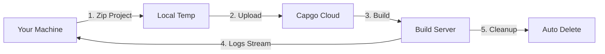

import { Steps, Card, CardGrid } from '@astrojs/starlight/components';

Commencer avec Capgo Cloud Construction and Créer your first iOS or Android Natif Construction in minutes.

## What You'll Need

Before you begin, ensure you have:

- A Capacitor Application that builds successfully locally
- Node.js 20 or higher installed
- A Capgo Compte with an Actif subscription
- Your app already registered in Capgo (run `npx @capgo/cli@latest app add` if not)
- **Construction credentials configured** (certificates, keystores) - see below

## Before Your First Construction

<CardGrid>
  <Card title="⚠️ Setup Credentials First" icon="warning">
    **Required before building:** You must configure your build credentials (certificates for iOS, keystores for Android).

    [Configuration Credentials →](/docs/CLI/cloud-Construction/credentials/)
  </Card>
</CardGrid>

## Démarrage rapide

<Steps>

1. **Configuration Construction Credentials**

   Before you can Construction, you need to Enregistrer your credentials locally:

   **For iOS:**
   ```bash
   npx @capgo/cli build credentials save \
     --platform ios \
     --certificate ./cert.p12 \
     --p12-password "password" \
     --provisioning-profile ./profile.mobileprovision \
     --apple-key ./AuthKey.p8 \
     --apple-key-id "KEY123" \
     --apple-issuer-id "issuer-uuid" \
     --apple-team-id "team-id"
   ```

   **For Android:**
   ```bash
   npx @capgo/cli build credentials save \
     --platform android \
     --keystore ./release.keystore \
     --keystore-alias "my-key" \
     --keystore-key-password "key-pass" \
     --keystore-store-password "store-pass"
   ```

   See the [full credentials Guide](/docs/CLI/cloud-Construction/credentials/) for details.

2. **Verify Local Construction**

   First, ensure your Application builds locally without errors:

   ```bash
   # Build your web assets
   npm run build

   # Sync with Capacitor
   npx cap sync

   # Test local build (optional but recommended)
   npx cap open ios    # For iOS
   npx cap open android # For Android
   ```

3. **Authenticate with Capgo**

   Set your Capgo Clé API (if not already configured):

   ```bash
   npx @capgo/cli@latest login
   ```

   Or set the environment variable:
   ```bash
   export CAPGO_TOKEN=your_api_key_here
   ```

4. **Run Your First Construction**

   Démarrer with an Android Débogage Construction (fastest to Test):

   ```bash
   npx @capgo/cli@latest build com.example.app \
     --platform android \
     --build-mode debug
   ```

   You'll see real-time Journaux as your Construction progresses:
   ```
   ✔ Creating build job...
   ✔ Uploading project (15.2 MB)...
   ✔ Build started

   📝 Build logs:
   → Installing dependencies...
   → Running Gradle build...
   → Signing APK...
   ✔ Build succeeded in 3m 42s
   ```

5. **Vérifier Construction Status**

   The CLI will automatically poll and display the Construction status. Once Terminé, you'll see:

   - Construction time
   - Succès/failure status
   - Application submitted to Application Store/Play Store (if credentials configured)

</Steps>

## Understanding the Construction Process

When you run the Construction Commande, here's what happens:



1. **Local Preparation** - Your project is zipped (excluding `node_modules` and dotfiles)
2. **Télécharger** - The zip is uploaded to secure cloud storage (Cloudflare R2)
3. **Construction Execution** - Your Application builds on dedicated infrastructure
4. **Journal Streaming** - Real-time Journaux stream to your Terminal via Server-Sent Events
5. **Automatic Cleanup** - Construction artifacts are deleted (Android: instant, iOS: 24 hours)

## Your First Production Construction

Once you've verified the process works, Créer a Production Construction:

### Android

```bash
npx @capgo/cli@latest build com.example.app \
  --platform android \
  --build-mode release
```

You'll need to configure signing credentials first. See [Android Construction Configuration](/docs/CLI/cloud-Construction/Android/).

### iOS

```bash
npx @capgo/cli@latest build com.example.app \
  --platform ios \
  --build-mode release
```

iOS builds require signing certificates and provisioning profiles. See [iOS Construction Configuration](/docs/CLI/cloud-Construction/iOS/).

## What Gets Built

**Important:** Capgo Cloud Build only builds the **native parts** of your app (iOS and Android native code).

You are responsible for:
- Building your web assets (`npm run build`)
- Running `npx cap sync` before the build
- Ensuring all dependencies are in `package.json`

We handle:
- Natif iOS compilation (Xcode, Fastlane)
- Natif Android compilation (Gradle)
- Code signing
- Application Store submission (if configured)

## Construction Time & Costs

Construction time is measured from Démarrer to completion:

- **Android**: Typically 3-5 minutes (1× billing multiplier)
- **iOS**: Typically 5-10 minutes (2× billing multiplier due to Mac hardware costs)

You only pay for actual Construction time used. No hidden fees.

## Common Use Cases

### CI/CD Integration

Ajouter to your GitHub Actions workflow:

```yaml
- name: Build native app
  env:
    CAPGO_TOKEN: ${{ secrets.CAPGO_TOKEN }}
  run: |
    npm run build
    npx cap sync
    npx @capgo/cli@latest build ${{ secrets.APP_ID }} \
      --platform both \
      --build-mode release
```

### Local Développement

Test builds locally before committing:

```bash
# Quick debug build for testing
npm run build && npx cap sync
npx @capgo/cli@latest build com.example.app \
  --platform android \
  --build-mode debug
```

### Multi-Platform Builds

Construction for both platforms simultaneously:

```bash
npx @capgo/cli@latest build com.example.app \
  --platform both \
  --build-mode release
```

## Suivant Steps

Now that you've created your first Construction:

- [Configure iOS builds](/docs/CLI/cloud-Construction/iOS/) - Set up certificates and profiles
- [Configure Android builds](/docs/CLI/cloud-Construction/Android/) - Set up keystores and Play Store
- [Dépannage](/docs/CLI/cloud-Construction/Dépannage/) - Problèmes courants and Solutions
- [CLI Référence](/docs/CLI/Référence/Construction/) - Terminé Commande Documentation

## Need Aide?

- Vérifier the [Dépannage Guide](/docs/CLI/cloud-Construction/Dépannage/)
- Join our [Discord Communauté](https://discord.com/invite/VnYRvBfgA6)
- Email Support at Support@capgo.Application
