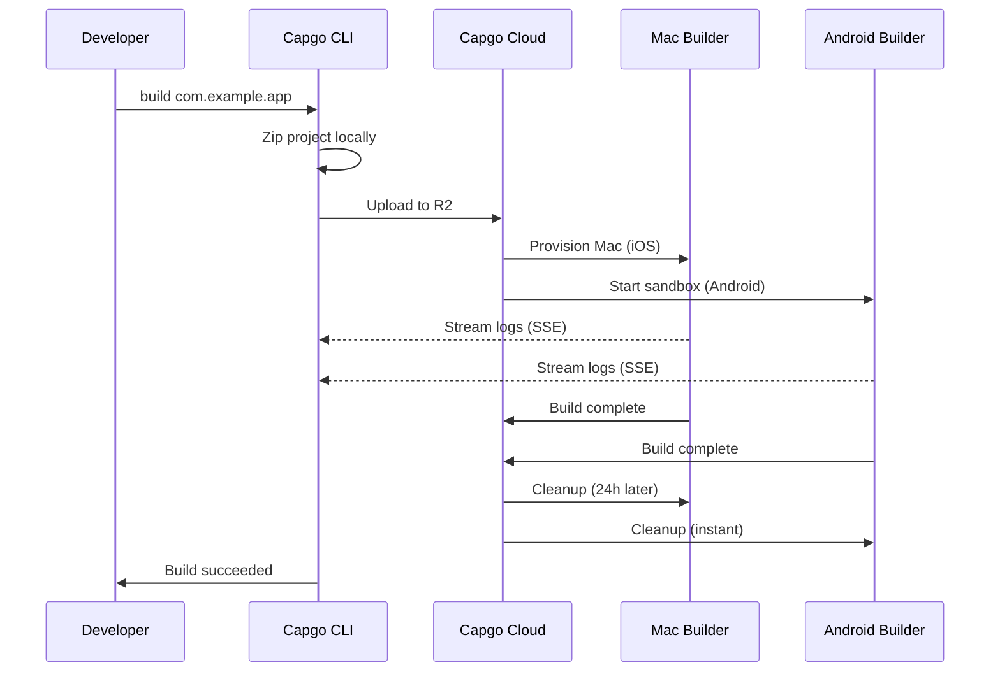

import { Card, CardGrid } from '@astrojs/starlight/components';

🏗️ Construction Natif mobile apps in the cloud and automatically Soumettre them to the Application Store and Play Store.

## Aperçu

The `build` command allows you to build your Capacitor app for iOS and Android in Capgo's cloud infrastructure, similar to how Expo handles builds. Your app is built on dedicated infrastructure and can be automatically submitted to the app stores.

**Current Status:** Public Beta

## Why Use Cloud Construction?

Construction Natif mobile apps traditionally requires:
- **Mac hardware** for iOS builds ($1000+ or expensive CI minutes)
- **Complex CI/CD** Configuration with caching and credentials
- **Maintenance overhead** for Xcode, Android Studio, and SDKs

With Capgo Cloud Construction, you get:
- ✅ **No Mac required** - Construction iOS apps from any machine
- ✅ **Zero Configuration** - No CI/CD Configuration needed
- ✅ **Battle-tested** - Built on 3 years of internal Production use
- ✅ **Secure** - No Journal storage, automatic cleanup
- ✅ **Natif-only** - Your JavaScript stays private

## Démarrage rapide

```bash
npx @capgo/cli@latest build com.example.app
```

That's it! Your Application will be built in the cloud and you'll see real-time Journaux.

## Documentation Sections

<CardGrid>
  <Card title="⚠️ Setup Credentials FIRST" icon="warning">
    **Required before building:** Save your iOS/Android credentials locally.

    [Configuration Credentials →](/docs/CLI/cloud-Construction/credentials/)
  </Card>

  <Card title="Getting Started" icon="rocket">
    Créer your first Natif Construction in minutes.

    [Read Guide →](/docs/CLI/cloud-Construction/getting-started/)
  </Card>

  <Card title="iOS Builds" icon="seti:apple">
    Configure certificates and Construction for Application Store.

    [Configure iOS →](/docs/CLI/cloud-Construction/iOS/)
  </Card>

  <Card title="Android Builds" icon="seti:android">
    Set up keystores and Construction for Play Store.

    [Configure Android →](/docs/CLI/cloud-Construction/Android/)
  </Card>

  <Card title="Troubleshooting" icon="warning">
    Solutions to common Construction issues.

    [Get Aide →](/docs/CLI/cloud-Construction/Dépannage/)
  </Card>
</CardGrid>

## Commande Référence

### Basic Utilisation

```bash
npx @capgo/cli@latest build [appId] [options]
```

### Exemples

Construction for both platforms:
```bash
npx @capgo/cli@latest build com.example.app
```

Construction for iOS only:
```bash
npx @capgo/cli@latest build com.example.app --platform ios
```

Construction for Android in Débogage mode:
```bash
npx @capgo/cli@latest build com.example.app --platform android --build-mode debug
```

Construction from a specific directory:
```bash
npx @capgo/cli@latest build com.example.app --path ./my-app
```

### Options

| Option | Type | Default | Description |
|--------|------|---------|-------------|
| `appId` | string | capacitor.config | Application ID (e.g., com.example.app) |
| `--path <path>` | string | Current directory | Path to your project directory |
| `--platform <platform>` | string | both | Target platform: `ios`, `android`, or `both` |
| `--build-mode <mode>` | string | release | Build mode: `debug` or `release` |
| `--build-config <config>` | string | - | Additional build configuration as JSON string |
| `-a, --apikey <apikey>` | string | - | API key (or use `CAPGO_TOKEN` env var) |
| `--supa-host <url>` | string | https://api.capgo.app | Custom Supabase host URL |
| `--supa-anon <key>` | string | - | Custom Supabase anon key |

## How It Works



### Construction Process

1. **Local Preparation** - Your project is zipped locally (excluding `node_modules`, dotfiles)
2. **Télécharger** - Zip file uploaded to secure cloud storage (Cloudflare R2)
3. **Construction Execution**:
   - **iOS**: Dedicated Mac machine provisioned, Fastlane builds and signs
   - **Android**: Secure sandbox created, Gradle compiles and signs
4. **Journal Streaming** - Real-time Journaux via Server-Sent Events (not stored!)
5. **Automatic Cleanup**:
   - **iOS**: Files deleted after 24 hours when machine is dismissed
   - **Android**: Everything deleted instantly after Construction

## Our Expertise

Capgo Cloud Construction isn't Nouveau infrastructure - we've been using it internally for **3 years**:

- ✅ **Custom Fastlane** - Built specifically for Capacitor apps
- ✅ **Thousands of builds** - Battle-tested in Production
- ✅ **Capacitor experts** - Deep knowledge of what matters
- ✅ **Natif-only focus** - Your JavaScript never touches our servers

## Sécurité & Privacy

- **No Journal storage** - Journaux only stream to your Terminal, never saved
- **No artifact storage** - Apps sent directly to Application Store/Play Store, we keep nothing
- **Credentials auto-deleted** - Used only during Construction, deleted after (max 24h)
- **Isolated builds** - Each Construction runs in isolation
- **Your code stays yours** - We only Construction Natif parts, JavaScript stays local

## CI/CD Integration

Works everywhere - GitHub Actions, GitLab CI, or any CI/CD platform:

```yaml
- name: Build native app
  env:
    CAPGO_TOKEN: ${{ secrets.CAPGO_TOKEN }}
  run: |
    npm run build
    npx cap sync
    npx @capgo/cli@latest build com.example.app \
      --platform both \
      --build-mode release
```

No need for:
- Mac runners
- Android SDK Installation
- Xcode Installation
- Complex caching
- Credential management

## Pricing

Construction time is billed based on actual Utilisation:

- **Android**: 1× multiplier (~$0.XX per minute)
- **iOS**: 2× multiplier (~$0.XX per minute, due to Mac hardware)

**Typical costs:**
- Android Débogage: 3 min × 1× = ~$X.XX
- iOS Libération: 7 min × 2× = ~$X.XX

Only pay for what you use. No minimums, no surprises.

## Comparison to Other Solutions

| Fonctionnalité | Capgo Cloud Construction | GitHub Actions (Mac) | Expo EAS |
|---------|------------------|---------------------|----------|
| **Mac required locally** | ❌ No | ✅ Yes | ❌ No |
| **Configuration complexity** | ⭐ Single Commande | ⭐⭐⭐ Complex YAML | ⭐⭐ Config files |
| **Capacitor Natif** | ✅ Optimized | ⚠️ Generic | ❌ Expo only |
| **Your code privacy** | ✅ Never stored | ⚠️ In runners | ⚠️ Uploaded |
| **Cost (iOS)** | 💰 2× base | 💰💰💰 10× expensive | 💰💰 Premium |

## What Gets Built

**Important:** Capgo builds **native parts only**.

✅ **We Construction:**
- iOS Natif code (Swift, Objective-C, Xcode projects)
- Android Natif code (Java, Kotlin, Gradle projects)
- Code signing and Application Store submission

❌ **You Construction (locally):**
- JavaScript, HTML, CSS (`npm run build`)
- Capacitor sync (`npx cap sync`)
- Your web assets

This separation ensures:
- **Better Sécurité** - Your Application logic stays private
- **Faster builds** - No duplicate web builds
- **Clear responsibility** - You control your code

## Limitations

Current limitations during public Bêta:

- **Construction timeout**: 10 minutes maximum
- **Télécharger timeout**: 1 hour for Télécharger URL
- **iOS machine**: 24-hour lease requirement, Construction on Mac will enqueue to ensure optimal Utilisation
- **Access**: Public Bêta only

## Get Started

Ready to Construction without the hassle?

<CardGrid>
  <Card title="Create Your First Build" icon="rocket">
    Step-by-step Guide to your first cloud Construction.

    [Get started →](/docs/CLI/cloud-Construction/getting-started/)
  </Card>

  <Card title="Join Public Beta" icon="star">
    Cloud Construction is in public Bêta. Join our Communauté to get access.

    [Join Discord →](https://discord.com/invite/VnYRvBfgA6)
  </Card>
</CardGrid>

## Learn More

- [Commencer Guide](/docs/CLI/cloud-Construction/getting-started/) - Créer your first Construction
- [iOS Configuration](/docs/CLI/cloud-Construction/iOS/) - Set up iOS builds
- [Android Configuration](/docs/CLI/cloud-Construction/Android/) - Set up Android builds
- [Dépannage](/docs/CLI/cloud-Construction/Dépannage/) - Problèmes courants and Solutions
- [Blog: Introducing Cloud Construction](/blog/introducing-capgo-cloud-Construction/) - Fonctionnalité announcement

## Need Aide?

- 📚 [Dépannage Guide](/docs/CLI/cloud-Construction/Dépannage/)
- 💬 [Discord Communauté](https://discord.com/invite/VnYRvBfgA6)
- 📧 Email: Support@capgo.Application
