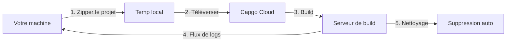

import { Steps, Card, CardGrid } from '@astrojs/starlight/components';

Commencez avec Capgo Cloud Build et créez votre premier build natif iOS ou Android en quelques minutes.

## Ce dont vous aurez besoin

Avant de commencer, assurez-vous d'avoir :

- Une application Capacitor qui compile avec succès localement
- Node.js 20 ou supérieur installé
- Un compte Capgo avec un abonnement actif
- Votre application déjà enregistrée dans Capgo (exécutez `npx @capgo/cli@latest app add` si ce n'est pas le cas)
- **Identifiants de build configurés** (certificats, keystores) - voir ci-dessous

## Avant votre premier build

<CardGrid>
  <Card title="⚠️ Configurez d'abord les identifiants" icon="warning">
    **Requis avant de compiler :** Vous devez configurer vos identifiants de build (certificats pour iOS, keystores pour Android).

    [Configurer les identifiants →](/docs/cli/cloud-build/credentials/)
  </Card>
</CardGrid>

## Démarrage rapide

<Steps>

1. **Configurer les identifiants de build**

   Avant de pouvoir compiler, vous devez enregistrer vos identifiants localement :

   **Pour iOS :**
   ```bash
   npx @capgo/cli build credentials save \
     --platform ios \
     --certificate ./cert.p12 \
     --p12-password "password" \
     --provisioning-profile ./profile.mobileprovision \
     --apple-key ./AuthKey.p8 \
     --apple-key-id "KEY123" \
     --apple-issuer-id "issuer-uuid" \
     --apple-team-id "team-id"
   ```

   **Pour Android :**
   ```bash
   npx @capgo/cli build credentials save \
     --platform android \
     --keystore ./release.keystore \
     --keystore-alias "my-key" \
     --keystore-key-password "key-pass" \
     --keystore-store-password "store-pass"
   ```

   Consultez le [guide complet des identifiants](/docs/cli/cloud-build/credentials/) pour plus de détails.

2. **Vérifier le build local**

   D'abord, assurez-vous que votre application compile localement sans erreurs :

   ```bash
   # Compiler vos assets web
   npm run build

   # Synchroniser avec Capacitor
   npx cap sync

   # Tester le build local (optionnel mais recommandé)
   npx cap open ios    # Pour iOS
   npx cap open android # Pour Android
   ```

3. **S'authentifier avec Capgo**

   Définissez votre clé API Capgo (si ce n'est pas déjà fait) :

   ```bash
   npx @capgo/cli@latest login
   ```

   Ou définissez la variable d'environnement :
   ```bash
   export CAPGO_TOKEN=votre_clé_api_ici
   ```

4. **Exécuter votre premier build**

   Commencez avec un build de débogage Android (le plus rapide à tester) :

   ```bash
   npx @capgo/cli@latest build com.example.app \
     --platform android \
     --build-mode debug
   ```

   Vous verrez les logs en temps réel au fur et à mesure de la progression de votre build :
   ```
   ✔ Création du job de build...
   ✔ Téléversement du projet (15.2 MB)...
   ✔ Build démarré

   📝 Logs de build :
   → Installation des dépendances...
   → Exécution du build Gradle...
   → Signature de l'APK...
   ✔ Build réussi en 3m 42s
   ```

5. **Vérifier le statut du build**

   Le CLI interrogera et affichera automatiquement le statut du build. Une fois terminé, vous verrez :

   - Temps de build
   - Statut de succès/échec
   - Application soumise à l'App Store/Play Store (si les identifiants sont configurés)

</Steps>

## Comprendre le processus de build

Lorsque vous exécutez la commande de build, voici ce qui se passe :



1. **Préparation locale** - Votre projet est zippé (en excluant `node_modules` et les fichiers dotfiles)
2. **Téléversement** - Le zip est téléversé vers un stockage cloud sécurisé (Cloudflare R2)
3. **Exécution du build** - Votre application est compilée sur une infrastructure dédiée
4. **Flux de logs** - Les logs en temps réel sont diffusés vers votre terminal via Server-Sent Events
5. **Nettoyage automatique** - Les artefacts de build sont supprimés (Android : instantané, iOS : 24 heures)

## Votre premier build de production

Une fois que vous avez vérifié que le processus fonctionne, créez un build de production :

### Android

```bash
npx @capgo/cli@latest build com.example.app \
  --platform android \
  --build-mode release
```

Vous devrez d'abord configurer les identifiants de signature. Voir [Configuration des builds Android](/docs/cli/cloud-build/android/).

### iOS

```bash
npx @capgo/cli@latest build com.example.app \
  --platform ios \
  --build-mode release
```

Les builds iOS nécessitent des certificats de signature et des profils de provisionnement. Voir [Configuration des builds iOS](/docs/cli/cloud-build/ios/).

## Ce qui est compilé

**Important :** Capgo Cloud Build compile uniquement les **parties natives** de votre application (code natif iOS et Android).

Vous êtes responsable de :
- Compiler vos assets web (`npm run build`)
- Exécuter `npx cap sync` avant le build
- S'assurer que toutes les dépendances sont dans `package.json`

Nous gérons :
- Compilation native iOS (Xcode, Fastlane)
- Compilation native Android (Gradle)
- Signature du code
- Soumission à l'app store (si configurée)

## Temps et coûts de build

Le temps de build est mesuré du début à la fin :

- **Android** : Typiquement 3-5 minutes (multiplicateur de facturation 1×)
- **iOS** : Typiquement 5-10 minutes (multiplicateur de facturation 2× en raison des coûts du matériel Mac)

Vous ne payez que pour le temps de build réellement utilisé. Pas de frais cachés.

## Cas d'utilisation courants

### Intégration CI/CD

Ajoutez à votre workflow GitHub Actions :

```yaml
- name: Build native app
  env:
    CAPGO_TOKEN: ${{ secrets.CAPGO_TOKEN }}
  run: |
    npm run build
    npx cap sync
    npx @capgo/cli@latest build ${{ secrets.APP_ID }} \
      --platform both \
      --build-mode release
```

### Développement local

Testez les builds localement avant de committer :

```bash
# Build de débogage rapide pour les tests
npm run build && npx cap sync
npx @capgo/cli@latest build com.example.app \
  --platform android \
  --build-mode debug
```

### Builds multi-plateformes

Compilez pour les deux plateformes simultanément :

```bash
npx @capgo/cli@latest build com.example.app \
  --platform both \
  --build-mode release
```

## Prochaines étapes

Maintenant que vous avez créé votre premier build :

- [Configurer les builds iOS](/docs/cli/cloud-build/ios/) - Configurer les certificats et profils
- [Configurer les builds Android](/docs/cli/cloud-build/android/) - Configurer les keystores et le Play Store
- [Dépannage](/docs/cli/cloud-build/troubleshooting/) - Problèmes courants et solutions
- [Référence CLI](/docs/cli/reference/build/) - Documentation complète des commandes

## Besoin d'aide ?

- Consultez le [guide de dépannage](/docs/cli/cloud-build/troubleshooting/)
- Rejoignez notre [communauté Discord](https://discord.com/invite/VnYRvBfgA6)
- Envoyez un email au support à support@capgo.app
