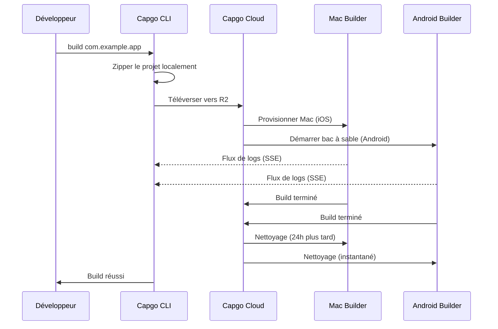

import { Card, CardGrid } from '@astrojs/starlight/components';

🏗️ Compilez des applications mobiles natives dans le cloud et soumettez-les automatiquement à l'App Store et au Play Store.

## Vue d'ensemble

La commande `build` vous permet de compiler votre application Capacitor pour iOS et Android dans l'infrastructure cloud de Capgo, de manière similaire à la façon dont Expo gère les builds. Votre application est compilée sur une infrastructure dédiée et peut être automatiquement soumise aux app stores.

**Statut actuel :** Bêta publique

## Pourquoi utiliser Cloud Build ?

Traditionnellement, compiler des applications mobiles natives nécessite :
- **Du matériel Mac** pour les builds iOS (1000$+ ou des minutes CI coûteuses)
- **Une configuration CI/CD complexe** avec mise en cache et identifiants
- **Une maintenance importante** pour Xcode, Android Studio et les SDK

Avec Capgo Cloud Build, vous obtenez :
- ✅ **Pas de Mac requis** - Compilez des applications iOS depuis n'importe quelle machine
- ✅ **Zéro configuration** - Aucune configuration CI/CD nécessaire
- ✅ **Éprouvé au combat** - Construit sur 3 ans d'utilisation interne en production
- ✅ **Sécurisé** - Pas de stockage de logs, nettoyage automatique
- ✅ **Focus natif uniquement** - Votre JavaScript reste privé

## Démarrage rapide

```bash
npx @capgo/cli@latest build com.example.app
```

C'est tout ! Votre application sera compilée dans le cloud et vous verrez les logs en temps réel.

## Sections de documentation

<CardGrid>
  <Card title="⚠️ Configurez d'abord les identifiants" icon="warning">
    **Requis avant de compiler :** Enregistrez vos identifiants iOS/Android localement.

    [Configurer les identifiants →](/docs/cli/cloud-build/credentials/)
  </Card>

  <Card title="Commencer" icon="rocket">
    Créez votre premier build natif en quelques minutes.

    [Lire le guide →](/docs/cli/cloud-build/getting-started/)
  </Card>

  <Card title="Builds iOS" icon="seti:apple">
    Configurez les certificats et compilez pour l'App Store.

    [Configurer iOS →](/docs/cli/cloud-build/ios/)
  </Card>

  <Card title="Builds Android" icon="seti:android">
    Configurez les keystores et compilez pour le Play Store.

    [Configurer Android →](/docs/cli/cloud-build/android/)
  </Card>

  <Card title="Dépannage" icon="warning">
    Solutions aux problèmes de build courants.

    [Obtenir de l'aide →](/docs/cli/cloud-build/troubleshooting/)
  </Card>
</CardGrid>

## Référence de commande

### Utilisation de base

```bash
npx @capgo/cli@latest build [appId] [options]
```

### Exemples

Compiler pour les deux plateformes :
```bash
npx @capgo/cli@latest build com.example.app
```

Compiler uniquement pour iOS :
```bash
npx @capgo/cli@latest build com.example.app --platform ios
```

Compiler pour Android en mode debug :
```bash
npx @capgo/cli@latest build com.example.app --platform android --build-mode debug
```

Compiler depuis un répertoire spécifique :
```bash
npx @capgo/cli@latest build com.example.app --path ./my-app
```

### Options

| Option | Type | Défaut | Description |
|--------|------|---------|-------------|
| `appId` | string | capacitor.config | ID de l'application (par ex., com.example.app) |
| `--path <path>` | string | Répertoire actuel | Chemin vers le répertoire de votre projet |
| `--platform <platform>` | string | both | Plateforme cible : `ios`, `android` ou `both` |
| `--build-mode <mode>` | string | release | Mode de build : `debug` ou `release` |
| `--build-config <config>` | string | - | Configuration de build supplémentaire en chaîne JSON |
| `-a, --apikey <apikey>` | string | - | Clé API (ou utilisez la variable d'env `CAPGO_TOKEN`) |
| `--supa-host <url>` | string | https://api.capgo.app | URL hôte Supabase personnalisée |
| `--supa-anon <key>` | string | - | Clé anon Supabase personnalisée |

## Comment ça fonctionne



### Processus de build

1. **Préparation locale** - Votre projet est zippé localement (en excluant `node_modules`, dotfiles)
2. **Téléversement** - Fichier zip téléversé vers un stockage cloud sécurisé (Cloudflare R2)
3. **Exécution du build** :
   - **iOS** : Machine Mac dédiée provisionnée, Fastlane compile et signe
   - **Android** : Bac à sable sécurisé créé, Gradle compile et signe
4. **Flux de logs** - Logs en temps réel via Server-Sent Events (non stockés !)
5. **Nettoyage automatique** :
   - **iOS** : Fichiers supprimés après 24 heures quand la machine est renvoyée
   - **Android** : Tout est supprimé instantanément après le build

## Notre expertise

Capgo Cloud Build n'est pas une nouvelle infrastructure - nous l'utilisons en interne depuis **3 ans** :

- ✅ **Fastlane personnalisé** - Construit spécifiquement pour les applications Capacitor
- ✅ **Des milliers de builds** - Éprouvé au combat en production
- ✅ **Experts Capacitor** - Connaissance approfondie de ce qui compte
- ✅ **Focus natif uniquement** - Votre JavaScript ne touche jamais nos serveurs

## Sécurité et confidentialité

- **Pas de stockage de logs** - Les logs ne font que diffuser vers votre terminal, jamais sauvegardés
- **Pas de stockage d'artefacts** - Les applications sont envoyées directement à l'App Store/Play Store, nous ne gardons rien
- **Identifiants auto-supprimés** - Utilisés uniquement pendant le build, supprimés après (max 24h)
- **Builds isolés** - Chaque build s'exécute dans l'isolation
- **Votre code reste le vôtre** - Nous compilons uniquement les parties natives, JavaScript reste local

## Intégration CI/CD

Fonctionne partout - GitHub Actions, GitLab CI ou toute plateforme CI/CD :

```yaml
- name: Build native app
  env:
    CAPGO_TOKEN: ${{ secrets.CAPGO_TOKEN }}
  run: |
    npm run build
    npx cap sync
    npx @capgo/cli@latest build com.example.app \
      --platform both \
      --build-mode release
```

Pas besoin de :
- Runners Mac
- Installation Android SDK
- Installation Xcode
- Mise en cache complexe
- Gestion des identifiants

## Tarification

Le temps de build est facturé selon l'utilisation réelle :

- **Android** : Multiplicateur 1× (~$0.XX par minute)
- **iOS** : Multiplicateur 2× (~$0.XX par minute, dû au matériel Mac)

**Coûts typiques :**
- Debug Android : 3 min × 1× = ~$X.XX
- Release iOS : 7 min × 2× = ~$X.XX

Ne payez que ce que vous utilisez. Pas de minimums, pas de surprises.

## Comparaison avec d'autres solutions

| Fonctionnalité | Capgo Cloud Build | GitHub Actions (Mac) | Expo EAS |
|---------|------------------|---------------------|----------|
| **Mac requis localement** | ❌ Non | ✅ Oui | ❌ Non |
| **Complexité de configuration** | ⭐ Commande unique | ⭐⭐⭐ YAML complexe | ⭐⭐ Fichiers de config |
| **Natif Capacitor** | ✅ Optimisé | ⚠️ Générique | ❌ Expo uniquement |
| **Confidentialité de votre code** | ✅ Jamais stocké | ⚠️ Dans les runners | ⚠️ Téléversé |
| **Coût (iOS)** | 💰 Base 2× | 💰💰💰 10× coûteux | 💰💰 Premium |

## Ce qui est compilé

**Important :** Capgo compile **uniquement les parties natives**.

✅ **Nous compilons :**
- Code natif iOS (Swift, Objective-C, projets Xcode)
- Code natif Android (Java, Kotlin, projets Gradle)
- Signature du code et soumission à l'app store

❌ **Vous compilez (localement) :**
- JavaScript, HTML, CSS (`npm run build`)
- Synchronisation Capacitor (`npx cap sync`)
- Vos assets web

Cette séparation assure :
- **Meilleure sécurité** - Votre logique d'application reste privée
- **Builds plus rapides** - Pas de builds web en double
- **Responsabilité claire** - Vous contrôlez votre code

## Limitations

Limitations actuelles pendant la bêta publique :

- **Timeout de build** : 10 minutes maximum
- **Timeout de téléversement** : 1 heure pour l'URL de téléversement
- **Machine iOS** : Exigence de bail de 24 heures, le build sur Mac sera mis en file d'attente pour assurer une utilisation optimale
- **Accès** : Bêta publique uniquement

## Commencer

Prêt à compiler sans tracas ?

<CardGrid>
  <Card title="Créer votre premier build" icon="rocket">
    Guide étape par étape pour votre premier build cloud.

    [Commencer →](/docs/cli/cloud-build/getting-started/)
  </Card>

  <Card title="Rejoindre la bêta publique" icon="star">
    Cloud Build est en bêta publique. Rejoignez notre communauté pour obtenir un accès.

    [Rejoindre Discord →](https://discord.com/invite/VnYRvBfgA6)
  </Card>
</CardGrid>

## En savoir plus

- [Guide de démarrage](/docs/cli/cloud-build/getting-started/) - Créer votre premier build
- [Configuration iOS](/docs/cli/cloud-build/ios/) - Configurer les builds iOS
- [Configuration Android](/docs/cli/cloud-build/android/) - Configurer les builds Android
- [Dépannage](/docs/cli/cloud-build/troubleshooting/) - Problèmes courants et solutions
- [Blog : Présentation de Cloud Build](/blog/introducing-capgo-cloud-build/) - Annonce de la fonctionnalité

## Besoin d'aide ?

- 📚 [Guide de dépannage](/docs/cli/cloud-build/troubleshooting/)
- 💬 [Communauté Discord](https://discord.com/invite/VnYRvBfgA6)
- 📧 Email : support@capgo.app
