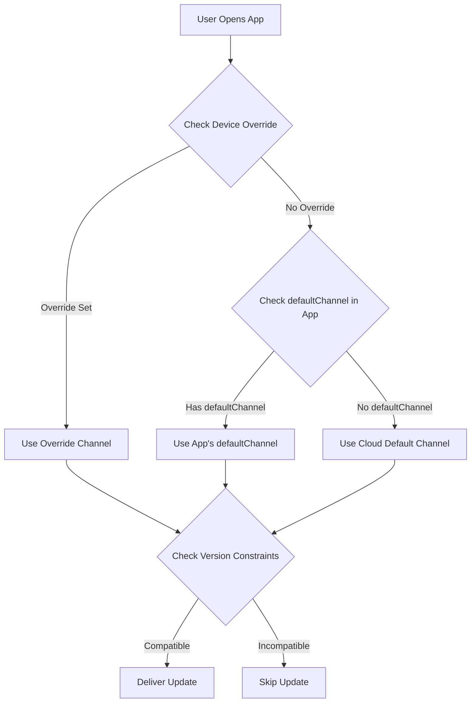

import { Aside } from '@astrojs/starlight/components';

Ce guide explique comment livrer automatiquement le dernier bundle compatible aux utilisateurs en fonction de leur version d'application native, **similaire à l'approche d'Ionic AppFlow**. Cela garantit une gestion simplifiée des mises à jour et des déploiements plus rapides tout en évitant les problèmes de compatibilité.

<Aside type="tip" title="Migration depuis Ionic AppFlow ?">
  Si vous migrez depuis Ionic AppFlow, ce guide est particulièrement important pour vous. AppFlow associait automatiquement les mises à jour aux versions natives, et Capgo fournit la même capacité avec encore plus de contrôle et de flexibilité. Consultez le [Guide de Migration AppFlow](/docs/upgrade/from-appflow-to-capgo) pour les instructions étape par étape.
</Aside>

## Aperçu

Le système de ciblage des versions de Capgo vous permet de :

- **Livrer automatiquement des mises à jour compatibles** aux utilisateurs en fonction de leur version d'application native
- **Prévenir les changements brisants** d'atteindre les versions d'application incompatibles
- **Gérer plusieurs versions d'applications** simultanément sans logique complexe
- **Déployer les mises à jour de manière fluide** pour des segments d'utilisateurs spécifiques

### Pourquoi le Ciblage des Versions est Important (Particulièrement pour les Utilisateurs d'AppFlow)

Si vous êtes familier avec **Ionic AppFlow**, vous savez à quel point il est crucial de vous assurer que les utilisateurs reçoivent uniquement des mises à jour compatibles. AppFlow associait automatiquement les bundles de mise à jour en direct aux versions d'applications natives, évitant que JavaScript incompatible ne soit livré au code natif plus ancien.

**Capgo fournit les mêmes garanties de sécurité**, avec des fonctionnalités supplémentaires :
- Contrôle plus granulaire sur la correspondance des versions
- Plusieurs stratégies (canaux, semver, contraintes natives)
- Meilleure visibilité dans la distribution des versions
- Contrôle via API et CLI aux côtés de la gestion du tableau de bord

Cette approche est particulièrement utile quand :
- Vous avez des utilisateurs sur différentes versions principales de votre application (par exemple, v1.x, v2.x, v3.x)
- Vous devez maintenir la compatibilité descendante tout en déployant des changements brisants
- Vous souhaitez empêcher les bundles plus nouveaux de casser le code natif plus ancien
- Vous migrez progressivement les utilisateurs d'une version à une autre
- **Vous migrez depuis AppFlow** et souhaitez maintenir la même sécurité de mise à jour

## Comment Cela Fonctionne

Capgo utilise une approche multicouche pour faire correspondre les utilisateurs aux mises à jour compatibles :

1. **Contraintes de Version Natives** : Empêchez les bundles d'être livrés aux versions natives incompatibles
2. **Routage Basé sur les Canaux** : Routez différentes versions d'applications vers différents canaux de mise à jour
3. **Contrôles de Versioning Sémantique** : Bloquez automatiquement les mises à jour au-delà des limites majeure/mineure/correctif
4. **Remplacements au Niveau de l'Appareil** : Ciblez des appareils spécifiques ou des groupes d'utilisateurs

### Flux de Correspondance des Versions



## Stratégie 1 : Routage des Versions Basé sur les Canaux

Ceci est l'**approche recommandée** pour gérer les changements brisants et les mises à jour de versions principales. Elle est similaire au modèle de livraison d'AppFlow.

### Scénario Exemple

- **App v1.x** (100 000 utilisateurs) → canal `production`
- **App v2.x** (50 000 utilisateurs avec changements brisants) → canal `v2`
- **App v3.x** (10 000 utilisateurs bêta) → canal `v3`

### Mise en œuvre

#### Étape 1 : Configurer les Canaux pour Chaque Version Principale

```typescript
// capacitor.config.ts pour les builds version 1.x
import { CapacitorConfig } from '@capacitor/cli';

const config: CapacitorConfig = {
  appId: 'com.example.app',
  appName: 'Example App',
  plugins: {
    CapacitorUpdater: {
      autoUpdate: true,
      defaultChannel: 'production', // ou omis pour défaut
    }
  }
};

export default config;
```

```typescript
// capacitor.config.ts pour les builds version 2.x
const config: CapacitorConfig = {
  appId: 'com.example.app',
  appName: 'Example App',
  plugins: {
    CapacitorUpdater: {
      autoUpdate: true,
      defaultChannel: 'v2', // Oriente automatiquement les utilisateurs de v2
    }
  }
};
```

```typescript
// capacitor.config.ts pour les builds version 3.x
const config: CapacitorConfig = {
  appId: 'com.example.app',
  appName: 'Example App',
  plugins: {
    CapacitorUpdater: {
      autoUpdate: true,
      defaultChannel: 'v3', // Oriente automatiquement les utilisateurs de v3
    }
  }
};
```

#### Étape 2 : Créer des Canaux

```bash
# Créer des canaux pour chaque version principale
npx @capgo/cli channel create production
npx @capgo/cli channel create v2
npx @capgo/cli channel create v3

# Activer l'auto-affectation pour que les applications puissent changer de canal
npx @capgo/cli channel set production --self-assign
npx @capgo/cli channel set v2 --self-assign
npx @capgo/cli channel set v3 --self-assign
```

#### Étape 3 : Télécharger les Bundles Spécifiques à la Version

```bash
# Pour les utilisateurs de v1.x (depuis la branche v1-maintenance)
git checkout v1-maintenance
npm run build
npx @capgo/cli bundle upload --channel production

# Pour les utilisateurs de v2.x (depuis la branche v2-maintenance ou main)
git checkout main
npm run build
npx @capgo/cli bundle upload --channel v2

# Pour les utilisateurs de v3.x (depuis la branche bêta/v3)
git checkout beta
npm run build
npx @capgo/cli bundle upload --channel v3
```

<Aside type="tip" title="Routage Automatique">
  Quand les utilisateurs ouvrent l'application, ils se connectent automatiquement à leur canal désigné en fonction du `defaultChannel` dans leur bundle d'application installé. Aucun changement de code JavaScript requis !
</Aside>

### Avantages

- **Zéro changement de code** - Le routage de canal se fait automatiquement
- **Séparation claire** - Chaque version a son propre pipeline de mise à jour
- **Ciblage flexible** - Poussez les mises à jour vers des groupes de versions spécifiques
- **Déploiements sécurisés** - Les changements brisants ne parviennent jamais aux versions incompatibles

## Stratégie 2 : Contrôles de Versioning Sémantique

Utilisez les contrôles de versioning sémantique intégrés de Capgo pour empêcher les mises à jour au-delà des limites de version.

### Désactiver la Mise à Jour Automatique à Travers les Versions Principales

```bash
# Créer un canal qui bloque les mises à jour de version majeure
npx @capgo/cli channel create stable --disable-auto-update major
```

Cette configuration signifie :
- Les utilisateurs sur la version d'application **1.2.3** recevront les mises à jour jusqu'à **1.9.9**
- Les utilisateurs ne recevront **PAS** la version **2.0.0** automatiquement
- Empêche les changements brisants d'atteindre le code natif plus ancien

### Options de Contrôle Granulaire

```bash
# Bloquer les mises à jour de version mineure (1.2.x n'obtient pas 1.3.0)
npx @capgo/cli channel set stable --disable-auto-update minor

# Bloquer les mises à jour de correctif (1.2.3 n'obtient pas 1.2.4)
npx @capgo/cli channel set stable --disable-auto-update patch

# Permettre toutes les mises à jour
npx @capgo/cli channel set stable --disable-auto-update none
```

<Aside type="caution" title="Versioning Sémantique Requis">
  Cette stratégie ne fonctionne que si vous suivez le versioning sémantique (semver) pour vos versions d'application. Assurez-vous que vos numéros de version suivent le format `MAJEURE.MINEURE.CORRECTIF`.
</Aside>

## Stratégie 3 : Contraintes de Version Natives

Spécifiez les exigences de version native minimales pour les bundles afin d'empêcher la livraison aux appareils incompatibles.

### Utilisation de la Condition de Délai nativeVersion

Lors du téléchargement d'un bundle, vous pouvez spécifier une version native minimale :

```bash
# Ce bundle nécessite la version native 2.0.0 ou supérieure
npx @capgo/cli bundle upload \
  --channel production \
  --native-version "2.0.0"
```

<Aside type="note" title="Comment Cela Fonctionne">
  Les appareils sur la version native 1.x ne recevront PAS ce bundle. Seuls les appareils sur 2.0.0+ l'obtiendront. C'est parfait pour les mises à jour nécessitant de nouvelles API natives ou des plugins.
</Aside>

### Cas d'Utilisation

1. **Nouveau Plugin Natif Requis**
   ```bash
   # Le bundle a besoin du plugin Camera ajouté en v2.0.0
   npx @capgo/cli bundle upload --native-version "2.0.0"
   ```

2. **Changements d'API Native Brisants**
   ```bash
   # Le bundle utilise les nouvelles API Capacitor 6
   npx @capgo/cli bundle upload --native-version "3.0.0"
   ```

3. **Migration Progressive**
   ```bash
   # Testez le bundle uniquement sur la dernière version native
   npx @capgo/cli bundle upload \
     --channel beta \
     --native-version "2.5.0"
   ```

## Stratégie 4 : Prévention de la Rétrogradation Automatique

Empêchez les utilisateurs de recevoir des bundles plus anciens que leur version native actuelle.

### Activez dans les Paramètres du Canal

Dans le tableau de bord Capgo :
1. Allez à **Canaux** → Sélectionnez votre canal
2. Activez **"Désactiver la rétrogradation automatique sous native"**
3. Enregistrez les modifications

Ou via CLI :
```bash
npx @capgo/cli channel set production --disable-downgrade
```

### Exemple

- Version de l'appareil de l'utilisateur : Version native **1.2.5**
- Bundle de canal : Version **1.2.3**
- **Résultat** : La mise à jour est bloquée (serait une rétrogradation)

Ceci est utile quand :
- Les utilisateurs ont installé manuellement une version plus récente depuis l'app store
- Vous devez vous assurer que les utilisateurs ont toujours les derniers correctifs de sécurité
- Vous voulez prévenir les bugs de régression

## Stratégie 5 : Ciblage au Niveau de l'Appareil

Remplacez l'affectation de canal pour des appareils spécifiques ou des groupes d'utilisateurs.

### Forcer une Version Spécifique pour les Tests

```typescript
import { CapacitorUpdater } from '@capgo/capacitor-updater'

// Forcer les testeurs bêta à utiliser le canal v3
async function assignBetaTesters() {
  const deviceId = await CapacitorUpdater.getDeviceId()

  // Vérifiez si l'utilisateur est testeur bêta
  if (isBetaTester(userId)) {
    await CapacitorUpdater.setChannel({ channel: 'v3' })
  }
}
```

### Remplacement d'Appareil du Tableau de Bord

Dans le tableau de bord Capgo :
1. Allez à **Appareils** → Trouvez l'appareil
2. Cliquez sur **Définir le Canal** ou **Définir la Version**
3. Remplacez par un canal ou une version de bundle spécifique
4. L'appareil recevra les mises à jour de la source remplacée

<Aside type="tip" title="Test des Mises à Jour">
  Utilisez les remplacements d'appareil pour tester les mises à jour sur votre propre appareil avant de déployer à tous les utilisateurs.
</Aside>

## Flux de Travail Complet de Style AppFlow

Voici un exemple complet combinant toutes les stratégies :

### 1. Configuration Initiale (App v1.0.0)

```bash
# Créer un canal de production avec contrôles semver
npx @capgo/cli channel create production \
  --disable-auto-update major \
  --disable-downgrade
```

```typescript
// capacitor.config.ts
const config: CapacitorConfig = {
  plugins: {
    CapacitorUpdater: {
      autoUpdate: true,
      defaultChannel: 'production',
    }
  }
};
```

### 2. Déployer un Changement Brisante (App v2.0.0)

```bash
# Créer un canal v2 pour la nouvelle version
npx @capgo/cli channel create v2 \
  --disable-auto-update major \
  --disable-downgrade \
  --self-assign

# Créer une branche git pour la maintenance v1
git checkout -b v1-maintenance
git push origin v1-maintenance
```

```typescript
// capacitor.config.ts pour v2.0.0
const config: CapacitorConfig = {
  plugins: {
    CapacitorUpdater: {
      autoUpdate: true,
      defaultChannel: 'v2', // Les nouveaux utilisateurs obtiennent le canal v2
    }
  }
};
```

### 3. Pousser les Mises à Jour pour les Deux Versions

```bash
# Mettre à jour les utilisateurs de v1.x (correction de bug)
git checkout v1-maintenance
# Effectuer les modifications
npx @capgo/cli bundle upload \
  --channel production \
  --native-version "1.0.0"

# Mettre à jour les utilisateurs de v2.x (nouvelle fonctionnalité)
git checkout main
# Effectuer les modifications
npx @capgo/cli bundle upload \
  --channel v2 \
  --native-version "2.0.0"
```

### 4. Surveiller la Distribution des Versions

Utilisez le tableau de bord Capgo pour suivre :
- Combien d'utilisateurs sont sur v1 vs v2
- Taux d'adoption des bundles par version
- Erreurs ou crashs par version

### 5. Déprécier l'Ancienne Version

Une fois l'utilisation v1 en baisse en dessous du seuil :

```bash
# Arrêter le téléchargement vers le canal de production
# Facultatif : Supprimer la branche de maintenance v1
git branch -d v1-maintenance

# Déplacer tous les utilisateurs restants vers défaut
# (Ils devront mettre à jour via l'app store)
```

## Précédence du Canal

Quand plusieurs configurations de canal existent, Capgo utilise cet ordre de priorité :

1. **Remplacement d'Appareil** (Tableau de Bord ou API) - Priorité Plus Élevée
2. **Remplacement Cloud** via appel `setChannel()`
3. **defaultChannel** en capacitor.config.ts
4. **Canal Défaut** (Paramètre Cloud) - Priorité Plus Basse

<Aside type="note" title="Exemple de Précédence">
  Si l'application d'un utilisateur a `defaultChannel: 'v2'` mais que vous remplacez son appareil par `'beta'` dans le tableau de bord, il recevra les mises à jour du canal `'beta'`.
</Aside>

## Meilleures Pratiques

### 1. Toujours Définir defaultChannel pour les Versions Principales

```typescript
// ✅ Bon : Chaque version principale a un canal explicite
// v1.x → production
// v2.x → v2
// v3.x → v3

// ❌ Mauvais : Dépendre du changement de canal dynamique
// Toutes les versions → production, changer manuellement
```

### 2. Utiliser le Versioning Sémantique

```bash
# ✅ Bon
1.0.0 → 1.0.1 → 1.1.0 → 2.0.0

# ❌ Mauvais
1.0 → 1.1 → 2 → 2.5
```

### 3. Maintenir des Branches Séparées

```bash
# ✅ Bon : Branches séparées par version majeure
main (v3.x)
v2-maintenance (v2.x)
v1-maintenance (v1.x)

# ❌ Mauvais : Branche unique pour toutes les versions
```

### 4. Tester Avant le Déploiement

```bash
# Tester d'abord sur le canal bêta
npx @capgo/cli bundle upload --channel beta

# Surveiller les problèmes, puis promouvoir en production
npx @capgo/cli bundle upload --channel production
```

### 5. Surveiller la Distribution des Versions

Vérifiez régulièrement votre tableau de bord :
- Les utilisateurs se mettent-ils à jour vers les versions natives plus récentes ?
- Les anciennes versions reçoivent-elles encore beaucoup de trafic ?
- Devriez-vous déprécier les anciens canaux ?

## Comparaison avec Ionic AppFlow

Pour les équipes migrant depuis **Ionic AppFlow**, voici une comparaison du ciblage des versions de Capgo :

| Fonctionnalité | Ionic AppFlow | Capgo |
|---------|---------------|-------|
| **Routage basé sur la version** | Automatique selon la version native | Automatique via `defaultChannel` + plusieurs stratégies |
| **Versioning sémantique** | Support basique | Avancé avec `--disable-auto-update` (majeure/mineure/correctif) |
| **Contraintes de version native** | Configuration manuelle dans le tableau de bord AppFlow | Drapeau `--native-version` intégré dans CLI |
| **Gestion des canaux** | Interface Web + CLI | Interface Web + CLI + API |
| **Remplacements d'appareil** | Contrôle limité au niveau de l'appareil | Contrôle complet via Tableau de Bord/API |
| **Prévention de rétrogradation automatique** | Oui | Oui via `--disable-downgrade` |
| **Maintenance multi-versions** | Gestion manuelle des branches/canaux | Automatisée avec la précédence des canaux |
| **Auto-hébergement** | Non | Oui (contrôle total) |
| **Analyse des versions** | Basique | Métriques détaillées par version |

<Aside type="note" title="Parité AppFlow et Au-Delà">
  Capgo fournit **toutes les capacités de ciblage des versions** qu'AppFlow a offert, plus des mécanismes de contrôle supplémentaires. Si vous avez compté sur la correspondance automatique des versions d'AppFlow, vous trouverez que Capgo est tout aussi sûr avec plus de flexibilité.
</Aside>

## Dépannage

### Les Utilisateurs ne Reçoivent pas les Mises à Jour

Vérifiez les points suivants :

1. **Affectation de Canal** : Vérifiez que l'appareil est sur le bon canal
   ```typescript
   const channel = await CapacitorUpdater.getChannel()
   console.log('Current channel:', channel)
   ```

2. **Contraintes de Version** : Vérifiez si le bundle a des exigences de version native
   - Tableau de Bord → Bundles → Vérifiez la colonne "Version Native"

3. **Paramètres Semver** : Vérifiez le paramètre `disable-auto-update` du canal
   ```bash
   npx @capgo/cli channel list
   ```

4. **Remplacement d'Appareil** : Vérifiez si l'appareil a un remplacement manuel
   - Tableau de Bord → Appareils → Recherchez l'appareil → Vérifiez le canal/la version

### Bundle Livré à la Mauvaise Version

1. **Vérifiez defaultChannel** : Assurez-vous du bon canal en `capacitor.config.ts`
2. **Vérifiez le Téléchargement du Bundle** : Vérifiez que le bundle a été téléchargé sur le canal prévu
3. **Inspectez la Version Native** : Confirmez que le drapeau `--native-version` a été utilisé correctement

### Changements Brisants Affectant les Anciennes Versions

1. **Correction Immédiate** : Remplacez les appareils affectés par un bundle sûr
   - Tableau de Bord → Appareils → Sélection Multiple → Définir la Version
2. **Correction à Long Terme** : Créer des canaux versionnés et maintenir les branches séparées
3. **Prévention** : Testez toujours les mises à jour sur les appareils représentatifs avant le déploiement

## Migration depuis Ionic AppFlow

Si vous migrez depuis **Ionic AppFlow**, le ciblage des versions fonctionne de manière très similaire dans Capgo, avec une flexibilité améliorée :

### Mappage des Concepts

| Concept AppFlow | Équivalent Capgo | Notes |
|-----------------|------------------|-------|
| **Canal de Déploiement** | Canal Capgo | Même concept, plus puissant |
| **Verrouillage de la Version Native** | drapeau `--native-version` | Contrôle plus granulaire |
| **Priorité du Canal** | Précédence du canal (override → cloud → default) | Priorité plus transparente |
| **Cible de Déploiement** | Canal + contrôles semver | Plusieurs stratégies disponibles |
| **Canal de Production** | canal `production` (ou n'importe quel nom) | Nommage flexible |
| **Déploiement basé sur Git** | Téléchargement du bundle CLI depuis la branche | Même flux de travail |
| **Correspondance automatique des versions** | `defaultChannel` + contraintes de version | Amélioré avec plusieurs stratégies |

### Différences Clés pour les Utilisateurs d'AppFlow

1. **Plus de Contrôle** : Capgo vous offre plusieurs stratégies (canaux, semver, version native) qui peuvent être combinées
2. **Meilleure Visibilité** : Le tableau de bord montre la distribution des versions et les problèmes de compatibilité
3. **Accès API** : Contrôle programmatique complet du ciblage des versions
4. **Auto-hébergement** : Option d'exécuter votre propre serveur de mise à jour avec la même logique de version

### Étapes de Migration

1. **Mappez vos canaux AppFlow** aux canaux Capgo (généralement 1:1)
2. **Définissez `defaultChannel`** en `capacitor.config.ts` pour chaque version majeure
3. **Configurez les règles semver** si vous souhaitez un blocage automatique aux limites de version
4. **Téléchargez les bundles spécifiques à la version** en utilisant le drapeau `--native-version`
5. **Surveillez la distribution des versions** dans le tableau de bord Capgo

<Aside type="tip" title="Guide Complet de Migration">
  Pour les instructions complètes de migration incluant le remplacement du SDK et le mappage de l'API, consultez le [Guide de Migration AppFlow vers Capgo](/docs/upgrade/from-appflow-to-capgo).
</Aside>

## Modèles Avancés

### Déploiement Progressif par Version

```typescript
// Migrer progressivement les utilisateurs de v1 à v2
async function migrateUsers() {
  const deviceId = await CapacitorUpdater.getDeviceId()
  const rolloutPercentage = 10 // Commencer avec 10%

  // Hash l'ID de l'appareil pour obtenir un pourcentage déterministe
  const hash = hashCode(deviceId) % 100

  if (hash < rolloutPercentage) {
    // L'utilisateur est dans le groupe de déploiement - Migrer à v2
    await CapacitorUpdater.setChannel({ channel: 'v2' })
  }
}
```

### Drapeaux de Fonctionnalité par Version

```typescript
// Activer les fonctionnalités selon la version native
async function checkFeatureAvailability() {
  const info = await CapacitorUpdater.getDeviceId()
  const nativeVersion = info.nativeVersion

  if (compareVersions(nativeVersion, '2.0.0') >= 0) {
    // Activer les fonctionnalités nécessitant v2.0.0+
    enableNewCameraFeature()
  }
}
```

### Test A/B Entre Versions

```typescript
// Exécuter des tests A/B au sein d'une même version native
async function assignABTest() {
  const nativeVersion = await getNativeVersion()

  if (nativeVersion.startsWith('2.')) {
    // Test A/B uniquement sur les utilisateurs de v2
    const variant = Math.random() < 0.5 ? 'v2-test-a' : 'v2-test-b'
    await CapacitorUpdater.setChannel({ channel: variant })
  }
}
```

## Résumé

Capgo fournit plusieurs stratégies pour la livraison de mises à jour spécifiques à la version :

1. **Routage Basé sur les Canaux** : Séparation automatique des versions via `defaultChannel`
2. **Versioning Sémantique** : Empêcher les mises à jour au-delà des limites majeure/mineure/correctif
3. **Contraintes de Version Natives** : Exiger une version native minimale pour les bundles
4. **Prévention de Rétrogradation Automatique** : Ne jamais livrer les anciens bundles aux versions natives plus récentes
5. **Remplacements d'Appareil** : Contrôle manuel pour les tests et le ciblage

En combinant ces stratégies, vous pouvez obtenir une livraison de mise à jour automatique de style AppFlow avec encore plus de flexibilité et de contrôle. Choisissez l'approche qui convient le mieux à votre flux de travail de versioning et de déploiement d'application.

Pour plus de détails sur les fonctionnalités spécifiques :
- [Guide des Changements Brisants](/docs/live-updates/breaking-changes) - Stratégie de versioning de canal détaillée
- [Gestion des Canaux](/docs/live-updates/channels) - Référence complète de configuration des canaux
- [Comportement des Mises à Jour](/docs/live-updates/update-behavior) - Délais de version native et conditions
