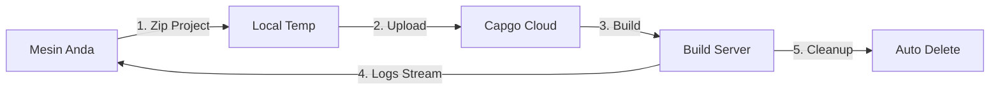

import { Steps, Card, CardGrid } from '@astrojs/starlight/components';

Mulai dengan Capgo Cloud Build dan buat build native iOS atau Android pertama Anda dalam hitungan menit.

## Yang Anda Butuhkan

Sebelum memulai, pastikan Anda memiliki:

- Aplikasi Capacitor yang berhasil di-build secara lokal
- Node.js 20 atau lebih tinggi terinstal
- Akun Capgo dengan subscription aktif
- Aplikasi Anda sudah terdaftar di Capgo (jalankan `npx @capgo/cli@latest app add` jika belum)
- **Kredensial build dikonfigurasi** (sertifikat, keystores) - lihat di bawah

## Sebelum Build Pertama Anda

<CardGrid>
  <Card title="⚠️ Setup Kredensial Terlebih Dahulu" icon="warning">
    **Wajib sebelum build:** Anda harus mengkonfigurasi kredensial build (sertifikat untuk iOS, keystores untuk Android).

    [Setup Kredensial →](/docs/cli/cloud-build/credentials/)
  </Card>
</CardGrid>

## Quick Start

<Steps>

1. **Setup Kredensial Build**

   Sebelum Anda dapat build, Anda perlu menyimpan kredensial secara lokal:

   **Untuk iOS:**
   ```bash
   npx @capgo/cli build credentials save \
     --platform ios \
     --certificate ./cert.p12 \
     --p12-password "password" \
     --provisioning-profile ./profile.mobileprovision \
     --apple-key ./AuthKey.p8 \
     --apple-key-id "KEY123" \
     --apple-issuer-id "issuer-uuid" \
     --apple-team-id "team-id"
   ```

   **Untuk Android:**
   ```bash
   npx @capgo/cli build credentials save \
     --platform android \
     --keystore ./release.keystore \
     --keystore-alias "my-key" \
     --keystore-key-password "key-pass" \
     --keystore-store-password "store-pass"
   ```

   Lihat [panduan kredensial lengkap](/docs/cli/cloud-build/credentials/) untuk detail.

2. **Verifikasi Build Lokal**

   Pertama, pastikan aplikasi Anda build secara lokal tanpa error:

   ```bash
   # Build web assets Anda
   npm run build

   # Sync dengan Capacitor
   npx cap sync

   # Test build lokal (opsional tapi direkomendasikan)
   npx cap open ios    # Untuk iOS
   npx cap open android # Untuk Android
   ```

3. **Autentikasi dengan Capgo**

   Set API key Capgo Anda (jika belum dikonfigurasi):

   ```bash
   npx @capgo/cli@latest login
   ```

   Atau set environment variable:
   ```bash
   export CAPGO_TOKEN=your_api_key_here
   ```

4. **Jalankan Build Pertama Anda**

   Mulai dengan build debug Android (tercepat untuk test):

   ```bash
   npx @capgo/cli@latest build com.example.app \
     --platform android \
     --build-mode debug
   ```

   Anda akan melihat log real-time saat build berlangsung:
   ```
   ✔ Creating build job...
   ✔ Uploading project (15.2 MB)...
   ✔ Build started

   📝 Build logs:
   → Installing dependencies...
   → Running Gradle build...
   → Signing APK...
   ✔ Build succeeded in 3m 42s
   ```

5. **Periksa Status Build**

   CLI akan otomatis polling dan menampilkan status build. Setelah selesai, Anda akan melihat:

   - Waktu build
   - Status berhasil/gagal
   - Aplikasi disubmit ke App Store/Play Store (jika kredensial dikonfigurasi)

</Steps>

## Memahami Proses Build

Saat Anda menjalankan command build, inilah yang terjadi:



1. **Persiapan Lokal** - Proyek Anda di-zip (mengecualikan `node_modules` dan dotfiles)
2. **Upload** - Zip diupload ke cloud storage yang aman (Cloudflare R2)
3. **Eksekusi Build** - Aplikasi Anda di-build di infrastruktur dedicated
4. **Log Streaming** - Log real-time stream ke terminal Anda via Server-Sent Events
5. **Cleanup Otomatis** - Build artifacts dihapus (Android: instan, iOS: 24 jam)

## Build Produksi Pertama Anda

Setelah Anda verifikasi prosesnya berfungsi, buat build produksi:

### Android

```bash
npx @capgo/cli@latest build com.example.app \
  --platform android \
  --build-mode release
```

Anda perlu mengkonfigurasi kredensial signing terlebih dahulu. Lihat [Konfigurasi Build Android](/docs/cli/cloud-build/android/).

### iOS

```bash
npx @capgo/cli@latest build com.example.app \
  --platform ios \
  --build-mode release
```

Build iOS memerlukan sertifikat signing dan provisioning profile. Lihat [Konfigurasi Build iOS](/docs/cli/cloud-build/ios/).

## Yang Di-Build

**Penting:** Capgo Cloud Build hanya build **bagian native** dari aplikasi Anda (kode native iOS dan Android).

Anda bertanggung jawab untuk:
- Build web assets Anda (`npm run build`)
- Jalankan `npx cap sync` sebelum build
- Pastikan semua dependencies ada di `package.json`

Kami menangani:
- Kompilasi native iOS (Xcode, Fastlane)
- Kompilasi native Android (Gradle)
- Code signing
- Submission app store (jika dikonfigurasi)

## Waktu Build & Biaya

Waktu build diukur dari awal sampai selesai:

- **Android**: Biasanya 3-5 menit (billing multiplier 1×)
- **iOS**: Biasanya 5-10 menit (billing multiplier 2× karena biaya hardware Mac)

Anda hanya membayar untuk waktu build yang benar-benar digunakan. Tidak ada biaya tersembunyi.

## Use Case Umum

### Integrasi CI/CD

Tambahkan ke workflow GitHub Actions Anda:

```yaml
- name: Build native app
  env:
    CAPGO_TOKEN: ${{ secrets.CAPGO_TOKEN }}
  run: |
    npm run build
    npx cap sync
    npx @capgo/cli@latest build ${{ secrets.APP_ID }} \
      --platform both \
      --build-mode release
```

### Development Lokal

Test build secara lokal sebelum commit:

```bash
# Quick debug build untuk testing
npm run build && npx cap sync
npx @capgo/cli@latest build com.example.app \
  --platform android \
  --build-mode debug
```

### Build Multi-Platform

Build untuk kedua platform secara bersamaan:

```bash
npx @capgo/cli@latest build com.example.app \
  --platform both \
  --build-mode release
```

## Langkah Selanjutnya

Sekarang Anda telah membuat build pertama:

- [Konfigurasi build iOS](/docs/cli/cloud-build/ios/) - Setup sertifikat dan profile
- [Konfigurasi build Android](/docs/cli/cloud-build/android/) - Setup keystores dan Play Store
- [Troubleshooting](/docs/cli/cloud-build/troubleshooting/) - Masalah umum dan solusi
- [Referensi CLI](/docs/cli/reference/build/) - Dokumentasi command lengkap

## Butuh Bantuan?

- Periksa [panduan troubleshooting](/docs/cli/cloud-build/troubleshooting/)
- Gabung [komunitas Discord](https://discord.com/invite/VnYRvBfgA6) kami
- Email support di support@capgo.app
