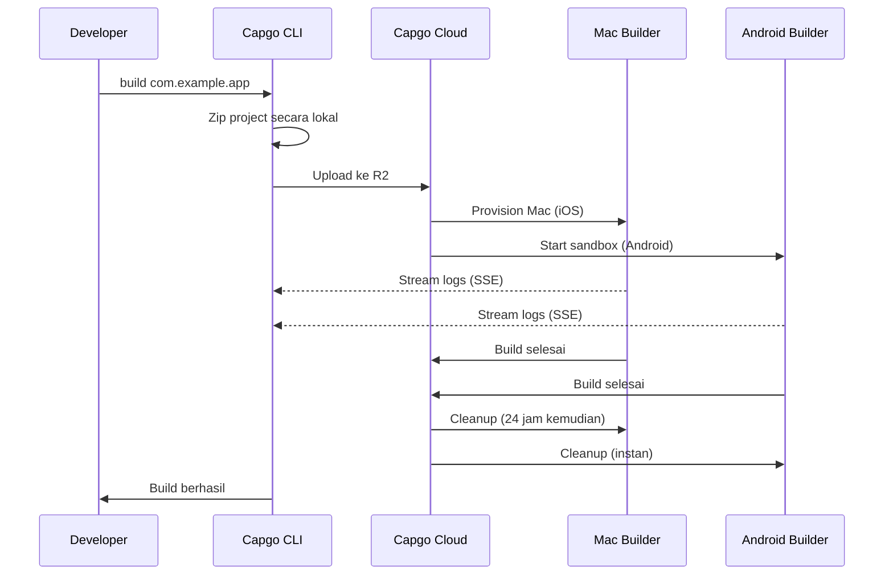

import { Card, CardGrid } from '@astrojs/starlight/components';

🏗️ Build aplikasi mobile native di cloud dan otomatis submit ke App Store dan Play Store.

## Gambaran Umum

Command `build` memungkinkan Anda mem-build aplikasi Capacitor untuk iOS dan Android di infrastruktur cloud Capgo, mirip dengan cara Expo menangani build. Aplikasi Anda di-build di infrastruktur dedicated dan dapat otomatis disubmit ke app store.

**Status Saat Ini:** Public Beta

## Mengapa Menggunakan Cloud Build?

Building aplikasi mobile native secara tradisional memerlukan:
- **Hardware Mac** untuk build iOS ($1000+ atau menit CI yang mahal)
- **Setup CI/CD yang kompleks** dengan caching dan kredensial
- **Overhead maintenance** untuk Xcode, Android Studio, dan SDK

Dengan Capgo Cloud Build, Anda mendapat:
- ✅ **Tidak perlu Mac** - Build aplikasi iOS dari mesin mana pun
- ✅ **Zero setup** - Tidak perlu konfigurasi CI/CD
- ✅ **Battle-tested** - Dibangun di atas 3 tahun penggunaan produksi internal
- ✅ **Aman** - Tidak ada penyimpanan log, cleanup otomatis
- ✅ **Native-only** - JavaScript Anda tetap privat

## Quick Start

```bash
npx @capgo/cli@latest build com.example.app
```

Itu saja! Aplikasi Anda akan di-build di cloud dan Anda akan melihat log real-time.

## Bagian Dokumentasi

<CardGrid>
  <Card title="⚠️ Setup Kredensial PERTAMA" icon="warning">
    **Wajib sebelum build:** Simpan kredensial iOS/Android Anda secara lokal.

    [Setup Kredensial →](/docs/cli/cloud-build/credentials/)
  </Card>

  <Card title="Memulai" icon="rocket">
    Buat build native pertama Anda dalam hitungan menit.

    [Baca panduan →](/docs/cli/cloud-build/getting-started/)
  </Card>

  <Card title="Build iOS" icon="seti:apple">
    Konfigurasi sertifikat dan build untuk App Store.

    [Konfigurasi iOS →](/docs/cli/cloud-build/ios/)
  </Card>

  <Card title="Build Android" icon="seti:android">
    Setup keystores dan build untuk Play Store.

    [Konfigurasi Android →](/docs/cli/cloud-build/android/)
  </Card>

  <Card title="Troubleshooting" icon="warning">
    Solusi untuk masalah build umum.

    [Dapatkan bantuan →](/docs/cli/cloud-build/troubleshooting/)
  </Card>
</CardGrid>

## Referensi Command

### Penggunaan Dasar

```bash
npx @capgo/cli@latest build [appId] [options]
```

### Contoh

Build untuk kedua platform:
```bash
npx @capgo/cli@latest build com.example.app
```

Build hanya untuk iOS:
```bash
npx @capgo/cli@latest build com.example.app --platform ios
```

Build untuk Android dalam mode debug:
```bash
npx @capgo/cli@latest build com.example.app --platform android --build-mode debug
```

Build dari direktori spesifik:
```bash
npx @capgo/cli@latest build com.example.app --path ./my-app
```

### Opsi

| Opsi | Tipe | Default | Deskripsi |
|--------|------|---------|-------------|
| `appId` | string | capacitor.config | Application ID (mis., com.example.app) |
| `--path <path>` | string | Current directory | Path ke direktori proyek Anda |
| `--platform <platform>` | string | both | Platform target: `ios`, `android`, atau `both` |
| `--build-mode <mode>` | string | release | Mode build: `debug` atau `release` |
| `--build-config <config>` | string | - | Konfigurasi build tambahan sebagai string JSON |
| `-a, --apikey <apikey>` | string | - | API key (atau gunakan env var `CAPGO_TOKEN`) |
| `--supa-host <url>` | string | https://api.capgo.app | URL host Supabase kustom |
| `--supa-anon <key>` | string | - | Anon key Supabase kustom |

## Cara Kerjanya



### Proses Build

1. **Persiapan Lokal** - Proyek Anda di-zip secara lokal (mengecualikan `node_modules`, dotfiles)
2. **Upload** - File zip diupload ke cloud storage aman (Cloudflare R2)
3. **Eksekusi Build**:
   - **iOS**: Mesin Mac dedicated diprovision, Fastlane build dan sign
   - **Android**: Sandbox aman dibuat, Gradle kompilasi dan sign
4. **Log Streaming** - Log real-time via Server-Sent Events (tidak disimpan!)
5. **Cleanup Otomatis**:
   - **iOS**: File dihapus setelah 24 jam saat mesin di-dismiss
   - **Android**: Semua dihapus instan setelah build

## Keahlian Kami

Capgo Cloud Build bukan infrastruktur baru - kami telah menggunakannya secara internal selama **3 tahun**:

- ✅ **Fastlane Kustom** - Dibangun khusus untuk aplikasi Capacitor
- ✅ **Ribuan build** - Battle-tested di produksi
- ✅ **Expert Capacitor** - Pengetahuan mendalam tentang apa yang penting
- ✅ **Fokus native-only** - JavaScript Anda tidak pernah menyentuh server kami

## Keamanan & Privasi

- **Tidak ada penyimpanan log** - Log hanya stream ke terminal Anda, tidak pernah disimpan
- **Tidak ada penyimpanan artifact** - Aplikasi dikirim langsung ke App Store/Play Store, kami tidak menyimpan apa pun
- **Kredensial auto-deleted** - Hanya digunakan selama build, dihapus setelahnya (maks 24 jam)
- **Build terisolasi** - Setiap build berjalan dalam isolasi
- **Kode Anda tetap milik Anda** - Kami hanya build bagian native, JavaScript tetap lokal

## Integrasi CI/CD

Berfungsi di mana saja - GitHub Actions, GitLab CI, atau platform CI/CD mana pun:

```yaml
- name: Build native app
  env:
    CAPGO_TOKEN: ${{ secrets.CAPGO_TOKEN }}
  run: |
    npm run build
    npx cap sync
    npx @capgo/cli@latest build com.example.app \
      --platform both \
      --build-mode release
```

Tidak perlu:
- Mac runners
- Instalasi Android SDK
- Instalasi Xcode
- Caching kompleks
- Manajemen kredensial

## Harga

Waktu build dibill berdasarkan penggunaan aktual:

- **Android**: Multiplier 1× (~$0.XX per menit)
- **iOS**: Multiplier 2× (~$0.XX per menit, karena hardware Mac)

**Biaya tipikal:**
- Debug Android: 3 min × 1× = ~$X.XX
- Release iOS: 7 min × 2× = ~$X.XX

Hanya bayar untuk yang Anda gunakan. Tidak ada minimum, tidak ada kejutan.

## Perbandingan dengan Solusi Lain

| Fitur | Capgo Cloud Build | GitHub Actions (Mac) | Expo EAS |
|---------|------------------|---------------------|----------|
| **Mac diperlukan secara lokal** | ❌ Tidak | ✅ Ya | ❌ Tidak |
| **Kompleksitas setup** | ⭐ Single command | ⭐⭐⭐ YAML kompleks | ⭐⭐ File config |
| **Native Capacitor** | ✅ Dioptimalkan | ⚠️ Generik | ❌ Hanya Expo |
| **Privasi kode Anda** | ✅ Tidak pernah disimpan | ⚠️ Di runners | ⚠️ Diupload |
| **Biaya (iOS)** | 💰 2× dasar | 💰💰💰 10× mahal | 💰💰 Premium |

## Yang Di-Build

**Penting:** Capgo build **bagian native saja**.

✅ **Kami build:**
- Kode native iOS (Swift, Objective-C, proyek Xcode)
- Kode native Android (Java, Kotlin, proyek Gradle)
- Code signing dan submission app store

❌ **Anda build (secara lokal):**
- JavaScript, HTML, CSS (`npm run build`)
- Capacitor sync (`npx cap sync`)
- Web assets Anda

Pemisahan ini memastikan:
- **Keamanan lebih baik** - Logika aplikasi Anda tetap privat
- **Build lebih cepat** - Tidak ada duplikasi build web
- **Tanggung jawab jelas** - Anda kontrol kode Anda

## Keterbatasan

Keterbatasan saat ini selama public beta:

- **Timeout build**: Maksimal 10 menit
- **Timeout upload**: 1 jam untuk upload URL
- **Mesin iOS**: Persyaratan lease 24 jam, build di Mac akan antri untuk memastikan penggunaan optimal
- **Akses**: Hanya public beta

## Mulai

Siap build tanpa ribet?

<CardGrid>
  <Card title="Buat Build Pertama Anda" icon="rocket">
    Panduan langkah demi langkah untuk cloud build pertama Anda.

    [Mulai →](/docs/cli/cloud-build/getting-started/)
  </Card>

  <Card title="Gabung Public Beta" icon="star">
    Cloud Build dalam public beta. Gabung komunitas kami untuk mendapat akses.

    [Gabung Discord →](https://discord.com/invite/VnYRvBfgA6)
  </Card>
</CardGrid>

## Pelajari Lebih Lanjut

- [Panduan Getting Started](/docs/cli/cloud-build/getting-started/) - Buat build pertama Anda
- [Konfigurasi iOS](/docs/cli/cloud-build/ios/) - Setup build iOS
- [Konfigurasi Android](/docs/cli/cloud-build/android/) - Setup build Android
- [Troubleshooting](/docs/cli/cloud-build/troubleshooting/) - Masalah umum dan solusi
- [Blog: Introducing Cloud Build](/blog/introducing-capgo-cloud-build/) - Pengumuman fitur

## Butuh Bantuan?

- 📚 [Panduan troubleshooting](/docs/cli/cloud-build/troubleshooting/)
- 💬 [Komunitas Discord](https://discord.com/invite/VnYRvBfgA6)
- 📧 Email: support@capgo.app
