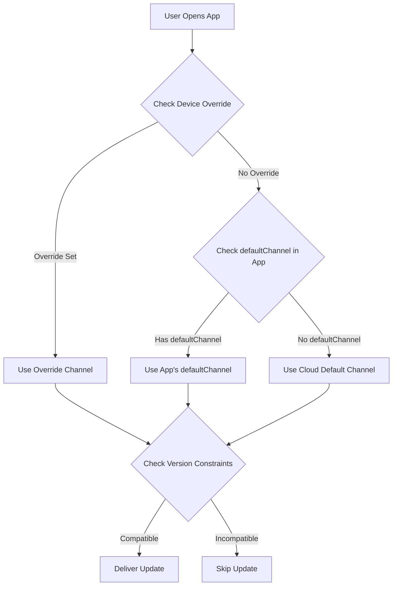

import { Aside } from '@astrojs/starlight/components';

Panduan ini menjelaskan cara memberikan bundel kompatibel terbaru secara otomatis kepada pengguna berdasarkan versi aplikasi asli mereka, **mirip dengan pendekatan Ionic AppFlow**. Ini memastikan manajemen pembaruan yang disederhanakan dan peluncuran yang lebih cepat sambil mencegah masalah kompatibilitas.

<Aside type="tip" title="Migrasi dari Ionic AppFlow?">
  Jika Anda bermigrasi dari Ionic AppFlow, panduan ini sangat penting bagi Anda. AppFlow secara otomatis mencocokkan pembaruan dengan versi asli, dan Capgo menyediakan kemampuan yang sama dengan kontrol dan fleksibilitas yang lebih besar. Lihat [Panduan Migrasi AppFlow](/docs/upgrade/from-appflow-to-capgo) untuk petunjuk langkah demi langkah.
</Aside>

## Ikhtisar

Sistem penargetan versi Capgo memungkinkan Anda untuk:

- **Memberikan pembaruan yang kompatibel secara otomatis** kepada pengguna berdasarkan versi aplikasi asli mereka
- **Mencegah perubahan besar** mencapai versi aplikasi yang tidak kompatibel
- **Mengelola beberapa versi aplikasi** secara bersamaan tanpa logika yang rumit
- **Meluncurkan pembaruan dengan lancar** ke segmen pengguna tertentu

### Mengapa Penargetan Versi Penting (Terutama untuk Pengguna AppFlow)

Jika Anda sudah familiar dengan **Ionic AppFlow**, Anda tahu betapa pentingnya memastikan pengguna hanya menerima pembaruan yang kompatibel. AppFlow secara otomatis mencocokkan bundel pembaruan langsung dengan versi aplikasi asli, mencegah JavaScript yang tidak kompatibel dikirimkan ke kode asli yang lebih lama.

**Capgo menyediakan jaminan keamanan yang sama**, dengan fitur tambahan:
- Kontrol lebih granular atas pencocokan versi
- Beberapa strategi (saluran, semver, batasan asli)
- Visibilitas lebih baik dalam distribusi versi
- Kontrol API dan CLI bersama dengan manajemen dasbor

Pendekatan ini sangat berguna ketika:
- Anda memiliki pengguna pada versi utama aplikasi yang berbeda (misalnya, v1.x, v2.x, v3.x)
- Anda perlu mempertahankan kompatibilitas ke belakang sambil meluncurkan perubahan besar
- Anda ingin mencegah bundel yang lebih baru merusak kode asli yang lebih lama
- Anda secara bertahap memigrasikan pengguna dari satu versi ke versi lain
- **Anda bermigrasi dari AppFlow** dan ingin mempertahankan keamanan pembaruan yang sama

## Cara Kerja

Capgo menggunakan pendekatan berlapis untuk mencocokkan pengguna dengan pembaruan yang kompatibel:

1. **Batasan Versi Asli**: Cegah bundel dikirim ke versi asli yang tidak kompatibel
2. **Perutean Berbasis Saluran**: Arahkan versi aplikasi yang berbeda ke saluran pembaruan yang berbeda
3. **Kontrol Versioning Semantik**: Otomatis memblokir pembaruan lintas batas utama/kecil/patch
4. **Penggantian Tingkat Perangkat**: Targetkan perangkat spesifik atau kelompok pengguna

### Alur Pencocokan Versi



## Strategi 1: Perutean Versi Berbasis Saluran

Ini adalah **pendekatan yang direkomendasikan** untuk mengelola perubahan besar dan pembaruan versi utama. Ini mirip dengan model pengiriman AppFlow.

### Skenario Contoh

- **App v1.x** (100.000 pengguna) → saluran `production`
- **App v2.x** (50.000 pengguna dengan perubahan besar) → saluran `v2`
- **App v3.x** (10.000 pengguna beta) → saluran `v3`

### Implementasi

#### Langkah 1: Konfigurasi Saluran untuk Setiap Versi Utama

```typescript
// capacitor.config.ts untuk build versi 1.x
import { CapacitorConfig } from '@capacitor/cli';

const config: CapacitorConfig = {
  appId: 'com.example.app',
  appName: 'Example App',
  plugins: {
    CapacitorUpdater: {
      autoUpdate: true,
      defaultChannel: 'production', // atau abaikan untuk default
    }
  }
};

export default config;
```

```typescript
// capacitor.config.ts untuk build versi 2.x
const config: CapacitorConfig = {
  appId: 'com.example.app',
  appName: 'Example App',
  plugins: {
    CapacitorUpdater: {
      autoUpdate: true,
      defaultChannel: 'v2', // Rute pengguna v2 secara otomatis
    }
  }
};
```

```typescript
// capacitor.config.ts untuk build versi 3.x
const config: CapacitorConfig = {
  appId: 'com.example.app',
  appName: 'Example App',
  plugins: {
    CapacitorUpdater: {
      autoUpdate: true,
      defaultChannel: 'v3', // Rute pengguna v3 secara otomatis
    }
  }
};
```

#### Langkah 2: Buat Saluran

```bash
# Buat saluran untuk setiap versi utama
npx @capgo/cli channel create production
npx @capgo/cli channel create v2
npx @capgo/cli channel create v3

# Aktifkan self-assign sehingga aplikasi dapat beralih saluran
npx @capgo/cli channel set production --self-assign
npx @capgo/cli channel set v2 --self-assign
npx @capgo/cli channel set v3 --self-assign
```

#### Langkah 3: Unggah Bundel Spesifik Versi

```bash
# Untuk pengguna v1.x (dari cabang v1-maintenance)
git checkout v1-maintenance
npm run build
npx @capgo/cli bundle upload --channel production

# Untuk pengguna v2.x (dari cabang v2-maintenance atau main)
git checkout main
npm run build
npx @capgo/cli bundle upload --channel v2

# Untuk pengguna v3.x (dari cabang beta/v3)
git checkout beta
npm run build
npx @capgo/cli bundle upload --channel v3
```

<Aside type="tip" title="Perutean Otomatis">
  Ketika pengguna membuka aplikasi, mereka secara otomatis terhubung ke saluran yang ditunjuk berdasarkan `defaultChannel` di bundel aplikasi yang terinstal. Tidak ada perubahan kode JavaScript yang diperlukan!
</Aside>

### Manfaat

- **Nol perubahan kode** - Perutean saluran terjadi secara otomatis
- **Pemisahan yang jelas** - Setiap versi memiliki pipeline pembaruan sendiri
- **Penargetan fleksibel** - Dorong pembaruan ke grup versi tertentu
- **Peluncuran yang aman** - Perubahan besar tidak pernah mencapai versi yang tidak kompatibel

## Strategi 2: Kontrol Versioning Semantik

Gunakan kontrol versioning semantik bawaan Capgo untuk mencegah pembaruan lintas batas versi.

### Nonaktifkan Pembaruan Otomatis Antar Versi Utama

```bash
# Buat saluran yang memblokir pembaruan versi utama
npx @capgo/cli channel create stable --disable-auto-update major
```

Konfigurasi ini berarti:
- Pengguna pada versi aplikasi **1.2.3** akan menerima pembaruan hingga **1.9.9**
- Pengguna akan **TIDAK** menerima versi **2.0.0** secara otomatis
- Mencegah perubahan besar mencapai kode asli yang lebih lama

### Opsi Kontrol Granular

```bash
# Blokir pembaruan versi minor (1.2.x tidak akan mendapat 1.3.0)
npx @capgo/cli channel set stable --disable-auto-update minor

# Blokir pembaruan patch (1.2.3 tidak akan mendapat 1.2.4)
npx @capgo/cli channel set stable --disable-auto-update patch

# Izinkan semua pembaruan
npx @capgo/cli channel set stable --disable-auto-update none
```

<Aside type="caution" title="Versioning Semantik Diperlukan">
  Strategi ini hanya berfungsi jika Anda mengikuti versioning semantik (semver) untuk versi aplikasi Anda. Pastikan nomor versi Anda mengikuti format `MAJOR.MINOR.PATCH`.
</Aside>

## Strategi 3: Batasan Versi Asli

Tentukan persyaratan versi asli minimum untuk bundel untuk mencegah pengiriman ke perangkat yang tidak kompatibel.

### Menggunakan Kondisi Penundaan nativeVersion

Saat mengunggah bundel, Anda dapat menentukan versi asli minimum:

```bash
# Bundel ini memerlukan versi asli 2.0.0 atau lebih tinggi
npx @capgo/cli bundle upload \
  --channel production \
  --native-version "2.0.0"
```

<Aside type="note" title="Cara Kerjanya">
  Perangkat pada versi asli 1.x TIDAK akan menerima bundel ini. Hanya perangkat pada 2.0.0+ yang akan mendapatkannya. Ini sempurna untuk pembaruan yang memerlukan API asli baru atau plugin.
</Aside>

### Kasus Penggunaan

1. **Plugin Asli Baru Diperlukan**
   ```bash
   # Bundel memerlukan plugin Kamera ditambahkan di v2.0.0
   npx @capgo/cli bundle upload --native-version "2.0.0"
   ```

2. **Perubahan API Asli yang Mengganggu**
   ```bash
   # Bundel menggunakan API Capacitor 6 yang baru
   npx @capgo/cli bundle upload --native-version "3.0.0"
   ```

3. **Migrasi Bertahap**
   ```bash
   # Uji bundel hanya pada versi asli terbaru
   npx @capgo/cli bundle upload \
     --channel beta \
     --native-version "2.5.0"
   ```

## Strategi 4: Pencegahan Downgrade Otomatis

Cegah pengguna menerima bundel yang lebih lama dari versi asli mereka saat ini.

### Aktifkan dalam Pengaturan Saluran

Di dasbor Capgo:
1. Buka **Saluran** → Pilih saluran Anda
2. Aktifkan **"Nonaktifkan downgrade otomatis di bawah native"**
3. Simpan perubahan

Atau melalui CLI:
```bash
npx @capgo/cli channel set production --disable-downgrade
```

### Contoh

- Versi perangkat pengguna: Versi asli **1.2.5**
- Bundel saluran: Versi **1.2.3**
- **Hasil**: Pembaruan diblokir (akan menjadi downgrade)

Ini berguna ketika:
- Pengguna secara manual menginstal versi yang lebih baru dari app store
- Anda perlu memastikan pengguna selalu memiliki patch keamanan terbaru
- Anda ingin mencegah bug regresi

## Strategi 5: Penargetan Tingkat Perangkat

Ganti penugasan saluran untuk perangkat atau kelompok pengguna tertentu.

### Paksa Versi Spesifik untuk Pengujian

```typescript
import { CapacitorUpdater } from '@capgo/capacitor-updater'

// Paksa penguji beta untuk menggunakan saluran v3
async function assignBetaTesters() {
  const deviceId = await CapacitorUpdater.getDeviceId()

  // Periksa apakah pengguna adalah penguji beta
  if (isBetaTester(userId)) {
    await CapacitorUpdater.setChannel({ channel: 'v3' })
  }
}
```

### Penggantian Perangkat Dasbor

Di dasbor Capgo:
1. Buka **Perangkat** → Temukan perangkat
2. Klik **Atur Saluran** atau **Atur Versi**
3. Ganti dengan saluran atau versi bundel tertentu
4. Perangkat akan menerima pembaruan dari sumber yang diganti

<Aside type="tip" title="Pengujian Pembaruan">
  Gunakan penggantian perangkat untuk menguji pembaruan pada perangkat Anda sendiri sebelum diluncurkan ke semua pengguna.
</Aside>

## Alur Kerja Lengkap Gaya AppFlow

Berikut adalah contoh lengkap yang menggabungkan semua strategi:

### 1. Pengaturan Awal (App v1.0.0)

```bash
# Buat saluran produksi dengan kontrol semver
npx @capgo/cli channel create production \
  --disable-auto-update major \
  --disable-downgrade
```

```typescript
// capacitor.config.ts
const config: CapacitorConfig = {
  plugins: {
    CapacitorUpdater: {
      autoUpdate: true,
      defaultChannel: 'production',
    }
  }
};
```

### 2. Rilis Perubahan Mengganggu (App v2.0.0)

```bash
# Buat saluran v2 untuk versi baru
npx @capgo/cli channel create v2 \
  --disable-auto-update major \
  --disable-downgrade \
  --self-assign

# Buat cabang git untuk pemeliharaan v1
git checkout -b v1-maintenance
git push origin v1-maintenance
```

```typescript
// capacitor.config.ts untuk v2.0.0
const config: CapacitorConfig = {
  plugins: {
    CapacitorUpdater: {
      autoUpdate: true,
      defaultChannel: 'v2', // Pengguna baru mendapat saluran v2
    }
  }
};
```

### 3. Dorong Pembaruan untuk Kedua Versi

```bash
# Perbarui pengguna v1.x (perbaikan bug)
git checkout v1-maintenance
# Lakukan perubahan
npx @capgo/cli bundle upload \
  --channel production \
  --native-version "1.0.0"

# Perbarui pengguna v2.x (fitur baru)
git checkout main
# Lakukan perubahan
npx @capgo/cli bundle upload \
  --channel v2 \
  --native-version "2.0.0"
```

### 4. Pantau Distribusi Versi

Gunakan dasbor Capgo untuk melacak:
- Berapa banyak pengguna yang ada di v1 vs v2
- Tingkat adopsi bundel per versi
- Kesalahan atau crash per versi

### 5. Hentikan Versi Lama

Setelah penggunaan v1 turun di bawah ambang batas:

```bash
# Berhenti mengunggah ke saluran produksi
# Opsional: Hapus cabang pemeliharaan v1
git branch -d v1-maintenance

# Pindahkan semua pengguna yang tersisa ke default
# (Mereka perlu memperbarui melalui app store)
```

## Prioritas Saluran

Ketika ada beberapa konfigurasi saluran, Capgo menggunakan urutan prioritas ini:

1. **Penggantian Perangkat** (Dasbor atau API) - Prioritas Tertinggi
2. **Penggantian Cloud** melalui panggilan `setChannel()`
3. **defaultChannel** di capacitor.config.ts
4. **Saluran Default** (Pengaturan Cloud) - Prioritas Terendah

<Aside type="note" title="Contoh Prioritas">
  Jika aplikasi pengguna memiliki `defaultChannel: 'v2'` tetapi Anda mengganti perangkat mereka menjadi `'beta'` di dasbor, mereka akan menerima pembaruan dari saluran `'beta'`.
</Aside>

## Praktik Terbaik

### 1. Selalu Atur defaultChannel untuk Versi Utama

```typescript
// ✅ Baik: Setiap versi utama memiliki saluran eksplisit
// v1.x → production
// v2.x → v2
// v3.x → v3

// ❌ Buruk: Mengandalkan pengalihan saluran dinamis
// Semua versi → production, alihkan secara manual
```

### 2. Gunakan Versioning Semantik

```bash
# ✅ Baik
1.0.0 → 1.0.1 → 1.1.0 → 2.0.0

# ❌ Buruk
1.0 → 1.1 → 2 → 2.5
```

### 3. Pertahankan Cabang Terpisah

```bash
# ✅ Baik: Cabang terpisah per versi utama
main (v3.x)
v2-maintenance (v2.x)
v1-maintenance (v1.x)

# ❌ Buruk: Cabang tunggal untuk semua versi
```

### 4. Uji Sebelum Peluncuran

```bash
# Uji di saluran beta terlebih dahulu
npx @capgo/cli bundle upload --channel beta

# Pantau masalah, lalu promosikan ke produksi
npx @capgo/cli bundle upload --channel production
```

### 5. Pantau Distribusi Versi

Periksa dasbor Anda secara teratur:
- Apakah pengguna meningkatkan ke versi asli yang lebih baru?
- Apakah versi lama masih mendapat traffic tinggi?
- Haruskah Anda menghentikan saluran lama?

## Perbandingan dengan Ionic AppFlow

Untuk tim yang bermigrasi dari **Ionic AppFlow**, berikut adalah perbandingan penargetan versi Capgo:

| Fitur | Ionic AppFlow | Capgo |
|---------|---------------|-------|
| **Perutean berbasis versi** | Otomatis berdasarkan versi asli | Otomatis melalui `defaultChannel` + beberapa strategi |
| **Versioning semantik** | Dukungan dasar | Lanjutan dengan `--disable-auto-update` (major/minor/patch) |
| **Batasan versi asli** | Konfigurasi manual di dasbor AppFlow | Bendera `--native-version` bawaan di CLI |
| **Manajemen saluran** | Web UI + CLI | Web UI + CLI + API |
| **Penggantian perangkat** | Kontrol tingkat perangkat terbatas | Kontrol penuh melalui Dasbor/API |
| **Pencegahan downgrade otomatis** | Ya | Ya melalui `--disable-downgrade` |
| **Pemeliharaan versi ganda** | Manajemen cabang/saluran manual | Otomatis dengan prioritas saluran |
| **Self-hosting** | Tidak | Ya (kontrol penuh) |
| **Analitik versi** | Dasar | Metrik terperinci per versi |

<Aside type="note" title="Paritas AppFlow dan Seterusnya">
  Capgo menyediakan **semua kemampuan penargetan versi** yang ditawarkan AppFlow, plus mekanisme kontrol tambahan. Jika Anda mengandalkan pencocokan versi otomatis AppFlow, Anda akan menemukan Capgo sama amannya dengan lebih fleksibel.
</Aside>

## Pemecahan Masalah

### Pengguna Tidak Menerima Pembaruan

Periksa hal berikut:

1. **Penugasan Saluran**: Verifikasi perangkat ada di saluran yang benar
   ```typescript
   const channel = await CapacitorUpdater.getChannel()
   console.log('Current channel:', channel)
   ```

2. **Batasan Versi**: Periksa apakah bundel memiliki persyaratan versi asli
   - Dasbor → Bundel → Periksa kolom "Versi Asli"

3. **Pengaturan Semver**: Verifikasi pengaturan `disable-auto-update` saluran
   ```bash
   npx @capgo/cli channel list
   ```

4. **Penggantian Perangkat**: Periksa apakah perangkat memiliki penggantian manual
   - Dasbor → Perangkat → Cari perangkat → Periksa saluran/versi

### Bundel Dikirimkan ke Versi yang Salah

1. **Tinjau defaultChannel**: Pastikan saluran yang benar di `capacitor.config.ts`
2. **Periksa Unggahan Bundel**: Verifikasi bundel diunggah ke saluran yang dimaksudkan
3. **Inspeksi Versi Asli**: Konfirmasi bendera `--native-version` digunakan dengan benar

### Perubahan Mengganggu Mempengaruhi Versi Lama

1. **Perbaikan Segera**: Ganti perangkat yang terkena dampak ke bundel yang aman
   - Dasbor → Perangkat → Pilih Ganda → Atur Versi
2. **Perbaikan Jangka Panjang**: Buat saluran berversi dan pertahankan cabang terpisah
3. **Pencegahan**: Selalu uji pembaruan pada perangkat yang representatif sebelum diluncurkan

## Migrasi dari Ionic AppFlow

Jika Anda bermigrasi dari **Ionic AppFlow**, penargetan versi bekerja sangat mirip di Capgo, dengan fleksibilitas yang ditingkatkan:

### Pemetaan Konsep

| Konsep AppFlow | Setara Capgo | Catatan |
|-----------------|------------------|-------|
| **Saluran Penerapan** | Saluran Capgo | Konsep yang sama, lebih kuat |
| **Kunci Versi Asli** | bendera `--native-version` | Kontrol lebih granular |
| **Prioritas Saluran** | Prioritas saluran (override → cloud → default) | Prioritas lebih transparan |
| **Target Penerapan** | Saluran + kontrol semver | Beberapa strategi tersedia |
| **Saluran Produksi** | saluran `production` (atau nama apa pun) | Penamaan fleksibel |
| **Penerapan berbasis Git** | Unggahan bundel CLI dari cabang | Alur kerja yang sama |
| **Pencocokan versi otomatis** | `defaultChannel` + batasan versi | Ditingkatkan dengan beberapa strategi |

### Perbedaan Kunci untuk Pengguna AppFlow

1. **Kontrol Lebih Banyak**: Capgo memberi Anda beberapa strategi (saluran, semver, versi asli) yang dapat digabungkan
2. **Visibilitas Lebih Baik**: Dasbor menampilkan distribusi versi dan masalah kompatibilitas
3. **Akses API**: Kontrol pemrograman penuh atas penargetan versi
4. **Self-Hosting**: Opsi untuk menjalankan server pembaruan Anda sendiri dengan logika versi yang sama

### Langkah-Langkah Migrasi

1. **Petakan saluran AppFlow Anda** ke saluran Capgo (biasanya 1:1)
2. **Atur `defaultChannel`** di `capacitor.config.ts` untuk setiap versi utama
3. **Konfigurasi aturan semver** jika Anda ingin pemblokiran otomatis di batas versi
4. **Unggah bundel spesifik versi** menggunakan bendera `--native-version`
5. **Pantau distribusi versi** di dasbor Capgo

<Aside type="tip" title="Panduan Migrasi Lengkap">
  Untuk petunjuk migrasi lengkap termasuk penggantian SDK dan pemetaan API, lihat [Panduan Migrasi AppFlow ke Capgo](/docs/upgrade/from-appflow-to-capgo).
</Aside>

## Pola Lanjutan

### Peluncuran Bertahap per Versi

```typescript
// Migrasikan pengguna v1 secara bertahap ke v2
async function migrateUsers() {
  const deviceId = await CapacitorUpdater.getDeviceId()
  const rolloutPercentage = 10 // Mulai dengan 10%

  // Hash ID perangkat untuk mendapatkan persentase deterministik
  const hash = hashCode(deviceId) % 100

  if (hash < rolloutPercentage) {
    // Pengguna berada dalam grup peluncuran - Migrasikan ke v2
    await CapacitorUpdater.setChannel({ channel: 'v2' })
  }
}
```

### Bendera Fitur per Versi

```typescript
// Aktifkan fitur berdasarkan versi asli
async function checkFeatureAvailability() {
  const info = await CapacitorUpdater.getDeviceId()
  const nativeVersion = info.nativeVersion

  if (compareVersions(nativeVersion, '2.0.0') >= 0) {
    // Aktifkan fitur yang memerlukan v2.0.0+
    enableNewCameraFeature()
  }
}
```

### Pengujian A/B Lintas Versi

```typescript
// Jalankan tes A/B dalam versi asli yang sama
async function assignABTest() {
  const nativeVersion = await getNativeVersion()

  if (nativeVersion.startsWith('2.')) {
    // Hanya tes A/B pada pengguna v2
    const variant = Math.random() < 0.5 ? 'v2-test-a' : 'v2-test-b'
    await CapacitorUpdater.setChannel({ channel: variant })
  }
}
```

## Ringkasan

Capgo menyediakan beberapa strategi untuk pengiriman pembaruan khusus versi:

1. **Perutean Berbasis Saluran**: Pemisahan versi otomatis melalui `defaultChannel`
2. **Versioning Semantik**: Cegah pembaruan lintas batas utama/kecil/patch
3. **Batasan Versi Asli**: Memerlukan versi asli minimum untuk bundel
4. **Pencegahan Downgrade Otomatis**: Tidak pernah memberikan bundel yang lebih lama ke versi asli yang lebih baru
5. **Penggantian Perangkat**: Kontrol manual untuk pengujian dan penargetan

Dengan menggabungkan strategi-strategi ini, Anda dapat mencapai pengiriman pembaruan otomatis gaya AppFlow dengan fleksibilitas dan kontrol yang lebih besar. Pilih pendekatan yang paling sesuai dengan alur kerja versiong dan penerapan aplikasi Anda.

Untuk detail lebih lanjut tentang fitur tertentu:
- [Panduan Perubahan Mengganggu](/docs/live-updates/breaking-changes) - Strategi versiong saluran terperinci
- [Manajemen Saluran](/docs/live-updates/channels) - Referensi konfigurasi saluran lengkap
- [Perilaku Pembaruan](/docs/live-updates/update-behavior) - Penundaan versi asli dan kondisi
