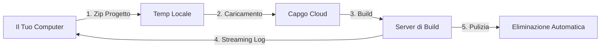

import { Steps, Card, CardGrid } from '@astrojs/starlight/components';

Inizia con Capgo Cloud Build e crea la tua prima build nativa iOS o Android in pochi minuti.

## Di Cosa Hai Bisogno

Prima di iniziare, assicurati di avere:

- Un'app Capacitor che si compila correttamente in locale
- Node.js 20 o superiore installato
- Un account Capgo con abbonamento attivo
- La tua app già registrata in Capgo (esegui `npx @capgo/cli@latest app add` se non l'hai fatto)
- **Credenziali di build configurate** (certificati, keystore) - vedi sotto

## Prima della Tua Prima Build

<CardGrid>
  <Card title="⚠️ Configura Prima le Credenziali" icon="warning">
    **Richiesto prima della build:** Devi configurare le tue credenziali di build (certificati per iOS, keystore per Android).

    [Configura Credenziali →](/docs/cli/cloud-build/credentials/)
  </Card>
</CardGrid>

## Avvio Rapido

<Steps>

1. **Configura le Credenziali di Build**

   Prima di poter creare, devi salvare le tue credenziali localmente:

   **Per iOS:**
   ```bash
   npx @capgo/cli build credentials save \
     --platform ios \
     --certificate ./cert.p12 \
     --p12-password "password" \
     --provisioning-profile ./profile.mobileprovision \
     --apple-key ./AuthKey.p8 \
     --apple-key-id "KEY123" \
     --apple-issuer-id "issuer-uuid" \
     --apple-team-id "team-id"
   ```

   **Per Android:**
   ```bash
   npx @capgo/cli build credentials save \
     --platform android \
     --keystore ./release.keystore \
     --keystore-alias "my-key" \
     --keystore-key-password "key-pass" \
     --keystore-store-password "store-pass"
   ```

   Consulta la [guida completa alle credenziali](/docs/cli/cloud-build/credentials/) per i dettagli.

2. **Verifica Build Locale**

   Prima, assicurati che la tua app si compili localmente senza errori:

   ```bash
   # Compila le tue risorse web
   npm run build

   # Sincronizza con Capacitor
   npx cap sync

   # Testa build locale (opzionale ma consigliato)
   npx cap open ios    # Per iOS
   npx cap open android # Per Android
   ```

3. **Autenticati con Capgo**

   Imposta la tua chiave API Capgo (se non già configurata):

   ```bash
   npx @capgo/cli@latest login
   ```

   Oppure imposta la variabile d'ambiente:
   ```bash
   export CAPGO_TOKEN=tua_chiave_api_qui
   ```

4. **Esegui la Tua Prima Build**

   Inizia con una build debug Android (più veloce da testare):

   ```bash
   npx @capgo/cli@latest build com.example.app \
     --platform android \
     --build-mode debug
   ```

   Vedrai log in tempo reale mentre la tua build procede:
   ```
   ✔ Creazione job di build...
   ✔ Caricamento progetto (15.2 MB)...
   ✔ Build avviata

   📝 Log di build:
   → Installazione dipendenze...
   → Esecuzione build Gradle...
   → Firma APK...
   ✔ Build riuscita in 3m 42s
   ```

5. **Controlla Stato Build**

   Il CLI eseguirà automaticamente il polling e visualizzerà lo stato della build. Una volta completato, vedrai:

   - Tempo di build
   - Stato successo/fallimento
   - App inviata all'App Store/Play Store (se le credenziali sono configurate)

</Steps>

## Comprensione del Processo di Build

Quando esegui il comando build, ecco cosa succede:



1. **Preparazione Locale** - Il tuo progetto viene compresso (escludendo `node_modules` e file nascosti)
2. **Caricamento** - Lo zip viene caricato su archiviazione cloud sicura (Cloudflare R2)
3. **Esecuzione Build** - La tua app viene compilata su infrastruttura dedicata
4. **Streaming Log** - I log in tempo reale vengono trasmessi al tuo terminale tramite Server-Sent Events
5. **Pulizia Automatica** - Gli artefatti di build vengono eliminati (Android: istantaneo, iOS: 24 ore)

## La Tua Prima Build di Produzione

Una volta verificato che il processo funziona, crea una build di produzione:

### Android

```bash
npx @capgo/cli@latest build com.example.app \
  --platform android \
  --build-mode release
```

Dovrai prima configurare le credenziali di firma. Vedi [Configurazione Build Android](/docs/cli/cloud-build/android/).

### iOS

```bash
npx @capgo/cli@latest build com.example.app \
  --platform ios \
  --build-mode release
```

Le build iOS richiedono certificati di firma e profili di provisioning. Vedi [Configurazione Build iOS](/docs/cli/cloud-build/ios/).

## Cosa Viene Compilato

**Importante:** Capgo Cloud Build compila solo le **parti native** della tua app (codice nativo iOS e Android).

Sei responsabile di:
- Compilare le tue risorse web (`npm run build`)
- Eseguire `npx cap sync` prima della build
- Assicurarti che tutte le dipendenze siano in `package.json`

Gestiamo noi:
- Compilazione nativa iOS (Xcode, Fastlane)
- Compilazione nativa Android (Gradle)
- Firma del codice
- Invio agli app store (se configurato)

## Tempi e Costi di Build

Il tempo di build viene misurato dall'inizio al completamento:

- **Android**: Tipicamente 3-5 minuti (moltiplicatore di fatturazione 1×)
- **iOS**: Tipicamente 5-10 minuti (moltiplicatore di fatturazione 2× a causa dei costi dell'hardware Mac)

Paghi solo per il tempo di build effettivamente utilizzato. Nessun costo nascosto.

## Casi d'Uso Comuni

### Integrazione CI/CD

Aggiungi al tuo workflow GitHub Actions:

```yaml
- name: Build native app
  env:
    CAPGO_TOKEN: ${{ secrets.CAPGO_TOKEN }}
  run: |
    npm run build
    npx cap sync
    npx @capgo/cli@latest build ${{ secrets.APP_ID }} \
      --platform both \
      --build-mode release
```

### Sviluppo Locale

Testa le build localmente prima di eseguire il commit:

```bash
# Build debug rapida per il test
npm run build && npx cap sync
npx @capgo/cli@latest build com.example.app \
  --platform android \
  --build-mode debug
```

### Build Multi-Piattaforma

Compila per entrambe le piattaforme simultaneamente:

```bash
npx @capgo/cli@latest build com.example.app \
  --platform both \
  --build-mode release
```

## Prossimi Passi

Ora che hai creato la tua prima build:

- [Configura build iOS](/docs/cli/cloud-build/ios/) - Imposta certificati e profili
- [Configura build Android](/docs/cli/cloud-build/android/) - Imposta keystore e Play Store
- [Risoluzione dei Problemi](/docs/cli/cloud-build/troubleshooting/) - Problemi comuni e soluzioni
- [Riferimento CLI](/docs/cli/reference/build/) - Documentazione completa dei comandi

## Serve Aiuto?

- Consulta la [guida alla risoluzione dei problemi](/docs/cli/cloud-build/troubleshooting/)
- Unisciti alla nostra [community Discord](https://discord.com/invite/VnYRvBfgA6)
- Invia un'email al supporto a support@capgo.app
