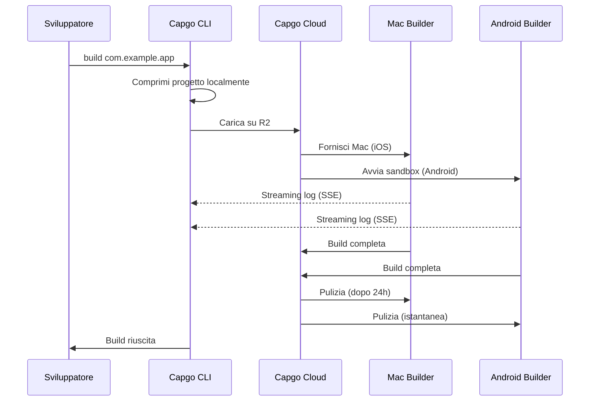

import { Card, CardGrid } from '@astrojs/starlight/components';

🏗️ Crea app mobile native nel cloud e inviale automaticamente all'App Store e al Play Store.

## Panoramica

Il comando `build` ti consente di creare la tua app Capacitor per iOS e Android nell'infrastruttura cloud di Capgo, in modo simile a come Expo gestisce le build. La tua app viene compilata su infrastruttura dedicata e può essere automaticamente inviata agli app store.

**Stato Attuale:** Beta Pubblica

## Perché Usare Cloud Build?

Creare app mobile native tradizionalmente richiede:
- **Hardware Mac** per build iOS ($1000+ o costosi minuti CI)
- **Configurazione CI/CD complessa** con caching e credenziali
- **Overhead di manutenzione** per Xcode, Android Studio e SDK

Con Capgo Cloud Build, ottieni:
- ✅ **Nessun Mac richiesto** - Crea app iOS da qualsiasi macchina
- ✅ **Zero configurazione** - Nessuna configurazione CI/CD necessaria
- ✅ **Collaudato** - Costruito su 3 anni di uso in produzione interno
- ✅ **Sicuro** - Nessuna archiviazione log, pulizia automatica
- ✅ **Solo nativo** - Il tuo JavaScript rimane privato

## Avvio Rapido

```bash
npx @capgo/cli@latest build com.example.app
```

Tutto qui! La tua app verrà compilata nel cloud e vedrai log in tempo reale.

## Sezioni della Documentazione

<CardGrid>
  <Card title="⚠️ Configura PRIMA le Credenziali" icon="warning">
    **Richiesto prima di compilare:** Salva le tue credenziali iOS/Android localmente.

    [Configura Credenziali →](/docs/cli/cloud-build/credentials/)
  </Card>

  <Card title="Iniziare" icon="rocket">
    Crea la tua prima build nativa in pochi minuti.

    [Leggi la guida →](/docs/cli/cloud-build/getting-started/)
  </Card>

  <Card title="Build iOS" icon="seti:apple">
    Configura certificati e compila per l'App Store.

    [Configura iOS →](/docs/cli/cloud-build/ios/)
  </Card>

  <Card title="Build Android" icon="seti:android">
    Configura keystore e compila per il Play Store.

    [Configura Android →](/docs/cli/cloud-build/android/)
  </Card>

  <Card title="Risoluzione dei Problemi" icon="warning">
    Soluzioni ai problemi comuni di build.

    [Ottieni aiuto →](/docs/cli/cloud-build/troubleshooting/)
  </Card>
</CardGrid>

## Riferimento Comandi

### Uso Base

```bash
npx @capgo/cli@latest build [appId] [opzioni]
```

### Esempi

Compila per entrambe le piattaforme:
```bash
npx @capgo/cli@latest build com.example.app
```

Compila solo per iOS:
```bash
npx @capgo/cli@latest build com.example.app --platform ios
```

Compila per Android in modalità debug:
```bash
npx @capgo/cli@latest build com.example.app --platform android --build-mode debug
```

Compila da una directory specifica:
```bash
npx @capgo/cli@latest build com.example.app --path ./my-app
```

### Opzioni

| Opzione | Tipo | Predefinito | Descrizione |
|--------|------|---------|-------------|
| `appId` | string | capacitor.config | ID Applicazione (es. com.example.app) |
| `--path <percorso>` | string | Directory corrente | Percorso alla directory del tuo progetto |
| `--platform <piattaforma>` | string | both | Piattaforma target: `ios`, `android`, o `both` |
| `--build-mode <modalità>` | string | release | Modalità build: `debug` o `release` |
| `--build-config <config>` | string | - | Configurazione build aggiuntiva come stringa JSON |
| `-a, --apikey <apikey>` | string | - | Chiave API (o usa la variabile d'ambiente `CAPGO_TOKEN`) |
| `--supa-host <url>` | string | https://api.capgo.app | URL host Supabase personalizzato |
| `--supa-anon <chiave>` | string | - | Chiave anon Supabase personalizzata |

## Come Funziona



### Processo di Build

1. **Preparazione Locale** - Il tuo progetto viene compresso localmente (escludendo `node_modules`, file nascosti)
2. **Caricamento** - File zip caricato su archiviazione cloud sicura (Cloudflare R2)
3. **Esecuzione Build**:
   - **iOS**: Macchina Mac dedicata fornita, Fastlane compila e firma
   - **Android**: Sandbox sicura creata, Gradle compila e firma
4. **Streaming Log** - Log in tempo reale tramite Server-Sent Events (non archiviati!)
5. **Pulizia Automatica**:
   - **iOS**: File eliminati dopo 24 ore quando la macchina viene rilasciata
   - **Android**: Tutto eliminato istantaneamente dopo la build

## La Nostra Esperienza

Capgo Cloud Build non è una nuova infrastruttura - la stiamo usando internamente da **3 anni**:

- ✅ **Fastlane Personalizzato** - Costruito specificamente per app Capacitor
- ✅ **Migliaia di build** - Collaudato in produzione
- ✅ **Esperti Capacitor** - Profonda conoscenza di ciò che conta
- ✅ **Focus solo nativo** - Il tuo JavaScript non tocca mai i nostri server

## Sicurezza e Privacy

- **Nessuna archiviazione log** - I log vengono solo trasmessi al tuo terminale, mai salvati
- **Nessuna archiviazione artefatti** - Le app vengono inviate direttamente all'App Store/Play Store, non conserviamo nulla
- **Credenziali eliminate automaticamente** - Usate solo durante la build, eliminate dopo
- **Build isolate** - Ogni build viene eseguita in isolamento
- **Il tuo codice rimane tuo** - Compiliamo solo parti native, JavaScript rimane locale

## Integrazione CI/CD

Funziona ovunque - GitHub Actions, GitLab CI, o qualsiasi piattaforma CI/CD:

```yaml
- name: Build native app
  env:
    CAPGO_TOKEN: ${{ secrets.CAPGO_TOKEN }}
  run: |
    npm run build
    npx cap sync
    npx @capgo/cli@latest build com.example.app \
      --platform both \
      --build-mode release
```

Non serve:
- Runner Mac
- Installazione Android SDK
- Installazione Xcode
- Caching complesso
- Gestione credenziali

## Prezzi

Il tempo di build viene fatturato in base all'uso effettivo:

- **Android**: Moltiplicatore 1× (~$0.XX al minuto)
- **iOS**: Moltiplicatore 2× (~$0.XX al minuto, a causa dell'hardware Mac)

**Costi tipici:**
- Debug Android: 3 min × 1× = ~$X.XX
- Release iOS: 7 min × 2× = ~$X.XX

Paghi solo per ciò che usi. Nessun minimo, nessuna sorpresa.

## Confronto con Altre Soluzioni

| Funzionalità | Capgo Cloud Build | GitHub Actions (Mac) | Expo EAS |
|---------|------------------|---------------------|----------|
| **Mac richiesto localmente** | ❌ No | ✅ Sì | ❌ No |
| **Complessità configurazione** | ⭐ Singolo comando | ⭐⭐⭐ YAML complesso | ⭐⭐ File di config |
| **Nativo Capacitor** | ✅ Ottimizzato | ⚠️ Generico | ❌ Solo Expo |
| **Privacy del codice** | ✅ Mai archiviato | ⚠️ Nei runner | ⚠️ Caricato |
| **Costo (iOS)** | 💰 2× base | 💰💰💰 10× costoso | 💰💰 Premium |

## Cosa Viene Compilato

**Importante:** Capgo compila **solo parti native**.

✅ **Compiliamo:**
- Codice nativo iOS (Swift, Objective-C, progetti Xcode)
- Codice nativo Android (Java, Kotlin, progetti Gradle)
- Firma del codice e invio agli app store

❌ **Tu compili (localmente):**
- JavaScript, HTML, CSS (`npm run build`)
- Sincronizzazione Capacitor (`npx cap sync`)
- Le tue risorse web

Questa separazione garantisce:
- **Maggiore sicurezza** - La logica della tua app rimane privata
- **Build più veloci** - Nessuna build web duplicata
- **Responsabilità chiara** - Tu controlli il tuo codice

## Limitazioni

Limitazioni attuali durante la beta pubblica:

- **Timeout build**: Massimo 10 minuti
- **Timeout caricamento**: 1 ora per l'URL di caricamento
- **Macchina iOS**: Requisito contratto di 24 ore, la build su Mac verrà accodata per garantire un utilizzo ottimale
- **Accesso**: Solo beta pubblica

## Iniziare

Pronto a compilare senza problemi?

<CardGrid>
  <Card title="Crea la Tua Prima Build" icon="rocket">
    Guida passo-passo alla tua prima build cloud.

    [Inizia →](/docs/cli/cloud-build/getting-started/)
  </Card>

  <Card title="Unisciti alla Beta Pubblica" icon="star">
    Cloud Build è in beta pubblica. Unisciti alla nostra community per ottenere l'accesso.

    [Unisciti a Discord →](https://discord.com/invite/VnYRvBfgA6)
  </Card>
</CardGrid>

## Scopri di Più

- [Guida Iniziare](/docs/cli/cloud-build/getting-started/) - Crea la tua prima build
- [Configurazione iOS](/docs/cli/cloud-build/ios/) - Configura build iOS
- [Configurazione Android](/docs/cli/cloud-build/android/) - Configura build Android
- [Risoluzione dei Problemi](/docs/cli/cloud-build/troubleshooting/) - Problemi comuni e soluzioni
- [Blog: Presentazione Cloud Build](/blog/introducing-capgo-cloud-build/) - Annuncio funzionalità

## Serve Aiuto?

- 📚 [Guida alla risoluzione dei problemi](/docs/cli/cloud-build/troubleshooting/)
- 💬 [Community Discord](https://discord.com/invite/VnYRvBfgA6)
- 📧 Email: support@capgo.app
