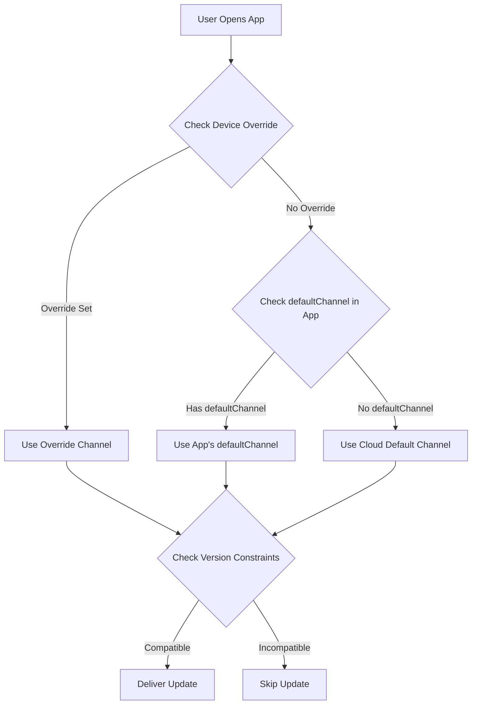

import { Aside } from '@astrojs/starlight/components';

Questa guida spiega come consegnare automaticamente il bundle compatibile più recente agli utenti in base alla loro versione di app nativa, **simile all'approccio di Ionic AppFlow**. Ciò garantisce una gestione semplificata degli aggiornamenti e rilasci più rapidi prevenendo al contempo i problemi di compatibilità.

<Aside type="tip" title="Migrazione da Ionic AppFlow?">
  Se stai migrando da Ionic AppFlow, questa guida è particolarmente importante per te. AppFlow ha automaticamente abbinato gli aggiornamenti alle versioni native, e Capgo fornisce la stessa capacità con ancora più controllo e flessibilità. Consulta la [Guida di migrazione AppFlow](/docs/upgrade/from-appflow-to-capgo) per le istruzioni passo passo.
</Aside>

## Panoramica

Il sistema di targeting delle versioni di Capgo ti consente di:

- **Consegnare automaticamente aggiornamenti compatibili** agli utenti in base alla loro versione di app nativa
- **Prevenire le modifiche significative** di raggiungere versioni di app incompatibili
- **Gestire più versioni di app** contemporaneamente senza logica complessa
- **Lanciare aggiornamenti senza problemi** per segmenti di utenti specifici

### Perché il Targeting delle Versioni è Importante (Soprattutto per gli Utenti di AppFlow)

Se hai familiarità con **Ionic AppFlow**, sai quanto sia critico assicurare che gli utenti ricevano solo aggiornamenti compatibili. AppFlow ha automaticamente abbinato i bundle di aggiornamento in tempo reale alle versioni di app native, prevenendo il recapito di JavaScript incompatibile al codice nativo più vecchio.

**Capgo fornisce le stesse garanzie di sicurezza**, con funzionalità aggiuntive:
- Controllo più granulare sul matching delle versioni
- Strategie multiple (canali, semver, vincoli nativi)
- Migliore visibilità nella distribuzione delle versioni
- Controllo API e CLI insieme alla gestione del dashboard

Questo approccio è particolarmente utile quando:
- Hai utenti su diverse versioni principali della tua app (ad esempio, v1.x, v2.x, v3.x)
- Devi mantenere la compatibilità all'indietro mentre implementi modifiche significative
- Vuoi evitare che bundle più recenti rompano il codice nativo più vecchio
- Stai gradualmente migrando gli utenti da una versione all'altra
- **Stai migrando da AppFlow** e vuoi mantenere la stessa sicurezza di aggiornamento

## Come Funziona

Capgo utilizza un approccio a più livelli per abbinare gli utenti agli aggiornamenti compatibili:

1. **Vincoli di Versione Nativa**: Impedisci la consegna dei bundle a versioni native incompatibili
2. **Routing Basato su Canali**: Indirizza diverse versioni di app a diversi canali di aggiornamento
3. **Controlli Versioning Semantico**: Blocca automaticamente gli aggiornamenti su confini maggiori/minori/patch
4. **Sostituzioni a Livello di Dispositivo**: Destinazione dispositivi specifici o gruppi di utenti

### Flusso di Corrispondenza delle Versioni



## Strategia 1: Routing delle Versioni Basato su Canali

Questo è l'**approccio consigliato** per gestire modifiche significative e aggiornamenti di versioni principali. È simile al modello di consegna di AppFlow.

### Scenario di Esempio

- **App v1.x** (100.000 utenti) → canale `production`
- **App v2.x** (50.000 utenti con modifiche significative) → canale `v2`
- **App v3.x** (10.000 utenti beta) → canale `v3`

### Implementazione

#### Passaggio 1: Configura Canali per Ogni Versione Principale

```typescript
// capacitor.config.ts per build versione 1.x
import { CapacitorConfig } from '@capacitor/cli';

const config: CapacitorConfig = {
  appId: 'com.example.app',
  appName: 'Example App',
  plugins: {
    CapacitorUpdater: {
      autoUpdate: true,
      defaultChannel: 'production', // o ometti per default
    }
  }
};

export default config;
```

```typescript
// capacitor.config.ts per build versione 2.x
const config: CapacitorConfig = {
  appId: 'com.example.app',
  appName: 'Example App',
  plugins: {
    CapacitorUpdater: {
      autoUpdate: true,
      defaultChannel: 'v2', // Indirizza automaticamente gli utenti v2
    }
  }
};
```

```typescript
// capacitor.config.ts per build versione 3.x
const config: CapacitorConfig = {
  appId: 'com.example.app',
  appName: 'Example App',
  plugins: {
    CapacitorUpdater: {
      autoUpdate: true,
      defaultChannel: 'v3', // Indirizza automaticamente gli utenti v3
    }
  }
};
```

#### Passaggio 2: Crea Canali

```bash
# Crea canali per ogni versione principale
npx @capgo/cli channel create production
npx @capgo/cli channel create v2
npx @capgo/cli channel create v3

# Abilita l'auto-assegnazione in modo che le app possano cambiare canale
npx @capgo/cli channel set production --self-assign
npx @capgo/cli channel set v2 --self-assign
npx @capgo/cli channel set v3 --self-assign
```

#### Passaggio 3: Carica Bundle Specifici della Versione

```bash
# Per utenti v1.x (da ramo v1-maintenance)
git checkout v1-maintenance
npm run build
npx @capgo/cli bundle upload --channel production

# Per utenti v2.x (da ramo v2-maintenance o main)
git checkout main
npm run build
npx @capgo/cli bundle upload --channel v2

# Per utenti v3.x (da ramo beta/v3)
git checkout beta
npm run build
npx @capgo/cli bundle upload --channel v3
```

<Aside type="tip" title="Routing Automatico">
  Quando gli utenti aprono l'app, si connettono automaticamente al loro canale designato in base al `defaultChannel` nel loro bundle di app installato. Nessun cambio di codice JavaScript richiesto!
</Aside>

### Vantaggi

- **Zero modifiche al codice** - Il routing del canale avviene automaticamente
- **Separazione chiara** - Ogni versione ha la propria pipeline di aggiornamento
- **Targeting flessibile** - Invia aggiornamenti a gruppi di versioni specifici
- **Rollout sicuri** - Le modifiche significative non raggiungono mai versioni incompatibili

## Strategia 2: Controlli Versioning Semantico

Utilizza i controlli di versioning semantico integrati di Capgo per prevenire gli aggiornamenti oltre i confini della versione.

### Disabilita Aggiornamento Automatico su Versioni Principali

```bash
# Crea un canale che blocca gli aggiornamenti della versione principale
npx @capgo/cli channel create stable --disable-auto-update major
```

Questa configurazione significa:
- Gli utenti sulla versione dell'app **1.2.3** riceveranno aggiornamenti fino a **1.9.9**
- Gli utenti **NON** riceveranno la versione **2.0.0** automaticamente
- Impedisce le modifiche significative di raggiungere il codice nativo più vecchio

### Opzioni di Controllo Granulare

```bash
# Blocca gli aggiornamenti della versione minore (1.2.x non otterrà 1.3.0)
npx @capgo/cli channel set stable --disable-auto-update minor

# Blocca gli aggiornamenti di patch (1.2.3 non otterrà 1.2.4)
npx @capgo/cli channel set stable --disable-auto-update patch

# Consenti tutti gli aggiornamenti
npx @capgo/cli channel set stable --disable-auto-update none
```

<Aside type="caution" title="Versioning Semantico Richiesto">
  Questa strategia funziona solo se segui il versioning semantico (semver) per le versioni della tua app. Assicurati che i tuoi numeri di versione seguano il formato `MAJOR.MINOR.PATCH`.
</Aside>

## Strategia 3: Vincoli di Versione Nativa

Specifica i requisiti di versione nativa minima per i bundle per prevenire la consegna ai dispositivi incompatibili.

### Uso della Condizione di Ritardo nativeVersion

Durante il caricamento di un bundle, puoi specificare una versione nativa minima:

```bash
# Questo bundle richiede la versione nativa 2.0.0 o superiore
npx @capgo/cli bundle upload \
  --channel production \
  --native-version "2.0.0"
```

<Aside type="note" title="Come Funziona">
  I dispositivi sulla versione nativa 1.x NON riceveranno questo bundle. Solo i dispositivi su 2.0.0+ lo otterranno. Questo è perfetto per gli aggiornamenti che richiedono nuove API native o plugin.
</Aside>

### Casi d'Uso

1. **Nuovo Plugin Nativo Richiesto**
   ```bash
   # Il bundle ha bisogno del plugin Camera aggiunto in v2.0.0
   npx @capgo/cli bundle upload --native-version "2.0.0"
   ```

2. **Modifiche API Native Significative**
   ```bash
   # Il bundle utilizza le nuove API di Capacitor 6
   npx @capgo/cli bundle upload --native-version "3.0.0"
   ```

3. **Migrazione Graduale**
   ```bash
   # Testa il bundle solo su versione nativa più recente
   npx @capgo/cli bundle upload \
     --channel beta \
     --native-version "2.5.0"
   ```

## Strategia 4: Prevenzione dei Downgrade Automatici

Impedisci agli utenti di ricevere bundle più vecchi della loro versione nativa attuale.

### Abilita nelle Impostazioni del Canale

Nel dashboard di Capgo:
1. Vai a **Canali** → Seleziona il tuo canale
2. Abilita **"Disabilita downgrade automatico sotto nativo"**
3. Salva le modifiche

O tramite CLI:
```bash
npx @capgo/cli channel set production --disable-downgrade
```

### Esempio

- Versione del dispositivo dell'utente: Versione nativa **1.2.5**
- Bundle canale: Versione **1.2.3**
- **Risultato**: L'aggiornamento è bloccato (sarebbe un downgrade)

Questo è utile quando:
- Gli utenti hanno installato manualmente una versione più recente dall'app store
- Devi assicurarti che gli utenti abbiano sempre le patch di sicurezza più recenti
- Vuoi prevenire i bug di regressione

## Strategia 5: Targeting a Livello di Dispositivo

Sostituisci l'assegnazione del canale per dispositivi o gruppi di utenti specifici.

### Forza Versione Specifica per i Test

```typescript
import { CapacitorUpdater } from '@capgo/capacitor-updater'

// Forza i beta tester a utilizzare il canale v3
async function assignBetaTesters() {
  const deviceId = await CapacitorUpdater.getDeviceId()

  // Verifica se l'utente è un beta tester
  if (isBetaTester(userId)) {
    await CapacitorUpdater.setChannel({ channel: 'v3' })
  }
}
```

### Sostituzione Dispositivo Dashboard

Nel dashboard di Capgo:
1. Vai a **Dispositivi** → Trova dispositivo
2. Fai clic su **Imposta Canale** o **Imposta Versione**
3. Sostituisci con canale o versione bundle specifico
4. Il dispositivo riceverà aggiornamenti da sorgente sostituita

<Aside type="tip" title="Test degli Aggiornamenti">
  Usa le sostituzioni dei dispositivi per testare gli aggiornamenti sul tuo dispositivo prima di distribuire a tutti gli utenti.
</Aside>

## Flusso di Lavoro Completo Stile AppFlow

Ecco un esempio completo che combina tutte le strategie:

### 1. Configurazione Iniziale (App v1.0.0)

```bash
# Crea canale di produzione con controlli semver
npx @capgo/cli channel create production \
  --disable-auto-update major \
  --disable-downgrade
```

```typescript
// capacitor.config.ts
const config: CapacitorConfig = {
  plugins: {
    CapacitorUpdater: {
      autoUpdate: true,
      defaultChannel: 'production',
    }
  }
};
```

### 2. Rilascia Modifica Significativa (App v2.0.0)

```bash
# Crea canale v2 per nuova versione
npx @capgo/cli channel create v2 \
  --disable-auto-update major \
  --disable-downgrade \
  --self-assign

# Crea ramo git per manutenzione v1
git checkout -b v1-maintenance
git push origin v1-maintenance
```

```typescript
// capacitor.config.ts per v2.0.0
const config: CapacitorConfig = {
  plugins: {
    CapacitorUpdater: {
      autoUpdate: true,
      defaultChannel: 'v2', // I nuovi utenti ottengono il canale v2
    }
  }
};
```

### 3. Invia Aggiornamenti a Entrambe le Versioni

```bash
# Aggiorna utenti v1.x (correzione bug)
git checkout v1-maintenance
# Apporta modifiche
npx @capgo/cli bundle upload \
  --channel production \
  --native-version "1.0.0"

# Aggiorna utenti v2.x (nuova funzionalità)
git checkout main
# Apporta modifiche
npx @capgo/cli bundle upload \
  --channel v2 \
  --native-version "2.0.0"
```

### 4. Monitora Distribuzione Versioni

Usa il dashboard di Capgo per tracciare:
- Quanti utenti sono su v1 vs v2
- Tassi di adozione bundle per versione
- Errori o arresti per versione

### 5. Depreca Versione Precedente

Una volta che l'uso di v1 scende al di sotto della soglia:

```bash
# Smetti di caricare nel canale di produzione
# Facoltativo: Elimina ramo di manutenzione v1
git branch -d v1-maintenance

# Sposta tutti gli utenti rimanenti al valore predefinito
# (Dovranno aggiornare tramite app store)
```

## Precedenza del Canale

Quando esistono più configurazioni di canali, Capgo utilizza questo ordine di precedenza:

1. **Sostituzione Dispositivo** (Dashboard o API) - Priorità Più Alta
2. **Sostituzione Cloud** tramite chiamata `setChannel()`
3. **defaultChannel** in capacitor.config.ts
4. **Canale Predefinito** (Impostazione Cloud) - Priorità Più Bassa

<Aside type="note" title="Esempio di Precedenza">
  Se l'app di un utente ha `defaultChannel: 'v2'` ma sostituisci il suo dispositivo con `'beta'` nel dashboard, riceverà aggiornamenti dal canale `'beta'`.
</Aside>

## Migliori Pratiche

### 1. Imposta Sempre defaultChannel per Versioni Principali

```typescript
// ✅ Bene: Ogni versione principale ha canale esplicito
// v1.x → production
// v2.x → v2
// v3.x → v3

// ❌ Male: Affidandosi al cambio di canale dinamico
// Tutte le versioni → production, cambia manualmente
```

### 2. Usa Versioning Semantico

```bash
# ✅ Bene
1.0.0 → 1.0.1 → 1.1.0 → 2.0.0

# ❌ Male
1.0 → 1.1 → 2 → 2.5
```

### 3. Mantieni Rami Separati

```bash
# ✅ Bene: Rami separati per versione principale
main (v3.x)
v2-maintenance (v2.x)
v1-maintenance (v1.x)

# ❌ Male: Ramo singolo per tutte le versioni
```

### 4. Testa Prima del Rollout

```bash
# Testa prima sul canale beta
npx @capgo/cli bundle upload --channel beta

# Monitora i problemi, quindi promuovi a produzione
npx @capgo/cli bundle upload --channel production
```

### 5. Monitora Distribuzione Versioni

Controlla regolarmente il tuo dashboard:
- Gli utenti si aggiornano alle versioni native più recenti?
- Le versioni precedenti ricevono ancora molto traffico?
- Dovresti deprecare i canali vecchi?

## Confronto con Ionic AppFlow

Per i team che migrano da **Ionic AppFlow**, ecco un confronto del targeting delle versioni di Capgo:

| Funzionalità | Ionic AppFlow | Capgo |
|---------|---------------|-------|
| **Routing basato su versione** | Automatico basato su versione nativa | Automatico tramite `defaultChannel` + strategie multiple |
| **Versioning semantico** | Supporto di base | Avanzato con `--disable-auto-update` (major/minor/patch) |
| **Vincoli di versione nativa** | Configurazione manuale nel dashboard AppFlow | Flag `--native-version` integrato in CLI |
| **Gestione canali** | Web UI + CLI | Web UI + CLI + API |
| **Sostituzioni dispositivo** | Controllo limitato a livello di dispositivo | Controllo completo tramite Dashboard/API |
| **Prevenzione downgrade automatico** | Sì | Sì tramite `--disable-downgrade` |
| **Manutenzione multi-versione** | Gestione manuale del ramo/canale | Automatizzata con precedenza del canale |
| **Self-hosting** | No | Sì (controllo completo) |
| **Analitiche versioni** | Base | Metriche dettagliate per versione |

<Aside type="note" title="Parità AppFlow e Oltre">
  Capgo fornisce **tutte le capacità di targeting delle versioni** che AppFlow ha offerto, più meccanismi di controllo aggiuntivi. Se hai fatto affidamento sul matching automatico delle versioni di AppFlow, troverai Capgo altrettanto sicuro con più flessibilità.
</Aside>

## Risoluzione dei Problemi

### Gli Utenti Non Ricevono Aggiornamenti

Controlla quanto segue:

1. **Assegnazione Canale**: Verifica che il dispositivo sia sul canale corretto
   ```typescript
   const channel = await CapacitorUpdater.getChannel()
   console.log('Current channel:', channel)
   ```

2. **Vincoli Versione**: Verifica se il bundle ha requisiti di versione nativa
   - Dashboard → Bundle → Controlla colonna "Versione Nativa"

3. **Impostazioni Semver**: Verifica impostazione `disable-auto-update` del canale
   ```bash
   npx @capgo/cli channel list
   ```

4. **Sostituzione Dispositivo**: Verifica se il dispositivo ha sostituzione manuale
   - Dashboard → Dispositivi → Cerca dispositivo → Controlla canale/versione

### Bundle Consegnato a Versione Sbagliata

1. **Rivedi defaultChannel**: Assicurati del canale corretto in `capacitor.config.ts`
2. **Controlla Caricamento Bundle**: Verifica che il bundle sia stato caricato nel canale previsto
3. **Ispeziona Versione Nativa**: Conferma che il flag `--native-version` sia stato usato correttamente

### Modifiche Significative che Interessano Versioni Precedenti

1. **Correzione Immediata**: Sostituisci dispositivi interessati con bundle sicuro
   - Dashboard → Dispositivi → Selezione Multipla → Imposta Versione
2. **Correzione a Lungo Termine**: Crea canali versionati e mantieni rami separati
3. **Prevenzione**: Testa sempre gli aggiornamenti su dispositivi rappresentativi prima del rollout

## Migrazione da Ionic AppFlow

Se stai migrando da **Ionic AppFlow**, il targeting delle versioni funziona in modo molto simile in Capgo, con maggiore flessibilità:

### Mappatura Concetti

| Concetto AppFlow | Equivalente Capgo | Note |
|-----------------|------------------|-------|
| **Canale di Distribuzione** | Canale Capgo | Stesso concetto, più potente |
| **Blocco Versione Nativa** | flag `--native-version` | Controllo più granulare |
| **Priorità Canale** | Precedenza canale (override → cloud → default) | Precedenza più trasparente |
| **Obiettivo Distribuzione** | Canale + controlli semver | Strategie multiple disponibili |
| **Canale Produzione** | canale `production` (o qualsiasi nome) | Denominazione flessibile |
| **Distribuzione basata su Git** | Caricamento bundle CLI da ramo | Stesso flusso di lavoro |
| **Matching versione automatico** | `defaultChannel` + vincoli versione | Migliorato con strategie multiple |

### Differenze Chiave per Utenti AppFlow

1. **Più Controllo**: Capgo ti offre più strategie (canali, semver, versione nativa) che possono essere combinate
2. **Migliore Visibilità**: Il dashboard mostra distribuzione versioni e problemi di compatibilità
3. **Accesso API**: Controllo programmatico completo del targeting delle versioni
4. **Self-Hosting**: Opzione per eseguire il tuo server di aggiornamento con la stessa logica di versione

### Passaggi di Migrazione

1. **Mappa i tuoi canali AppFlow** ai canali Capgo (di solito 1:1)
2. **Imposta `defaultChannel`** in `capacitor.config.ts` per ogni versione principale
3. **Configura regole semver** se vuoi blocco automatico ai confini della versione
4. **Carica bundle specifici della versione** usando il flag `--native-version`
5. **Monitora distribuzione versioni** nel dashboard di Capgo

<Aside type="tip" title="Guida di Migrazione Completa">
  Per istruzioni complete sulla migrazione incluso sostituzione SDK e mappatura API, consulta la [Guida di Migrazione AppFlow a Capgo](/docs/upgrade/from-appflow-to-capgo).
</Aside>

## Modelli Avanzati

### Rollout Graduale per Versione

```typescript
// Migra gradualmente utenti da v1 a v2
async function migrateUsers() {
  const deviceId = await CapacitorUpdater.getDeviceId()
  const rolloutPercentage = 10 // Inizia con 10%

  // Hash ID dispositivo per ottenere percentuale deterministica
  const hash = hashCode(deviceId) % 100

  if (hash < rolloutPercentage) {
    // L'utente è nel gruppo di rollout - Migra a v2
    await CapacitorUpdater.setChannel({ channel: 'v2' })
  }
}
```

### Flag Funzionalità per Versione

```typescript
// Abilita funzionalità in base alla versione nativa
async function checkFeatureAvailability() {
  const info = await CapacitorUpdater.getDeviceId()
  const nativeVersion = info.nativeVersion

  if (compareVersions(nativeVersion, '2.0.0') >= 0) {
    // Abilita funzionalità che richiedono v2.0.0+
    enableNewCameraFeature()
  }
}
```

### Test A/B Tra Versioni

```typescript
// Esegui test A/B all'interno della stessa versione nativa
async function assignABTest() {
  const nativeVersion = await getNativeVersion()

  if (nativeVersion.startsWith('2.')) {
    // Solo test A/B su utenti v2
    const variant = Math.random() < 0.5 ? 'v2-test-a' : 'v2-test-b'
    await CapacitorUpdater.setChannel({ channel: variant })
  }
}
```

## Riepilogo

Capgo fornisce più strategie per la consegna di aggiornamenti specifici della versione:

1. **Routing Basato su Canali**: Separazione versione automatica tramite `defaultChannel`
2. **Versioning Semantico**: Previeni aggiornamenti su confini major/minor/patch
3. **Vincoli Versione Nativa**: Richiedi versione nativa minima per bundle
4. **Prevenzione Downgrade Automatico**: Non consegnare mai bundle precedenti a versioni native più recenti
5. **Sostituzioni Dispositivo**: Controllo manuale per test e targeting

Combinando queste strategie, puoi raggiungere la consegna di aggiornamenti automatici stile AppFlow con ancora più flessibilità e controllo. Scegli l'approccio che meglio si adatta al tuo flusso di lavoro di versionamento e distribuzione dell'app.

Per maggiori dettagli su funzionalità specifiche:
- [Guida Modifiche Significative](/docs/live-updates/breaking-changes) - Strategia di versionamento del canale dettagliata
- [Gestione Canali](/docs/live-updates/channels) - Riferimento configurazione canale completo
- [Comportamento Aggiornamenti](/docs/live-updates/update-behavior) - Ritardi di versione nativa e condizioni
