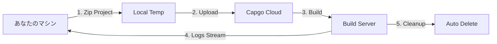

import { Steps, Card, CardGrid } from '@astrojs/starlight/components';

Capgo Cloud Buildを使い始めて、数分で最初のiOSまたはAndroidネイティブビルドを作成しましょう。

## 必要なもの

始める前に、以下が必要です:

- ローカルで正常にビルドされるCapacitorアプリ
- Node.js 20以上がインストールされている
- アクティブなサブスクリプションを持つCapgoアカウント
- Capgoにアプリがすでに登録されている（登録されていない場合は`npx @capgo/cli@latest app add`を実行）
- **ビルド認証情報が設定されている**（証明書、キーストア） - 以下を参照

## 最初のビルドの前に

<CardGrid>
  <Card title="⚠️ 最初に認証情報を設定してください" icon="warning">
    **ビルド前に必須:** ビルド認証情報（iOS用証明書、Android用キーストア）を設定する必要があります。

    [認証情報を設定 →](/docs/cli/cloud-build/credentials/)
  </Card>
</CardGrid>

## クイックスタート

<Steps>

1. **ビルド認証情報の設定**

   ビルドする前に、認証情報をローカルに保存する必要があります:

   **iOS用:**
   ```bash
   npx @capgo/cli build credentials save \
     --platform ios \
     --certificate ./cert.p12 \
     --p12-password "password" \
     --provisioning-profile ./profile.mobileprovision \
     --apple-key ./AuthKey.p8 \
     --apple-key-id "KEY123" \
     --apple-issuer-id "issuer-uuid" \
     --apple-team-id "team-id"
   ```

   **Android用:**
   ```bash
   npx @capgo/cli build credentials save \
     --platform android \
     --keystore ./release.keystore \
     --keystore-alias "my-key" \
     --keystore-key-password "key-pass" \
     --keystore-store-password "store-pass"
   ```

   詳細については、[完全な認証情報ガイド](/docs/cli/cloud-build/credentials/)をご覧ください。

2. **ローカルビルドの確認**

   まず、アプリがエラーなくローカルでビルドされることを確認してください:

   ```bash
   # Webアセットをビルド
   npm run build

   # Capacitorと同期
   npx cap sync

   # ローカルビルドをテスト（オプションですが推奨）
   npx cap open ios    # iOS用
   npx cap open android # Android用
   ```

3. **Capgoで認証**

   Capgo APIキーを設定してください（まだ設定していない場合）:

   ```bash
   npx @capgo/cli@latest login
   ```

   または環境変数を設定:
   ```bash
   export CAPGO_TOKEN=your_api_key_here
   ```

4. **最初のビルドを実行**

   Androidデバッグビルドから始めます（テストに最速）:

   ```bash
   npx @capgo/cli@latest build com.example.app \
     --platform android \
     --build-mode debug
   ```

   ビルドが進行するにつれて、リアルタイムのログが表示されます:
   ```
   ✔ Creating build job...
   ✔ Uploading project (15.2 MB)...
   ✔ Build started

   📝 Build logs:
   → Installing dependencies...
   → Running Gradle build...
   → Signing APK...
   ✔ Build succeeded in 3m 42s
   ```

5. **ビルドステータスの確認**

   CLIは自動的にポーリングしてビルドステータスを表示します。完了すると、以下が表示されます:

   - ビルド時間
   - 成功/失敗ステータス
   - App Store/Play Storeに送信されたアプリ（認証情報が設定されている場合）

</Steps>

## ビルドプロセスの理解

ビルドコマンドを実行すると、以下が実行されます:



1. **ローカル準備** - プロジェクトがzip化されます（`node_modules`とdotfilesを除く）
2. **アップロード** - zipが安全なクラウドストレージ（Cloudflare R2）にアップロードされます
3. **ビルド実行** - 専用インフラストラクチャでアプリがビルドされます
4. **ログストリーミング** - リアルタイムログがServer-Sent Events経由でターミナルにストリーミングされます
5. **自動クリーンアップ** - ビルドアーティファクトが削除されます（Android: 即座、iOS: 24時間）

## 最初の本番ビルド

プロセスが機能することを確認したら、本番ビルドを作成します:

### Android

```bash
npx @capgo/cli@latest build com.example.app \
  --platform android \
  --build-mode release
```

最初に署名認証情報を設定する必要があります。[Androidビルド設定](/docs/cli/cloud-build/android/)をご覧ください。

### iOS

```bash
npx @capgo/cli@latest build com.example.app \
  --platform ios \
  --build-mode release
```

iOSビルドには署名証明書とプロビジョニングプロファイルが必要です。[iOSビルド設定](/docs/cli/cloud-build/ios/)をご覧ください。

## ビルドされるもの

**重要:** Capgo Cloud Buildは、アプリの**ネイティブ部分のみ**をビルドします（iOSおよびAndroidネイティブコード）。

あなたの責任:
- Webアセットのビルド（`npm run build`）
- ビルド前の`npx cap sync`の実行
- すべての依存関係が`package.json`にあることの確認

私たちが処理すること:
- ネイティブiOSコンパイル（Xcode、Fastlane）
- ネイティブAndroidコンパイル（Gradle）
- コード署名
- アプリストアへの送信（設定されている場合）

## ビルド時間とコスト

ビルド時間は開始から完了まで測定されます:

- **Android**: 通常3〜5分（1倍の課金乗数）
- **iOS**: 通常5〜10分（Macハードウェアコストのため2倍の課金乗数）

実際に使用したビルド時間のみが課金されます。隠れた料金はありません。

## 一般的な使用例

### CI/CD統合

GitHub Actionsワークフローに追加:

```yaml
- name: Build native app
  env:
    CAPGO_TOKEN: ${{ secrets.CAPGO_TOKEN }}
  run: |
    npm run build
    npx cap sync
    npx @capgo/cli@latest build ${{ secrets.APP_ID }} \
      --platform both \
      --build-mode release
```

### ローカル開発

コミット前にローカルでビルドをテスト:

```bash
# テスト用のクイックデバッグビルド
npm run build && npx cap sync
npx @capgo/cli@latest build com.example.app \
  --platform android \
  --build-mode debug
```

### マルチプラットフォームビルド

両方のプラットフォームで同時にビルド:

```bash
npx @capgo/cli@latest build com.example.app \
  --platform both \
  --build-mode release
```

## 次のステップ

最初のビルドを作成したら:

- [iOSビルドを設定](/docs/cli/cloud-build/ios/) - 証明書とプロファイルを設定
- [Androidビルドを設定](/docs/cli/cloud-build/android/) - キーストアとPlay Storeを設定
- [トラブルシューティング](/docs/cli/cloud-build/troubleshooting/) - 一般的な問題と解決策
- [CLIリファレンス](/docs/cli/reference/build/) - 完全なコマンドドキュメント

## お困りですか？

- [トラブルシューティングガイド](/docs/cli/cloud-build/troubleshooting/)を確認
- [Discordコミュニティ](https://discord.com/invite/VnYRvBfgA6)に参加
- support@capgo.appにメールでサポート
