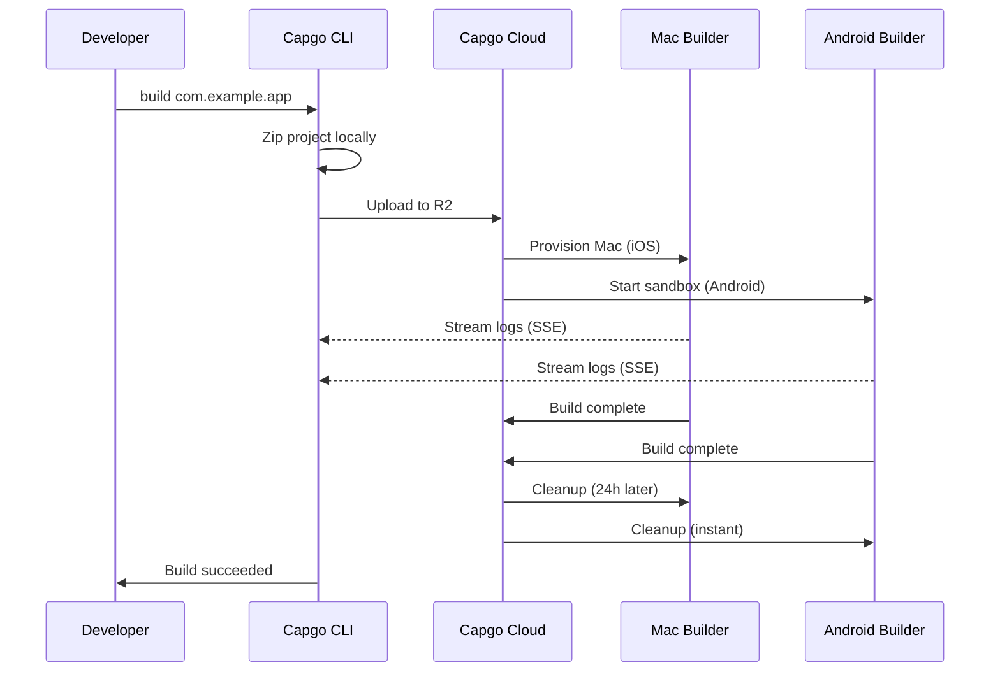

import { Card, CardGrid } from '@astrojs/starlight/components';

🏗️ クラウドでネイティブモバイルアプリをビルドし、App StoreとPlay Storeに自動的に送信します。

## 概要

`build`コマンドを使用すると、Expoがビルドを処理する方法と同様に、CapgoのクラウドインフラストラクチャでCapacitorアプリをiOSおよびAndroid用にビルドできます。アプリは専用インフラストラクチャでビルドされ、アプリストアに自動的に送信できます。

**現在のステータス:** パブリックベータ

## なぜCloud Buildを使用するのか？

従来のネイティブモバイルアプリのビルドには以下が必要です:
- iOSビルド用の**Macハードウェア**（$1000以上または高価なCIミニッツ）
- キャッシングと認証情報を使用した**複雑なCI/CD**設定
- Xcode、Android Studio、SDKの**メンテナンスオーバーヘッド**

Capgo Cloud Buildを使用すると、以下が得られます:
- ✅ **Macは不要** - どのマシンからでもiOSアプリをビルド
- ✅ **ゼロ設定** - CI/CD設定は不要
- ✅ **実証済み** - 3年間の内部本番使用で構築
- ✅ **安全** - ログ保存なし、自動クリーンアップ
- ✅ **ネイティブのみに焦点** - JavaScriptはサーバーに触れません

## クイックスタート

```bash
npx @capgo/cli@latest build com.example.app
```

これだけです！アプリはクラウドでビルドされ、リアルタイムログが表示されます。

## ドキュメントセクション

<CardGrid>
  <Card title="⚠️ 最初に認証情報を設定してください" icon="warning">
    **ビルド前に必須:** iOS/Android認証情報をローカルに保存してください。

    [認証情報を設定 →](/docs/cli/cloud-build/credentials/)
  </Card>

  <Card title="はじめに" icon="rocket">
    数分で最初のネイティブビルドを作成します。

    [ガイドを読む →](/docs/cli/cloud-build/getting-started/)
  </Card>

  <Card title="iOSビルド" icon="seti:apple">
    証明書を設定してApp Store用にビルドします。

    [iOSを設定 →](/docs/cli/cloud-build/ios/)
  </Card>

  <Card title="Androidビルド" icon="seti:android">
    キーストアを設定してPlay Store用にビルドします。

    [Androidを設定 →](/docs/cli/cloud-build/android/)
  </Card>

  <Card title="トラブルシューティング" icon="warning">
    一般的なビルドの問題の解決策。

    [ヘルプを得る →](/docs/cli/cloud-build/troubleshooting/)
  </Card>
</CardGrid>

## コマンドリファレンス

### 基本的な使用方法

```bash
npx @capgo/cli@latest build [appId] [options]
```

### 例

両方のプラットフォーム用にビルド:
```bash
npx @capgo/cli@latest build com.example.app
```

iOS専用にビルド:
```bash
npx @capgo/cli@latest build com.example.app --platform ios
```

Androidをデバッグモードでビルド:
```bash
npx @capgo/cli@latest build com.example.app --platform android --build-mode debug
```

特定のディレクトリからビルド:
```bash
npx @capgo/cli@latest build com.example.app --path ./my-app
```

### オプション

| オプション | タイプ | デフォルト | 説明 |
|--------|------|---------|-------------|
| `appId` | string | capacitor.config | アプリケーションID（例: com.example.app） |
| `--path <path>` | string | 現在のディレクトリ | プロジェクトディレクトリへのパス |
| `--platform <platform>` | string | both | ターゲットプラットフォーム: `ios`、`android`、または`both` |
| `--build-mode <mode>` | string | release | ビルドモード: `debug`または`release` |
| `--build-config <config>` | string | - | JSON文字列としての追加ビルド設定 |
| `-a, --apikey <apikey>` | string | - | APIキー（または`CAPGO_TOKEN`環境変数を使用） |
| `--supa-host <url>` | string | https://api.capgo.app | カスタムSupabaseホストURL |
| `--supa-anon <key>` | string | - | カスタムSupabase anonキー |

## 仕組み



### ビルドプロセス

1. **ローカル準備** - プロジェクトがローカルでzip化されます（`node_modules`、dotfilesを除く）
2. **アップロード** - zipファイルが安全なクラウドストレージにアップロードされます（Cloudflare R2）
3. **ビルド実行**:
   - **iOS**: 専用Macマシンがプロビジョニングされ、Fastlaneがビルドして署名
   - **Android**: 安全なサンドボックスが作成され、Gradleがコンパイルして署名
4. **ログストリーミング** - Server-Sent Events経由でリアルタイムログ（保存されません！）
5. **自動クリーンアップ**:
   - **iOS**: マシン解放時に24時間後にファイルが削除
   - **Android**: ビルド後に即座にすべてが削除

## 私たちの専門知識

Capgo Cloud Buildは新しいインフラストラクチャではありません - **3年間**内部で使用しています:

- ✅ **カスタムFastlane** - Capacitorアプリ専用に構築
- ✅ **数千のビルド** - 本番環境で実証済み
- ✅ **Capacitorエキスパート** - 重要なことへの深い知識
- ✅ **ネイティブのみに焦点** - JavaScriptはサーバーに触れません

## セキュリティとプライバシー

- **ログ保存なし** - ログはターミナルにのみストリーミングされ、保存されません
- **アーティファクト保存なし** - アプリはApp Store/Play Storeに直接送信され、何も保持しません
- **認証情報は自動削除** - ビルド中のみ使用され、その後削除（最大24時間）
- **分離されたビルド** - 各ビルドは分離して実行
- **コードはあなたのもの** - ネイティブ部分のみをビルドし、JavaScriptはローカルに保持

## CI/CD統合

GitHub Actions、GitLab CI、またはあらゆるCI/CDプラットフォームで動作します:

```yaml
- name: Build native app
  env:
    CAPGO_TOKEN: ${{ secrets.CAPGO_TOKEN }}
  run: |
    npm run build
    npx cap sync
    npx @capgo/cli@latest build com.example.app \
      --platform both \
      --build-mode release
```

不要なもの:
- Macランナー
- Android SDKインストール
- Xcodeインストール
- 複雑なキャッシング
- 認証情報管理

## 料金

ビルド時間は実際の使用量に基づいて課金されます:

- **Android**: 1倍の乗数（〜$0.XX/分）
- **iOS**: 2倍の乗数（〜$0.XX/分、Macハードウェアのため）

**一般的なコスト:**
- Androidデバッグ: 3分 × 1倍 = 〜$X.XX
- iOSリリース: 7分 × 2倍 = 〜$X.XX

使用した分のみお支払いください。最低料金なし、サプライズなし。

## 他のソリューションとの比較

| 機能 | Capgo Cloud Build | GitHub Actions (Mac) | Expo EAS |
|---------|------------------|---------------------|----------|
| **ローカルMac必須** | ❌ いいえ | ✅ はい | ❌ いいえ |
| **設定の複雑さ** | ⭐ 単一コマンド | ⭐⭐⭐ 複雑なYAML | ⭐⭐ 設定ファイル |
| **Capacitorネイティブ** | ✅ 最適化 | ⚠️ 汎用 | ❌ Expoのみ |
| **コードのプライバシー** | ✅ 保存されない | ⚠️ ランナー内 | ⚠️ アップロード |
| **コスト（iOS）** | 💰 2倍ベース | 💰💰💰 10倍高価 | 💰💰 プレミアム |

## ビルドされるもの

**重要:** Capgoは**ネイティブ部分のみ**をビルドします。

✅ **私たちがビルド:**
- iOSネイティブコード（Swift、Objective-C、Xcodeプロジェクト）
- Androidネイティブコード（Java、Kotlin、Gradleプロジェクト）
- コード署名とアプリストア送信

❌ **あなたがビルド（ローカル）:**
- JavaScript、HTML、CSS（`npm run build`）
- Capacitor sync（`npx cap sync`）
- Webアセット

この分離により:
- **セキュリティ向上** - アプリロジックはプライベートに保持
- **ビルドの高速化** - 重複するWebビルドなし
- **明確な責任** - コードを管理

## 制限事項

パブリックベータ中の現在の制限事項:

- **ビルドタイムアウト**: 最大10分
- **アップロードタイムアウト**: アップロードURLは1時間
- **iOSマシン**: 24時間リース要件、最適な使用を確保するためにMacでのビルドはキューに入れられます
- **アクセス**: パブリックベータのみ

## はじめる

面倒なしでビルドする準備はできましたか？

<CardGrid>
  <Card title="最初のビルドを作成" icon="rocket">
    最初のクラウドビルドへのステップバイステップガイド。

    [はじめる →](/docs/cli/cloud-build/getting-started/)
  </Card>

  <Card title="パブリックベータに参加" icon="star">
    Cloud Buildはパブリックベータ中です。コミュニティに参加してアクセスを取得してください。

    [Discordに参加 →](https://discord.com/invite/VnYRvBfgA6)
  </Card>
</CardGrid>

## 詳細を学ぶ

- [はじめにガイド](/docs/cli/cloud-build/getting-started/) - 最初のビルドを作成
- [iOS設定](/docs/cli/cloud-build/ios/) - iOSビルドを設定
- [Android設定](/docs/cli/cloud-build/android/) - Androidビルドを設定
- [トラブルシューティング](/docs/cli/cloud-build/troubleshooting/) - 一般的な問題と解決策
- [ブログ: Cloud Buildの紹介](/blog/introducing-capgo-cloud-build/) - 機能発表

## お困りですか？

- 📚 [トラブルシューティングガイド](/docs/cli/cloud-build/troubleshooting/)
- 💬 [Discordコミュニティ](https://discord.com/invite/VnYRvBfgA6)
- 📧 メール: support@capgo.app
