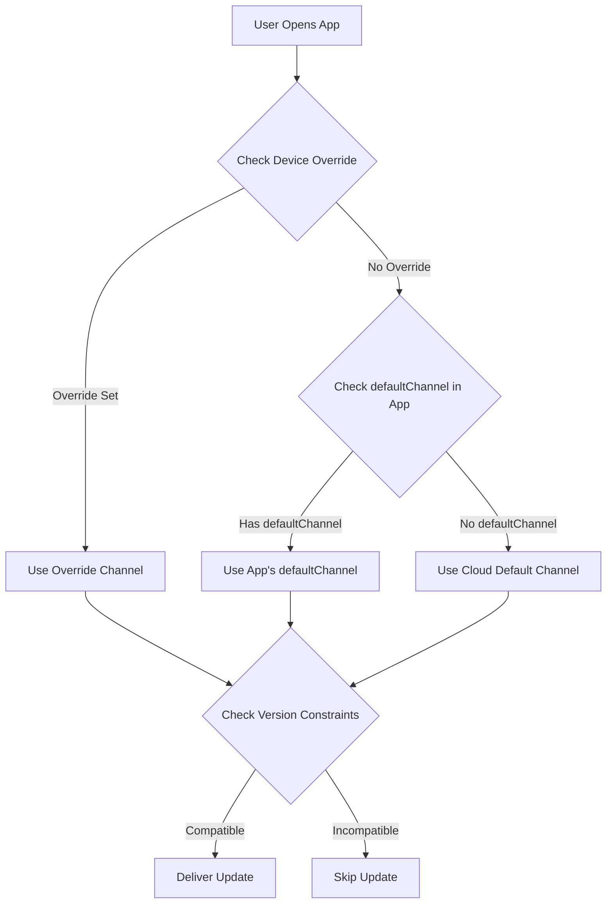

import { Aside } from '@astrojs/starlight/components';

このガイドでは、ネイティブアプリのバージョンに基づいて、ユーザーに最新の互換性のあるバンドルを自動的に配信する方法について説明します。**Ionic AppFlowのアプローチに似ています**。これにより、アップデート管理が簡素化され、より迅速なロールアウトが可能になり、互換性の問題を防ぐことができます。

<Aside type="tip" title="Ionic AppFlowから移行されていますか?">
  Ionic AppFlowから移行している場合、このガイドは特に重要です。AppFlowはアップデートをネイティブバージョンに自動的にマッチングしていました。Capgoは同じ機能をさらに多くの制御と柔軟性で提供します。ステップバイステップの移行手順については、[AppFlow移行ガイド](/docs/upgrade/from-appflow-to-capgo)を参照してください。
</Aside>

## 概要

Capgoのバージョンターゲティングシステムでは、以下のことが可能です:

- **ネイティブアプリのバージョンに基づいて、互換性のあるアップデートを自動的に配信**
- **破壊的な変更が互換性のないアプリバージョンに到達するのを防止**
- **複数のアプリバージョンを同時に管理**し、複雑なロジックなしで実現
- **アップデートをシームレスに特定のユーザーセグメントにロールアウト**

### バージョンターゲティングが重要な理由(AppFlowユーザーの場合は特に)

**Ionic AppFlow**に精通している場合、ユーザーが互換性のあるアップデートのみを受け取ることを確認することがいかに重要であるかご存知でしょう。AppFlowはライブアップデートバンドルをネイティブアプリバージョンに自動的にマッチングし、互換性のないJavaScriptが古いネイティブコードに配信されるのを防ぎました。

**Capgoは同じセキュリティ保証を提供**し、追加機能があります:
- バージョンマッチングのより細かい制御
- 複数の戦略(チャネル、semver、ネイティブ制約)
- バージョン配布の可視性向上
- ダッシュボード管理と並行してAPIおよびCLI制御

このアプローチは以下の場合に特に有用です:
- アプリの異なるメジャーバージョンにユーザーがいる場合(例: v1.x、v2.x、v3.x)
- 破壊的な変更を展開しながら下位互換性を維持する必要がある場合
- 新しいバンドルが古いネイティブコードを破壊するのを防ぎたい場合
- ユーザーをある程度から段階的に別のバージョンに移行する場合
- **AppFlowから移行**し、同じアップデートセキュリティを維持したい場合

## 仕組み

Capgoは、多層アプローチを使用してユーザーを互換性のあるアップデートにマッチングさせます:

1. **ネイティブバージョン制約**: 互換性のないネイティブバージョンへのバンドル配信を防止
2. **チャネルベースのルーティング**: 異なるアプリバージョンを異なるアップデートチャネルにルート
3. **セマンティックバージョニング制御**: メジャー/マイナー/パッチ境界を超えるアップデートを自動的にブロック
4. **デバイスレベルのオーバーライド**: 特定のデバイスまたはユーザーグループをターゲット化

### バージョンマッチングフロー



## 戦略1: チャネルベースのバージョンルーティング

これは、破壊的な変更とメジャーバージョン更新を管理するための**推奨アプローチ**です。AppFlowの配信モデルに似ています。

### サンプルシナリオ

- **App v1.x** (100,000ユーザー) → `production`チャネル
- **App v2.x** (50,000ユーザー、破壊的な変更付き) → `v2`チャネル
- **App v3.x** (10,000ベータユーザー) → `v3`チャネル

### 実装

#### ステップ1: 各メジャーバージョンのチャネルを構成

```typescript
// バージョン1.xビルドのcapacitor.config.ts
import { CapacitorConfig } from '@capacitor/cli';

const config: CapacitorConfig = {
  appId: 'com.example.app',
  appName: 'Example App',
  plugins: {
    CapacitorUpdater: {
      autoUpdate: true,
      defaultChannel: 'production', // またはデフォルト設定を省略
    }
  }
};

export default config;
```

```typescript
// バージョン2.xビルドのcapacitor.config.ts
const config: CapacitorConfig = {
  appId: 'com.example.app',
  appName: 'Example App',
  plugins: {
    CapacitorUpdater: {
      autoUpdate: true,
      defaultChannel: 'v2', // v2ユーザーを自動的にルート
    }
  }
};
```

```typescript
// バージョン3.xビルドのcapacitor.config.ts
const config: CapacitorConfig = {
  appId: 'com.example.app',
  appName: 'Example App',
  plugins: {
    CapacitorUpdater: {
      autoUpdate: true,
      defaultChannel: 'v3', // v3ユーザーを自動的にルート
    }
  }
};
```

#### ステップ2: チャネルを作成

```bash
# 各メジャーバージョン用のチャネルを作成
npx @capgo/cli channel create production
npx @capgo/cli channel create v2
npx @capgo/cli channel create v3

# アプリがチャネルを切り替えられるようにセルフアサインを有効化
npx @capgo/cli channel set production --self-assign
npx @capgo/cli channel set v2 --self-assign
npx @capgo/cli channel set v3 --self-assign
```

#### ステップ3: バージョン固有のバンドルをアップロード

```bash
# v1.xユーザー用(v1-maintenanceブランチから)
git checkout v1-maintenance
npm run build
npx @capgo/cli bundle upload --channel production

# v2.xユーザー用(v2-maintenanceまたはmainブランチから)
git checkout main
npm run build
npx @capgo/cli bundle upload --channel v2

# v3.xユーザー用(beta/v3ブランチから)
git checkout beta
npm run build
npx @capgo/cli bundle upload --channel v3
```

<Aside type="tip" title="自動ルーティング">
  ユーザーがアプリを開くと、インストール済みアプリバンドルの`defaultChannel`に基づいて、指定されたチャネルに自動的に接続されます。JavaScriptコード変更は不要です!
</Aside>

### メリット

- **コード変更ゼロ** - チャネルルーティングは自動的に行われます
- **明確な分離** - 各バージョンに独自のアップデートパイプラインがあります
- **柔軟なターゲティング** - 特定のバージョングループにアップデートを配信
- **安全なロールアウト** - 破壊的な変更は決して互換性のないバージョンに到達しません

## 戦略2: セマンティックバージョニング制御

Capgoの組み込みセマンティックバージョニング制御を使用して、バージョン境界を超えるアップデートを防止します。

### メジャーバージョン間の自動アップデートを無効化

```bash
# メジャーバージョン更新をブロックするチャネルを作成
npx @capgo/cli channel create stable --disable-auto-update major
```

この設定は以下を意味します:
- アプリバージョン**1.2.3**のユーザーは**1.9.9**までのアップデートを受け取ります
- ユーザーは自動的にバージョン**2.0.0**を受け取りません
- 破壊的な変更が古いネイティブコードに到達するのを防ぎます

### 細かい制御オプション

```bash
# マイナーバージョン更新をブロック(1.2.xは1.3.0を取得しません)
npx @capgo/cli channel set stable --disable-auto-update minor

# パッチ更新をブロック(1.2.3は1.2.4を取得しません)
npx @capgo/cli channel set stable --disable-auto-update patch

# すべてのアップデートを許可
npx @capgo/cli channel set stable --disable-auto-update none
```

<Aside type="caution" title="セマンティックバージョニング必須">
  この戦略は、アプリバージョンでセマンティックバージョニング(semver)に従う場合にのみ機能します。バージョン番号が`MAJOR.MINOR.PATCH`形式に従っていることを確認してください。
</Aside>

## 戦略3: ネイティブバージョン制約

バンドルのミニバージョン要件を指定して、互換性のないデバイスへの配信を防止します。

### nativeVersionディレイ条件の使用

バンドルをアップロードするときに、最小ネイティブバージョンを指定できます:

```bash
# このバンドルはネイティブバージョン2.0.0以上を必要とします
npx @capgo/cli bundle upload \
  --channel production \
  --native-version "2.0.0"
```

<Aside type="note" title="仕組み">
  ネイティブバージョン1.xのデバイスはこのバンドルを受け取りません。2.0.0以上のデバイスのみがそれを取得します。これは新しいネイティブAPIやプラグインを必要とするアップデートに最適です。
</Aside>

### ユースケース

1. **新しいネイティブプラグインが必要**
   ```bash
   # バンドルはv2.0.0でカメラプラグインが追加されている必要があります
   npx @capgo/cli bundle upload --native-version "2.0.0"
   ```

2. **ネイティブAPI変更の破壊**
   ```bash
   # バンドルは新しいCapacitor 6 APIを使用します
   npx @capgo/cli bundle upload --native-version "3.0.0"
   ```

3. **段階的移行**
   ```bash
   # バンドルを最新のネイティブバージョンのみでテスト
   npx @capgo/cli bundle upload \
     --channel beta \
     --native-version "2.5.0"
   ```

## 戦略4: 自動ダウングレード防止

ユーザーが現在のネイティブバージョンより古いバンドルを受け取るのを防止します。

### チャネル設定で有効化

Capgoダッシュボードで:
1. **チャネル** → チャネルを選択
2. **ネイティブ下の自動ダウングレードを無効化**を有効化
3. 変更を保存

またはCLI経由:
```bash
npx @capgo/cli channel set production --disable-downgrade
```

### サンプル

- ユーザーのデバイス: ネイティブバージョン**1.2.5**
- チャネルバンドル: バージョン**1.2.3**
- **結果**: アップデートがブロック(ダウングレードになります)

これは以下の場合に有用です:
- ユーザーが手動でアプリストアからより新しいバージョンをインストールした場合
- ユーザーが常に最新のセキュリティパッチを持つことを確認する必要がある場合
- 回帰バグを防ぎたい場合

## 戦略5: デバイスレベルのターゲティング

特定のデバイスまたはユーザーグループのチャネル割り当てをオーバーライドします。

### テスト用の特定バージョンを強制

```typescript
import { CapacitorUpdater } from '@capgo/capacitor-updater'

// ベータテスターをv3チャネルに強制
async function assignBetaTesters() {
  const deviceId = await CapacitorUpdater.getDeviceId()

  // ユーザーがベータテスターであるかチェック
  if (isBetaTester(userId)) {
    await CapacitorUpdater.setChannel({ channel: 'v3' })
  }
}
```

### ダッシュボードデバイスオーバーライド

Capgoダッシュボードで:
1. **デバイス** → デバイスを見つける
2. **チャネルを設定**または**バージョンを設定**をクリック
3. 特定のチャネルまたはバンドルバージョンでオーバーライド
4. デバイスはオーバーライドされたソースからアップデートを受け取ります

<Aside type="tip" title="アップデートのテスト">
  デバイスオーバーライドを使用して、すべてのユーザーにロールアウトする前に自分のデバイスでアップデートをテストします。
</Aside>

## 完全なAppFlowスタイルワークフロー

以下は、すべての戦略を組み合わせた完全な例です:

### 1. 初期設定(App v1.0.0)

```bash
# semver制御を備えたproductionチャネルを作成
npx @capgo/cli channel create production \
  --disable-auto-update major \
  --disable-downgrade
```

```typescript
// capacitor.config.ts
const config: CapacitorConfig = {
  plugins: {
    CapacitorUpdater: {
      autoUpdate: true,
      defaultChannel: 'production',
    }
  }
};
```

### 2. 破壊的な変更をリリース(App v2.0.0)

```bash
# 新しいバージョンのv2チャネルを作成
npx @capgo/cli channel create v2 \
  --disable-auto-update major \
  --disable-downgrade \
  --self-assign

# v1メンテナンス用のgitブランチを作成
git checkout -b v1-maintenance
git push origin v1-maintenance
```

```typescript
// v2.0.0のcapacitor.config.ts
const config: CapacitorConfig = {
  plugins: {
    CapacitorUpdater: {
      autoUpdate: true,
      defaultChannel: 'v2', // 新しいユーザーはv2チャネルを取得
    }
  }
};
```

### 3. 両方のバージョンにアップデートをプッシュ

```bash
# v1.xユーザーを更新(バグ修正)
git checkout v1-maintenance
# 変更を加える
npx @capgo/cli bundle upload \
  --channel production \
  --native-version "1.0.0"

# v2.xユーザーを更新(新機能)
git checkout main
# 変更を加える
npx @capgo/cli bundle upload \
  --channel v2 \
  --native-version "2.0.0"
```

### 4. バージョン配布を監視

Capgoダッシュボードを使用して以下を追跡:
- v1対v2のユーザー数
- バージョンごとのバンドル採用率
- バージョンごとのエラーまたはクラッシュ

### 5. 古いバージョンを非推奨

v1の使用がしきい値を下回った場合:

```bash
# productionチャネルへのアップロードを停止
# オプション: v1メンテナンスブランチを削除
git branch -d v1-maintenance

# 残りのすべてのユーザーをデフォルトに移動
# (アプリストア経由で更新する必要があります)
```

## チャネルプリセデンス

複数のチャネル構成が存在する場合、Capgoはこの優先順位を使用します:

1. **デバイスオーバーライド** (ダッシュボードまたはAPI) - 最優先
2. **クラウドオーバーライド** via `setChannel()`呼び出し
3. **defaultChannel** in capacitor.config.ts
4. **デフォルトチャネル** (クラウド設定) - 最低優先

<Aside type="note" title="優先順位の例">
  ユーザーのアプリが`defaultChannel: 'v2'`を持つが、ダッシュボードでデバイスを`'beta'`にオーバーライドした場合、彼らは`'beta'`チャネルからアップデートを受け取ります。
</Aside>

## ベストプラクティス

### 1. メジャーバージョンのdefaultChannelを常に設定

```typescript
// ✅ 良い: 各メジャーバージョンに明示的なチャネルがあります
// v1.x → production
// v2.x → v2
// v3.x → v3

// ❌ 悪い: 動的チャネル切り替えに依存
// すべてのバージョン → production、手動で切り替え
```

### 2. セマンティックバージョニングを使用

```bash
# ✅ 良い
1.0.0 → 1.0.1 → 1.1.0 → 2.0.0

# ❌ 悪い
1.0 → 1.1 → 2 → 2.5
```

### 3. 独立したブランチを維持

```bash
# ✅ 良い: メジャーバージョンごとに別のブランチ
main (v3.x)
v2-maintenance (v2.x)
v1-maintenance (v1.x)

# ❌ 悪い: すべてのバージョン用の単一ブランチ
```

### 4. ロールアウト前にテスト

```bash
# 最初にベータチャネルでテスト
npx @capgo/cli bundle upload --channel beta

# 問題を監視してからproductionに昇格
npx @capgo/cli bundle upload --channel production
```

### 5. バージョン配布を監視

定期的にダッシュボードを確認してください:
- ユーザーは新しいネイティブバージョンにアップグレードしていますか?
- 古いバージョンはまだ多くのトラフィックを取得していますか?
- 古いチャネルを非推奨にする必要がありますか?

## Ionic AppFlowとの比較

**Ionic AppFlow**から移行しているチームの場合、Capgoのバージョンターゲティングの比較は次の通りです:

| 機能 | Ionic AppFlow | Capgo |
|---------|---------------|-------|
| **バージョンベースのルーティング** | ネイティブバージョンに基づく自動 | `defaultChannel` +複数の戦略による自動 |
| **セマンティックバージョニング** | 基本的なサポート | `--disable-auto-update` (major/minor/patch)による高度なもの |
| **ネイティブバージョン制約** | AppFlowダッシュボードでの手動設定 | CLIの組み込み`--native-version`フラグ |
| **チャネル管理** | Web UI + CLI | Web UI + CLI + API |
| **デバイスオーバーライド** | 限定的なデバイスレベル制御 | ダッシュボード/API経由の完全制御 |
| **自動ダウングレード防止** | はい | `--disable-downgrade`経由ではい |
| **マルチバージョン保守** | 手動ブランチ/チャネル管理 | チャネルプリセデンスを使用した自動化 |
| **セルフホスティング** | いいえ | はい(完全制御) |
| **バージョン分析** | 基本的 | バージョンごとの詳細メトリクス |

<Aside type="note" title="AppFlowパリティ以上">
  Capgoは**AppFlowが提供したすべてのバージョンターゲティング機能**と追加の制御メカニズムを提供します。AppFlowの自動バージョンマッチングに頼っていた場合、Capgoは同等に安全で、より柔軟性があることがわかります。
</Aside>

## トラブルシューティング

### ユーザーがアップデートを受け取らない

以下を確認してください:

1. **チャネル割り当て**: デバイスが正しいチャネルにあることを確認
   ```typescript
   const channel = await CapacitorUpdater.getChannel()
   console.log('Current channel:', channel)
   ```

2. **バージョン制約**: バンドルがネイティブバージョン要件を持つかどうか確認
   - ダッシュボード → バンドル → "ネイティブバージョン"列を確認

3. **Semver設定**: チャネルの`disable-auto-update`設定を確認
   ```bash
   npx @capgo/cli channel list
   ```

4. **デバイスオーバーライド**: デバイスに手動オーバーライドがあるかどうか確認
   - ダッシュボード → デバイス → デバイスを検索 → チャネル/バージョンを確認

### 間違ったバージョンに配信されるバンドル

1. **defaultChannelを確認**: `capacitor.config.ts`で正しいチャネルを確認
2. **バンドルアップロードを確認**: バンドルが目的のチャネルにアップロードされたことを確認
3. **ネイティブバージョンを確認**: `--native-version`フラグが正しく使用されたことを確認

### 古いバージョンに影響を与える破壊的な変更

1. **即座の修正**: 影響を受けたデバイスを安全なバンドルでオーバーライド
   - ダッシュボード → デバイス → 複数選択 → バージョンを設定
2. **長期的な修正**: バージョンチャネルを作成し、独立したブランチを維持
3. **予防**: ロールアウト前に代表的なデバイスでアップデートを常にテストしてください

## Ionic AppFlowからの移行

**Ionic AppFlow**から移行する場合、バージョンターゲティングはCapgoで非常に似たように動作し、柔軟性が向上しています:

### 概念マップ

| AppFlow概念 | Capgo相当 | 注記 |
|-----------------|------------------|-------|
| **デプロイチャネル** | Capgoチャネル | 同じ概念、より強力 |
| **ネイティブバージョンロック** | `--native-version`フラグ | よりきめ細かい制御 |
| **チャネルプリオリティ** | チャネルプリセデンス(オーバーライド→クラウド→デフォルト) | より透過的なプリセデンス |
| **デプロイメントターゲット** | チャネル + semver制御 | 複数の戦略が利用可能 |
| **Productionチャネル** | `production`チャネル(任意の名前) | 柔軟な命名 |
| **Gitベースのデプロイメント** | ブランチからのCLIバンドルアップロード | 同じワークフロー |
| **自動バージョンマッチング** | `defaultChannel` +バージョン制約 | 複数の戦略で強化 |

### AppFlowユーザーの主な違い

1. **より多くの制御**: Capgoは複数の戦略(チャネル、semver、ネイティブバージョン)を提供し、組み合わせることができます
2. **より良い可視性**: ダッシュボードはバージョン配布と互換性の問題を表示します
3. **APIアクセス**: バージョンターゲティングに対する完全なプログラマティック制御
4. **セルフホスティング**: 同じバージョンロジックで独自のアップデートサーバーを実行するオプション

### 移行手順

1. **AppFlowチャネルをCapgoチャネルにマッピング**(通常は1:1)
2. 各メジャーバージョンのために`capacitor.config.ts`に**`defaultChannel`を設定**
3. バージョン境界で自動ブロックが必要な場合は**semverルールを構成**
4. `--native-version`フラグを使用して**バージョン固有のバンドルをアップロード**
5. Capgoダッシュボードで**バージョン配布を監視**

<Aside type="tip" title="完全な移行ガイド">
  SDKの置き換えとAPIマッピングを含む完全な移行手順については、[AppFlowからCapgoへの移行ガイド](/docs/upgrade/from-appflow-to-capgo)を参照してください。
</Aside>

## 高度なパターン

### バージョン別の段階的ロールアウト

```typescript
// v1ユーザーをv2に段階的に移行
async function migrateUsers() {
  const deviceId = await CapacitorUpdater.getDeviceId()
  const rolloutPercentage = 10 // 10%から開始

  // デバイスIDをハッシュして確定的なパーセンテージを取得
  const hash = hashCode(deviceId) % 100

  if (hash < rolloutPercentage) {
    // ユーザーはロールアウトグループに属しています - v2に移行
    await CapacitorUpdater.setChannel({ channel: 'v2' })
  }
}
```

### バージョン別フィーチャーフラグ

```typescript
// ネイティブバージョンに基づいて機能を有効化
async function checkFeatureAvailability() {
  const info = await CapacitorUpdater.getDeviceId()
  const nativeVersion = info.nativeVersion

  if (compareVersions(nativeVersion, '2.0.0') >= 0) {
    // v2.0.0+を必要とする機能を有効化
    enableNewCameraFeature()
  }
}
```

### バージョン間のA/Bテスト

```typescript
// 同じネイティブバージョン内でA/Bテストを実行
async function assignABTest() {
  const nativeVersion = await getNativeVersion()

  if (nativeVersion.startsWith('2.')) {
    // v2ユーザーのみでA/Bテスト
    const variant = Math.random() < 0.5 ? 'v2-test-a' : 'v2-test-b'
    await CapacitorUpdater.setChannel({ channel: variant })
  }
}
```

## まとめ

Capgoは、バージョン固有のアップデート配信のための複数の戦略を提供します:

1. **チャネルベースのルーティング**: `defaultChannel`経由の自動バージョン分離
2. **セマンティックバージョニング**: major/minor/patch境界を超えるアップデートを防止
3. **ネイティブバージョン制約**: バンドルにミニバージョンを要求
4. **自動ダウングレード防止**: 古いバンドルを新しいネイティブバージョンに配信しない
5. **デバイスオーバーライド**: テストとターゲティングのための手動制御

これらの戦略を組み合わせることで、AppFlowスタイルの自動アップデート配信をさらに多くの柔軟性と制御で実現できます。アプリのバージョニングとデプロイメントワークフローに最適なアプローチを選択してください。

特定の機能の詳細については:
- [破壊的な変更ガイド](/docs/live-updates/breaking-changes) - 詳細なチャネルバージョニング戦略
- [チャネル管理](/docs/live-updates/channels) - 完全なチャネル構成リファレンス
- [アップデート動作](/docs/live-updates/update-behavior) - ネイティブバージョンの遅延と条件
