import { Steps, Card, CardGrid } from '@astrojs/starlight/components';

Capgo Cloud Build를 시작하고 몇 분 안에 첫 iOS 또는 Android 네이티브 빌드를 생성하세요.

## 필요한 것

시작하기 전에 다음이 있는지 확인하세요:

- 로컬에서 성공적으로 빌드되는 Capacitor 앱
- Node.js 20 이상 설치됨
- 활성 구독이 있는 Capgo 계정
- 앱이 이미 Capgo에 등록됨 (아니라면 `npx @capgo/cli@latest app add` 실행)
- **빌드 자격 증명 구성됨** (인증서, 키스토어) - 아래 참조

## 첫 번째 빌드 전에

<CardGrid>
  <Card title="⚠️ 먼저 자격 증명 설정" icon="warning">
    **빌드하기 전 필수:** 빌드 자격 증명(iOS용 인증서, Android용 키스토어)을 구성해야 합니다.

    [자격 증명 설정 →](/docs/cli/cloud-build/credentials/)
  </Card>
</CardGrid>

## 빠른 시작

<Steps>

1. **빌드 자격 증명 설정**

   빌드하기 전에 자격 증명을 로컬에 저장해야 합니다:

   **iOS의 경우:**
   ```bash
   npx @capgo/cli build credentials save \
     --platform ios \
     --certificate ./cert.p12 \
     --p12-password "password" \
     --provisioning-profile ./profile.mobileprovision \
     --apple-key ./AuthKey.p8 \
     --apple-key-id "KEY123" \
     --apple-issuer-id "issuer-uuid" \
     --apple-team-id "team-id"
   ```

   **Android의 경우:**
   ```bash
   npx @capgo/cli build credentials save \
     --platform android \
     --keystore ./release.keystore \
     --keystore-alias "my-key" \
     --keystore-key-password "key-pass" \
     --keystore-store-password "store-pass"
   ```

   자세한 내용은 [전체 자격 증명 가이드](/docs/cli/cloud-build/credentials/)를 참조하세요.

2. **로컬 빌드 확인**

   먼저 앱이 오류 없이 로컬에서 빌드되는지 확인하세요:

   ```bash
   # 웹 에셋 빌드
   npm run build

   # Capacitor와 동기화
   npx cap sync

   # 로컬 빌드 테스트 (선택사항이지만 권장)
   npx cap open ios    # iOS용
   npx cap open android # Android용
   ```

3. **Capgo로 인증**

   Capgo API 키 설정 (아직 구성하지 않은 경우):

   ```bash
   npx @capgo/cli@latest login
   ```

   또는 환경 변수 설정:
   ```bash
   export CAPGO_TOKEN=your_api_key_here
   ```

4. **첫 번째 빌드 실행**

   Android 디버그 빌드로 시작 (테스트하기 가장 빠름):

   ```bash
   npx @capgo/cli@latest build com.example.app \
     --platform android \
     --build-mode debug
   ```

   빌드가 진행되는 동안 실시간 로그가 표시됩니다:
   ```
   ✔ Creating build job...
   ✔ Uploading project (15.2 MB)...
   ✔ Build started

   📝 Build logs:
   → Installing dependencies...
   → Running Gradle build...
   → Signing APK...
   ✔ Build succeeded in 3m 42s
   ```

5. **빌드 상태 확인**

   CLI가 자동으로 빌드 상태를 폴링하고 표시합니다. 완료되면 다음을 볼 수 있습니다:

   - 빌드 시간
   - 성공/실패 상태
   - App Store/Play Store에 제출된 앱 (자격 증명이 구성된 경우)

</Steps>

## 빌드 프로세스 이해

빌드 명령을 실행하면 다음과 같은 일이 발생합니다:

```mermaid
graph LR
    A[귀하의 머신] -->|1. 프로젝트 압축| B[로컬 임시]
    B -->|2. 업로드| C[Capgo Cloud]
    C -->|3. 빌드| D[빌드 서버]
    D -->|4. 로그 스트림| A
    D -->|5. 정리| E[자동 삭제]
```



1. **로컬 준비** - 프로젝트가 압축됩니다 (`node_modules` 및 dotfiles 제외)
2. **업로드** - zip 파일이 안전한 클라우드 스토리지(Cloudflare R2)에 업로드됩니다
3. **빌드 실행** - 전용 인프라에서 앱이 빌드됩니다
4. **로그 스트리밍** - Server-Sent Events를 통해 실시간 로그가 터미널로 스트리밍됩니다
5. **자동 정리** - 빌드 아티팩트가 삭제됩니다 (Android: 즉시, iOS: 24시간)

## 첫 번째 프로덕션 빌드

프로세스가 작동하는지 확인한 후 프로덕션 빌드를 생성하세요:

### Android

```bash
npx @capgo/cli@latest build com.example.app \
  --platform android \
  --build-mode release
```

먼저 서명 자격 증명을 구성해야 합니다. [Android 빌드 구성](/docs/cli/cloud-build/android/)을 참조하세요.

### iOS

```bash
npx @capgo/cli@latest build com.example.app \
  --platform ios \
  --build-mode release
```

iOS 빌드에는 서명 인증서와 프로비저닝 프로파일이 필요합니다. [iOS 빌드 구성](/docs/cli/cloud-build/ios/)을 참조하세요.

## 빌드되는 것

**중요:** Capgo Cloud Build는 앱의 **네이티브 부분**만 빌드합니다 (iOS 및 Android 네이티브 코드).

귀하가 담당하는 것:
- 웹 에셋 빌드 (`npm run build`)
- 빌드 전 `npx cap sync` 실행
- 모든 종속성이 `package.json`에 있는지 확인

저희가 처리하는 것:
- 네이티브 iOS 컴파일 (Xcode, Fastlane)
- 네이티브 Android 컴파일 (Gradle)
- 코드 서명
- 앱 스토어 제출 (구성된 경우)

## 빌드 시간 및 비용

빌드 시간은 시작부터 완료까지 측정됩니다:

- **Android**: 일반적으로 3-5분 (1× 청구 배수)
- **iOS**: 일반적으로 5-10분 (Mac 하드웨어 비용으로 인해 2× 청구 배수)

실제 사용 빌드 시간에 대해서만 지불합니다. 숨겨진 수수료는 없습니다.

## 일반적인 사용 사례

### CI/CD 통합

GitHub Actions 워크플로에 추가:

```yaml
- name: Build native app
  env:
    CAPGO_TOKEN: ${{ secrets.CAPGO_TOKEN }}
  run: |
    npm run build
    npx cap sync
    npx @capgo/cli@latest build ${{ secrets.APP_ID }} \
      --platform both \
      --build-mode release
```

### 로컬 개발

커밋하기 전에 로컬에서 빌드 테스트:

```bash
# 테스트를 위한 빠른 디버그 빌드
npm run build && npx cap sync
npx @capgo/cli@latest build com.example.app \
  --platform android \
  --build-mode debug
```

### 멀티 플랫폼 빌드

양쪽 플랫폼을 동시에 빌드:

```bash
npx @capgo/cli@latest build com.example.app \
  --platform both \
  --build-mode release
```

## 다음 단계

첫 번째 빌드를 생성했으니:

- [iOS 빌드 구성](/docs/cli/cloud-build/ios/) - 인증서 및 프로파일 설정
- [Android 빌드 구성](/docs/cli/cloud-build/android/) - 키스토어 및 Play Store 설정
- [문제 해결](/docs/cli/cloud-build/troubleshooting/) - 일반적인 문제 및 해결 방법
- [CLI 참조](/docs/cli/reference/build/) - 전체 명령 문서

## 도움이 필요하신가요?

- [문제 해결 가이드](/docs/cli/cloud-build/troubleshooting/) 확인
- [Discord 커뮤니티](https://discord.com/invite/VnYRvBfgA6)에 참여
- support@capgo.app으로 지원 이메일 보내기
