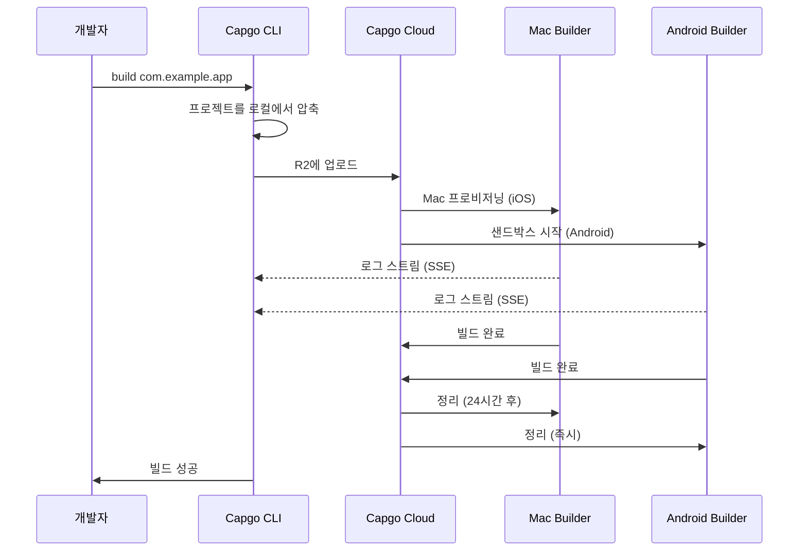

import { Card, CardGrid } from '@astrojs/starlight/components';

🏗️ 클라우드에서 네이티브 모바일 앱을 빌드하고 자동으로 App Store 및 Play Store에 제출하세요.

## 개요

`build` 명령을 사용하면 Capgo의 클라우드 인프라에서 iOS 및 Android용 Capacitor 앱을 빌드할 수 있습니다. Expo가 빌드를 처리하는 방식과 유사합니다. 앱은 전용 인프라에서 빌드되며 앱 스토어에 자동으로 제출될 수 있습니다.

**현재 상태:** 공개 베타

## Cloud Build를 사용하는 이유?

네이티브 모바일 앱을 전통적으로 빌드하려면 다음이 필요합니다:
- iOS 빌드를 위한 **Mac 하드웨어** ($1000+ 또는 비싼 CI 분)
- 캐싱 및 자격 증명을 사용한 **복잡한 CI/CD** 설정
- Xcode, Android Studio 및 SDK를 위한 **유지보수 오버헤드**

Capgo Cloud Build를 사용하면 다음을 얻을 수 있습니다:
- ✅ **Mac 불필요** - 모든 머신에서 iOS 앱 빌드
- ✅ **설정 불필요** - CI/CD 구성 불필요
- ✅ **검증됨** - 3년간의 내부 프로덕션 사용을 기반으로 구축
- ✅ **안전함** - 로그 저장 없음, 자동 정리
- ✅ **네이티브 전용 중점** - JavaScript는 비공개 유지

## 빠른 시작

```bash
npx @capgo/cli@latest build com.example.app
```

이게 전부입니다! 앱이 클라우드에서 빌드되고 실시간 로그가 표시됩니다.

## 문서 섹션

<CardGrid>
  <Card title="⚠️ 먼저 자격 증명 설정" icon="warning">
    **빌드하기 전 필수:** iOS/Android 자격 증명을 로컬에 저장하세요.

    [자격 증명 설정 →](/docs/cli/cloud-build/credentials/)
  </Card>

  <Card title="시작하기" icon="rocket">
    몇 분 안에 첫 네이티브 빌드를 만드세요.

    [가이드 읽기 →](/docs/cli/cloud-build/getting-started/)
  </Card>

  <Card title="iOS 빌드" icon="seti:apple">
    인증서를 구성하고 App Store용으로 빌드하세요.

    [iOS 구성 →](/docs/cli/cloud-build/ios/)
  </Card>

  <Card title="Android 빌드" icon="seti:android">
    키스토어를 설정하고 Play Store용으로 빌드하세요.

    [Android 구성 →](/docs/cli/cloud-build/android/)
  </Card>

  <Card title="문제 해결" icon="warning">
    일반적인 빌드 문제에 대한 해결책.

    [도움받기 →](/docs/cli/cloud-build/troubleshooting/)
  </Card>
</CardGrid>

## 명령 참조

### 기본 사용법

```bash
npx @capgo/cli@latest build [appId] [options]
```

### 예시

양쪽 플랫폼 빌드:
```bash
npx @capgo/cli@latest build com.example.app
```

iOS만 빌드:
```bash
npx @capgo/cli@latest build com.example.app --platform ios
```

디버그 모드로 Android 빌드:
```bash
npx @capgo/cli@latest build com.example.app --platform android --build-mode debug
```

특정 디렉토리에서 빌드:
```bash
npx @capgo/cli@latest build com.example.app --path ./my-app
```

### 옵션

| 옵션 | 유형 | 기본값 | 설명 |
|--------|------|---------|-------------|
| `appId` | string | capacitor.config | 애플리케이션 ID (예: com.example.app) |
| `--path <path>` | string | 현재 디렉토리 | 프로젝트 디렉토리 경로 |
| `--platform <platform>` | string | both | 대상 플랫폼: `ios`, `android` 또는 `both` |
| `--build-mode <mode>` | string | release | 빌드 모드: `debug` 또는 `release` |
| `--build-config <config>` | string | - | JSON 문자열로 추가 빌드 구성 |
| `-a, --apikey <apikey>` | string | - | API 키 (또는 `CAPGO_TOKEN` 환경 변수 사용) |
| `--supa-host <url>` | string | https://api.capgo.app | 커스텀 Supabase 호스트 URL |
| `--supa-anon <key>` | string | - | 커스텀 Supabase anon 키 |

## 작동 방식



### 빌드 프로세스

1. **로컬 준비** - 프로젝트가 로컬에서 압축됩니다 (`node_modules`, dotfiles 제외)
2. **업로드** - zip 파일이 안전한 클라우드 스토리지(Cloudflare R2)에 업로드됩니다
3. **빌드 실행**:
   - **iOS**: 전용 Mac 머신 프로비저닝, Fastlane 빌드 및 서명
   - **Android**: 보안 샌드박스 생성, Gradle 컴파일 및 서명
4. **로그 스트리밍** - Server-Sent Events를 통한 실시간 로그 (저장되지 않음!)
5. **자동 정리**:
   - **iOS**: 머신 해제 시 24시간 후 파일 삭제
   - **Android**: 빌드 후 즉시 모든 것 삭제

## 우리의 전문성

Capgo Cloud Build는 새로운 인프라가 아닙니다 - **3년** 동안 내부적으로 사용해 왔습니다:

- ✅ **커스텀 Fastlane** - Capacitor 앱을 위해 특별히 구축됨
- ✅ **수천 번의 빌드** - 프로덕션에서 검증됨
- ✅ **Capacitor 전문가** - 중요한 것에 대한 깊은 지식
- ✅ **네이티브 전용 중점** - JavaScript는 서버에 닿지 않음

## 보안 및 개인정보

- **로그 저장 없음** - 로그는 터미널로만 스트리밍되며 저장되지 않음
- **아티팩트 저장 없음** - 앱은 App Store/Play Store로 직접 전송되며 아무것도 보관하지 않음
- **자격 증명 자동 삭제** - 빌드 중에만 사용되며 이후 삭제됨 (최대 24시간)
- **격리된 빌드** - 각 빌드는 격리되어 실행됨
- **코드는 귀하의 것** - 네이티브 부분만 빌드하며 JavaScript는 로컬에 유지됨

## CI/CD 통합

어디서든 작동합니다 - GitHub Actions, GitLab CI 또는 모든 CI/CD 플랫폼:

```yaml
- name: Build native app
  env:
    CAPGO_TOKEN: ${{ secrets.CAPGO_TOKEN }}
  run: |
    npm run build
    npx cap sync
    npx @capgo/cli@latest build com.example.app \
      --platform both \
      --build-mode release
```

다음이 필요 없습니다:
- Mac 러너
- Android SDK 설치
- Xcode 설치
- 복잡한 캐싱
- 자격 증명 관리

## 요금

빌드 시간은 실제 사용량에 따라 청구됩니다:

- **Android**: 1× 배수 (분당 ~$0.XX)
- **iOS**: 2× 배수 (Mac 하드웨어로 인해 분당 ~$0.XX)

**일반적인 비용:**
- Android 디버그: 3분 × 1× = ~$X.XX
- iOS 릴리스: 7분 × 2× = ~$X.XX

사용한 만큼만 지불합니다. 최소 금액이나 예상치 못한 비용이 없습니다.

## 다른 솔루션과의 비교

| 기능 | Capgo Cloud Build | GitHub Actions (Mac) | Expo EAS |
|---------|------------------|---------------------|----------|
| **로컬 Mac 필요** | ❌ 아니오 | ✅ 예 | ❌ 아니오 |
| **설정 복잡성** | ⭐ 단일 명령 | ⭐⭐⭐ 복잡한 YAML | ⭐⭐ 구성 파일 |
| **Capacitor 네이티브** | ✅ 최적화됨 | ⚠️ 일반적 | ❌ Expo 전용 |
| **코드 개인정보** | ✅ 저장 안 함 | ⚠️ 러너에서 | ⚠️ 업로드됨 |
| **비용 (iOS)** | 💰 2× 기본 | 💰💰💰 10× 비쌈 | 💰💰 프리미엄 |

## 빌드되는 것

**중요:** Capgo는 **네이티브 부분만** 빌드합니다.

✅ **저희가 빌드하는 것:**
- iOS 네이티브 코드 (Swift, Objective-C, Xcode 프로젝트)
- Android 네이티브 코드 (Java, Kotlin, Gradle 프로젝트)
- 코드 서명 및 앱 스토어 제출

❌ **귀하가 빌드하는 것 (로컬에서):**
- JavaScript, HTML, CSS (`npm run build`)
- Capacitor 동기화 (`npx cap sync`)
- 웹 에셋

이러한 분리는 다음을 보장합니다:
- **더 나은 보안** - 앱 로직은 비공개 유지
- **더 빠른 빌드** - 중복 웹 빌드 없음
- **명확한 책임** - 코드를 제어함

## 제한 사항

공개 베타 동안의 현재 제한 사항:

- **빌드 시간 초과**: 최대 10분
- **업로드 시간 초과**: 업로드 URL에 대해 1시간
- **iOS 머신**: 24시간 리스 요구 사항, Mac의 빌드는 최적의 사용을 보장하기 위해 대기열에 추가됨
- **액세스**: 공개 베타만

## 시작하기

번거로움 없이 빌드할 준비가 되셨나요?

<CardGrid>
  <Card title="첫 번째 빌드 만들기" icon="rocket">
    첫 클라우드 빌드를 위한 단계별 가이드.

    [시작하기 →](/docs/cli/cloud-build/getting-started/)
  </Card>

  <Card title="공개 베타 참여" icon="star">
    Cloud Build는 공개 베타 중입니다. 커뮤니티에 참여하여 액세스하세요.

    [Discord 참여 →](https://discord.com/invite/VnYRvBfgA6)
  </Card>
</CardGrid>

## 더 알아보기

- [시작하기 가이드](/docs/cli/cloud-build/getting-started/) - 첫 빌드 만들기
- [iOS 구성](/docs/cli/cloud-build/ios/) - iOS 빌드 설정
- [Android 구성](/docs/cli/cloud-build/android/) - Android 빌드 설정
- [문제 해결](/docs/cli/cloud-build/troubleshooting/) - 일반적인 문제 및 해결 방법
- [블로그: Cloud Build 소개](/blog/introducing-capgo-cloud-build/) - 기능 발표

## 도움이 필요하신가요?

- 📚 [문제 해결 가이드](/docs/cli/cloud-build/troubleshooting/)
- 💬 [Discord 커뮤니티](https://discord.com/invite/VnYRvBfgA6)
- 📧 이메일: support@capgo.app
