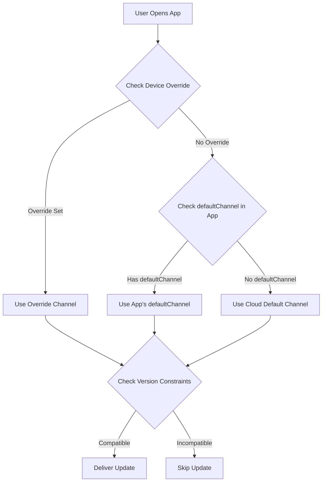

import { Aside } from '@astrojs/starlight/components';

이 가이드에서는 네이티브 앱 버전을 기반으로 사용자에게 최신 호환 번들을 자동으로 전달하는 방법을 설명합니다. **Ionic AppFlow의 접근 방식과 유사합니다**. 이를 통해 업데이트 관리가 간소화되고 더 빠른 출시가 가능해지며 호환성 문제를 방지할 수 있습니다.

<Aside type="tip" title="Ionic AppFlow에서 마이그레이션하시나요?">
  Ionic AppFlow에서 마이그레이션하는 경우 이 가이드는 특히 중요합니다. AppFlow는 업데이트를 네이티브 버전으로 자동 매칭했고, Capgo는 더 강력한 제어 및 유연성으로 동일한 기능을 제공합니다. 단계별 마이그레이션 지침은 [AppFlow 마이그레이션 가이드](/docs/upgrade/from-appflow-to-capgo)를 참조하세요.
</Aside>

## 개요

Capgo의 버전 타겟팅 시스템을 통해 다음을 수행할 수 있습니다:

- **네이티브 앱 버전을 기반으로 호환되는 업데이트를 자동으로 전달**
- **중단적 변경이 호환되지 않는 앱 버전에 도달하는 것을 방지**
- **복잡한 로직 없이 여러 앱 버전을 동시에 관리**
- **특정 사용자 세그먼트에 업데이트를 원활하게 롤아웃**

### 버전 타겟팅이 중요한 이유(특히 AppFlow 사용자의 경우)

**Ionic AppFlow**에 익숙하다면 사용자가 호환되는 업데이트만 받도록 하는 것이 얼마나 중요한지 알 것입니다. AppFlow는 라이브 업데이트 번들을 네이티브 앱 버전으로 자동 매칭하여 호환되지 않는 JavaScript가 구형 네이티브 코드로 전달되지 않도록 했습니다.

**Capgo는 동일한 보안 보장을 제공**하며 추가 기능이 있습니다:
- 버전 매칭에 대한 더 세밀한 제어
- 여러 전략(채널, semver, 네이티브 제약)
- 버전 배포의 향상된 가시성
- 대시보드 관리와 함께 API 및 CLI 제어

이 접근 방식은 특히 다음과 같은 경우에 유용합니다:
- 앱의 다양한 주요 버전에 사용자가 있는 경우(예: v1.x, v2.x, v3.x)
- 중단적 변경을 배포하는 동안 역호환성을 유지해야 하는 경우
- 새 번들이 구형 네이티브 코드를 손상시키는 것을 방지하려는 경우
- 사용자를 점진적으로 한 버전에서 다른 버전으로 마이그레이션하는 경우
- **AppFlow에서 마이그레이션**하고 동일한 업데이트 보안을 유지하려는 경우

## 작동 방식

Capgo는 다층 접근 방식을 사용하여 사용자를 호환되는 업데이트와 매칭합니다:

1. **네이티브 버전 제약**: 호환되지 않는 네이티브 버전으로의 번들 전달 방지
2. **채널 기반 라우팅**: 다양한 앱 버전을 다양한 업데이트 채널로 라우팅
3. **의미론적 버전 관리 제어**: 주요/부 버전/패치 경계를 넘는 업데이트 자동 차단
4. **장치 수준 재정의**: 특정 장치 또는 사용자 그룹 타게팅

### 버전 매칭 플로우



## 전략 1: 채널 기반 버전 라우팅

이는 중단적 변경 및 주요 버전 업데이트를 관리하기 위한 **권장 접근 방식**입니다. AppFlow의 전달 모델과 유사합니다.

### 예제 시나리오

- **App v1.x** (100,000 사용자) → `production` 채널
- **App v2.x** (50,000 사용자, 중단적 변경 포함) → `v2` 채널
- **App v3.x** (10,000 베타 사용자) → `v3` 채널

### 구현

#### 단계 1: 각 주요 버전에 대한 채널 구성

```typescript
// v1.x 빌드를 위한 capacitor.config.ts
import { CapacitorConfig } from '@capacitor/cli';

const config: CapacitorConfig = {
  appId: 'com.example.app',
  appName: 'Example App',
  plugins: {
    CapacitorUpdater: {
      autoUpdate: true,
      defaultChannel: 'production', // 또는 기본값으로 생략
    }
  }
};

export default config;
```

```typescript
// v2.x 빌드를 위한 capacitor.config.ts
const config: CapacitorConfig = {
  appId: 'com.example.app',
  appName: 'Example App',
  plugins: {
    CapacitorUpdater: {
      autoUpdate: true,
      defaultChannel: 'v2', // v2 사용자를 자동으로 라우팅
    }
  }
};
```

```typescript
// v3.x 빌드를 위한 capacitor.config.ts
const config: CapacitorConfig = {
  appId: 'com.example.app',
  appName: 'Example App',
  plugins: {
    CapacitorUpdater: {
      autoUpdate: true,
      defaultChannel: 'v3', // v3 사용자를 자동으로 라우팅
    }
  }
};
```

#### 단계 2: 채널 생성

```bash
# 각 주요 버전에 대한 채널 생성
npx @capgo/cli channel create production
npx @capgo/cli channel create v2
npx @capgo/cli channel create v3

# 앱이 채널을 전환할 수 있도록 셀프 할당 활성화
npx @capgo/cli channel set production --self-assign
npx @capgo/cli channel set v2 --self-assign
npx @capgo/cli channel set v3 --self-assign
```

#### 단계 3: 버전별 번들 업로드

```bash
# v1.x 사용자(v1-maintenance 브랜치)
git checkout v1-maintenance
npm run build
npx @capgo/cli bundle upload --channel production

# v2.x 사용자(v2-maintenance 또는 main 브랜치)
git checkout main
npm run build
npx @capgo/cli bundle upload --channel v2

# v3.x 사용자(beta/v3 브랜치)
git checkout beta
npm run build
npx @capgo/cli bundle upload --channel v3
```

<Aside type="tip" title="자동 라우팅">
  사용자가 앱을 열 때, 설치된 앱 번들의 `defaultChannel`을 기반으로 지정된 채널로 자동 연결됩니다. JavaScript 코드 변경이 필요하지 않습니다!
</Aside>

### 이점

- **코드 변경 없음** - 채널 라우팅이 자동으로 발생
- **명확한 분리** - 각 버전이 자체 업데이트 파이프라인을 가짐
- **유연한 타겟팅** - 특정 버전 그룹에 업데이트 푸시
- **안전한 롤아웃** - 중단적 변경이 호환되지 않는 버전에 도달하지 않음

## 전략 2: 의미론적 버전 관리 제어

Capgo의 내장 의미론적 버전 관리 제어를 사용하여 버전 경계를 넘는 업데이트를 방지합니다.

### 주요 버전 간 자동 업데이트 비활성화

```bash
# 주요 버전 업데이트를 차단하는 채널 생성
npx @capgo/cli channel create stable --disable-auto-update major
```

이 구성은 다음을 의미합니다:
- 앱 버전 **1.2.3**의 사용자는 **1.9.9**까지의 업데이트를 받습니다
- 사용자는 자동으로 버전 **2.0.0**을 받지 않습니다
- 중단적 변경이 구형 네이티브 코드에 도달하는 것을 방지합니다

### 세밀한 제어 옵션

```bash
# 부 버전 업데이트 차단(1.2.x는 1.3.0을 받지 않음)
npx @capgo/cli channel set stable --disable-auto-update minor

# 패치 업데이트 차단(1.2.3은 1.2.4를 받지 않음)
npx @capgo/cli channel set stable --disable-auto-update patch

# 모든 업데이트 허용
npx @capgo/cli channel set stable --disable-auto-update none
```

<Aside type="caution" title="의미론적 버전 관리 필수">
  이 전략은 앱 버전에 대해 의미론적 버전 관리(semver)를 따르는 경우에만 작동합니다. 버전 번호가 `MAJOR.MINOR.PATCH` 형식을 따르는지 확인하세요.
</Aside>

## 전략 3: 네이티브 버전 제약

호환되지 않는 장치로의 전달을 방지하기 위해 번들의 최소 네이티브 버전 요구사항을 지정합니다.

### nativeVersion 지연 조건 사용

번들을 업로드할 때 최소 네이티브 버전을 지정할 수 있습니다:

```bash
# 이 번들은 네이티브 버전 2.0.0 이상이 필요합니다
npx @capgo/cli bundle upload \
  --channel production \
  --native-version "2.0.0"
```

<Aside type="note" title="작동 방식">
  네이티브 버전 1.x인 장치는 이 번들을 받지 않습니다. 2.0.0 이상인 장치만 받습니다. 이는 새 네이티브 API 또는 플러그인이 필요한 업데이트에 이상적입니다.
</Aside>

### 사용 사례

1. **새 네이티브 플러그인 필요**
   ```bash
   # 번들에는 v2.0.0에서 추가된 카메라 플러그인이 필요합니다
   npx @capgo/cli bundle upload --native-version "2.0.0"
   ```

2. **중단적 네이티브 API 변경**
   ```bash
   # 번들은 새 Capacitor 6 API를 사용합니다
   npx @capgo/cli bundle upload --native-version "3.0.0"
   ```

3. **점진적 마이그레이션**
   ```bash
   # 최신 네이티브 버전에서만 번들 테스트
   npx @capgo/cli bundle upload \
     --channel beta \
     --native-version "2.5.0"
   ```

## 전략 4: 자동 다운그레이드 방지

사용자가 현재 네이티브 버전보다 이전 번들을 받지 않도록 방지합니다.

### 채널 설정에서 활성화

Capgo 대시보드에서:
1. **채널** → 채널 선택
2. **네이티브 아래의 자동 다운그레이드 비활성화** 활성화
3. 변경 사항 저장

또는 CLI를 통해:
```bash
npx @capgo/cli channel set production --disable-downgrade
```

### 예제

- 사용자의 장치: 네이티브 버전 **1.2.5**
- 채널 번들: 버전 **1.2.3**
- **결과**: 업데이트 차단됨(다운그레이드가 됨)

다음과 같은 경우에 유용합니다:
- 사용자가 앱 스토어에서 수동으로 최신 버전을 설치한 경우
- 사용자가 항상 최신 보안 패치를 가지도록 해야 하는 경우
- 회귀 버그를 방지하려는 경우

## 전략 5: 장치 수준 타겟팅

특정 장치 또는 사용자 그룹의 채널 할당을 재정의합니다.

### 테스트를 위해 특정 버전 강제

```typescript
import { CapacitorUpdater } from '@capgo/capacitor-updater'

// 베타 테스터가 v3 채널을 사용하도록 강제
async function assignBetaTesters() {
  const deviceId = await CapacitorUpdater.getDeviceId()

  // 사용자가 베타 테스터인지 확인
  if (isBetaTester(userId)) {
    await CapacitorUpdater.setChannel({ channel: 'v3' })
  }
}
```

### 대시보드 장치 재정의

Capgo 대시보드에서:
1. **장치** → 장치 찾기
2. **채널 설정** 또는 **버전 설정** 클릭
3. 특정 채널 또는 번들 버전으로 재정의
4. 장치가 재정의된 소스에서 업데이트를 받습니다

<Aside type="tip" title="업데이트 테스팅">
  장치 재정의를 사용하여 모든 사용자에게 롤아웃하기 전에 자신의 장치에서 업데이트를 테스트하세요.
</Aside>

## 완전한 AppFlow 스타일 워크플로우

모든 전략을 결합한 완전한 예제입니다:

### 1. 초기 설정(App v1.0.0)

```bash
# semver 제어를 사용하는 프로덕션 채널 생성
npx @capgo/cli channel create production \
  --disable-auto-update major \
  --disable-downgrade
```

```typescript
// capacitor.config.ts
const config: CapacitorConfig = {
  plugins: {
    CapacitorUpdater: {
      autoUpdate: true,
      defaultChannel: 'production',
    }
  }
};
```

### 2. 중단적 변경 출시(App v2.0.0)

```bash
# 새 버전용 v2 채널 생성
npx @capgo/cli channel create v2 \
  --disable-auto-update major \
  --disable-downgrade \
  --self-assign

# v1 유지보수용 git 브랜치 생성
git checkout -b v1-maintenance
git push origin v1-maintenance
```

```typescript
// v2.0.0용 capacitor.config.ts
const config: CapacitorConfig = {
  plugins: {
    CapacitorUpdater: {
      autoUpdate: true,
      defaultChannel: 'v2', // 신규 사용자가 v2 채널 받음
    }
  }
};
```

### 3. 두 버전 모두에 업데이트 푸시

```bash
# v1.x 사용자 업데이트(버그 수정)
git checkout v1-maintenance
# 변경사항 수행
npx @capgo/cli bundle upload \
  --channel production \
  --native-version "1.0.0"

# v2.x 사용자 업데이트(새 기능)
git checkout main
# 변경사항 수행
npx @capgo/cli bundle upload \
  --channel v2 \
  --native-version "2.0.0"
```

### 4. 버전 배포 모니터링

Capgo 대시보드를 사용하여 다음을 추적합니다:
- v1 대 v2에 있는 사용자 수
- 버전별 번들 채택률
- 버전별 오류 또는 충돌

### 5. 구형 버전 사용 중단

v1 사용량이 임계값 아래로 떨어진 후:

```bash
# 프로덕션 채널로의 업로드 중단
# 선택사항: v1 유지보수 브랜치 삭제
git branch -d v1-maintenance

# 남은 모든 사용자를 기본값으로 이동
# (앱 스토어를 통해 업데이트해야 함)
```

## 채널 우선순위

여러 채널 구성이 존재하는 경우 Capgo는 이 우선순위를 사용합니다:

1. **장치 재정의** (대시보드 또는 API) - 최고 우선순위
2. **클라우드 재정의** via `setChannel()` 호출
3. **defaultChannel** in capacitor.config.ts
4. **기본 채널** (클라우드 설정) - 최저 우선순위

<Aside type="note" title="우선순위 예제">
  사용자의 앱이 `defaultChannel: 'v2'`를 가지고 있지만 대시보드에서 장치를 `'beta'`로 재정의하면 `'beta'` 채널에서 업데이트를 받습니다.
</Aside>

## 모범 사례

### 1. 항상 주요 버전에 대해 defaultChannel 설정

```typescript
// ✅ 좋음: 각 주요 버전이 명시적 채널을 가짐
// v1.x → production
// v2.x → v2
// v3.x → v3

// ❌ 나쁨: 동적 채널 전환에 의존
// 모든 버전 → production, 수동으로 전환
```

### 2. 의미론적 버전 관리 사용

```bash
# ✅ 좋음
1.0.0 → 1.0.1 → 1.1.0 → 2.0.0

# ❌ 나쁨
1.0 → 1.1 → 2 → 2.5
```

### 3. 별도의 브랜치 유지

```bash
# ✅ 좋음: 주요 버전별 별도 브랜치
main (v3.x)
v2-maintenance (v2.x)
v1-maintenance (v1.x)

# ❌ 나쁨: 모든 버전용 단일 브랜치
```

### 4. 롤아웃 전 테스트

```bash
# 먼저 베타 채널에서 테스트
npx @capgo/cli bundle upload --channel beta

# 문제 모니터링 후 프로덕션으로 승격
npx @capgo/cli bundle upload --channel production
```

### 5. 버전 배포 모니터링

정기적으로 대시보드 확인:
- 사용자가 최신 네이티브 버전으로 업그레이드하고 있습니까?
- 구형 버전이 여전히 높은 트래픽을 받고 있습니까?
- 구형 채널을 사용 중단해야 합니까?

## Ionic AppFlow와 비교

**Ionic AppFlow**에서 마이그레이션하는 팀의 경우, Capgo의 버전 타겟팅 비교입니다:

| 기능 | Ionic AppFlow | Capgo |
|---------|---------------|-------|
| **버전 기반 라우팅** | 네이티브 버전 기반 자동 | `defaultChannel` + 다양한 전략 자동 |
| **의미론적 버전 관리** | 기본 지원 | `--disable-auto-update` (major/minor/patch) 고급 지원 |
| **네이티브 버전 제약** | AppFlow 대시보드에서 수동 구성 | CLI의 내장 `--native-version` 플래그 |
| **채널 관리** | Web UI + CLI | Web UI + CLI + API |
| **장치 재정의** | 제한된 장치 수준 제어 | 대시보드/API를 통한 완전한 제어 |
| **자동 다운그레이드 방지** | 예 | `--disable-downgrade`를 통해 예 |
| **다중 버전 유지보수** | 수동 브랜치/채널 관리 | 채널 우선순위를 사용한 자동화 |
| **자체 호스팅** | 아니오 | 예(완전한 제어) |
| **버전 분석** | 기본 | 버전당 상세 메트릭 |

<Aside type="note" title="AppFlow 패리티 이상">
  Capgo는 **AppFlow가 제공한 모든 버전 타겟팅 기능**과 추가 제어 메커니즘을 제공합니다. AppFlow의 자동 버전 매칭에 의존했다면 Capgo는 동등하게 안전하면서도 더 유연하다는 것을 알게 될 것입니다.
</Aside>

## 문제 해결

### 사용자가 업데이트를 받지 않음

다음을 확인하세요:

1. **채널 할당**: 장치가 올바른 채널에 있는지 확인
   ```typescript
   const channel = await CapacitorUpdater.getChannel()
   console.log('Current channel:', channel)
   ```

2. **버전 제약**: 번들이 네이티브 버전 요구사항을 가지고 있는지 확인
   - 대시보드 → 번들 → "네이티브 버전" 열 확인

3. **Semver 설정**: 채널의 `disable-auto-update` 설정 확인
   ```bash
   npx @capgo/cli channel list
   ```

4. **장치 재정의**: 장치가 수동 재정의를 가지고 있는지 확인
   - 대시보드 → 장치 → 장치 검색 → 채널/버전 확인

### 잘못된 버전으로 전달된 번들

1. **defaultChannel 검토**: `capacitor.config.ts`에서 올바른 채널 확인
2. **번들 업로드 확인**: 번들이 의도한 채널로 업로드되었는지 확인
3. **네이티브 버전 검토**: `--native-version` 플래그가 올바르게 사용되었는지 확인

### 중단적 변경이 구형 버전에 영향을 미침

1. **즉시 수정**: 영향을 받은 장치를 안전한 번들로 재정의
   - 대시보드 → 장치 → 다중 선택 → 버전 설정
2. **장기 수정**: 버전별 채널 생성 및 별도 브랜치 유지
3. **예방**: 롤아웃 전에 항상 대표 장치에서 업데이트를 테스트하세요

## Ionic AppFlow에서 마이그레이션

**Ionic AppFlow**에서 마이그레이션하는 경우 버전 타겟팅은 Capgo에서 매우 유사하게 작동하며 향상된 유연성이 있습니다:

### 개념 매핑

| AppFlow 개념 | Capgo 동등 | 참고 |
|-----------------|------------------|-------|
| **배포 채널** | Capgo 채널 | 동일한 개념, 더 강력함 |
| **네이티브 버전 잠금** | `--native-version` 플래그 | 더 세밀한 제어 |
| **채널 우선순위** | 채널 우선순위(override → cloud → default) | 더 투명한 우선순위 |
| **배포 대상** | 채널 + semver 제어 | 다양한 전략 사용 가능 |
| **프로덕션 채널** | `production` 채널(또는 임의의 이름) | 유연한 명명 |
| **Git 기반 배포** | 브랜치에서의 CLI 번들 업로드 | 동일한 워크플로우 |
| **자동 버전 매칭** | `defaultChannel` + 버전 제약 | 다양한 전략으로 향상됨 |

### AppFlow 사용자를 위한 주요 차이

1. **더 많은 제어**: Capgo는 다양한 전략(채널, semver, 네이티브 버전)을 제공하며 결합할 수 있습니다
2. **더 나은 가시성**: 대시보드가 버전 배포 및 호환성 문제를 표시합니다
3. **API 액세스**: 버전 타겟팅에 대한 완전한 프로그래머 제어
4. **자체 호스팅**: 동일한 버전 로직으로 자신의 업데이트 서버를 실행하는 옵션

### 마이그레이션 단계

1. **AppFlow 채널을 Capgo 채널로 매핑**(일반적으로 1:1)
2. 각 주요 버전에 대해 `capacitor.config.ts`에서 **`defaultChannel` 설정**
3. 버전 경계에서 자동 차단을 원하는 경우 **semver 규칙 구성**
4. `--native-version` 플래그를 사용하여 **버전별 번들 업로드**
5. Capgo 대시보드에서 **버전 배포 모니터링**

<Aside type="tip" title="완전한 마이그레이션 가이드">
  SDK 교체 및 API 매핑을 포함한 완전한 마이그레이션 지침은 [AppFlow에서 Capgo로 마이그레이션 가이드](/docs/upgrade/from-appflow-to-capgo)를 참조하세요.
</Aside>

## 고급 패턴

### 버전별 점진적 롤아웃

```typescript
// v1 사용자를 점진적으로 v2로 마이그레이션
async function migrateUsers() {
  const deviceId = await CapacitorUpdater.getDeviceId()
  const rolloutPercentage = 10 // 10%부터 시작

  // 결정적 백분율을 얻기 위해 장치 ID를 해시
  const hash = hashCode(deviceId) % 100

  if (hash < rolloutPercentage) {
    // 사용자가 롤아웃 그룹에 있음 - v2로 마이그레이션
    await CapacitorUpdater.setChannel({ channel: 'v2' })
  }
}
```

### 버전별 기능 플래그

```typescript
// 네이티브 버전을 기반으로 기능 활성화
async function checkFeatureAvailability() {
  const info = await CapacitorUpdater.getDeviceId()
  const nativeVersion = info.nativeVersion

  if (compareVersions(nativeVersion, '2.0.0') >= 0) {
    // v2.0.0+를 필요로 하는 기능 활성화
    enableNewCameraFeature()
  }
}
```

### 버전 간 A/B 테스트

```typescript
// 동일 네이티브 버전 내에서 A/B 테스트 실행
async function assignABTest() {
  const nativeVersion = await getNativeVersion()

  if (nativeVersion.startsWith('2.')) {
    // v2 사용자에서만 A/B 테스트
    const variant = Math.random() < 0.5 ? 'v2-test-a' : 'v2-test-b'
    await CapacitorUpdater.setChannel({ channel: variant })
  }
}
```

## 요약

Capgo는 버전별 업데이트 전달을 위한 여러 전략을 제공합니다:

1. **채널 기반 라우팅**: `defaultChannel`을 통한 자동 버전 분리
2. **의미론적 버전 관리**: 주요/부/패치 경계를 넘는 업데이트 방지
3. **네이티브 버전 제약**: 번들에 최소 네이티브 버전 필요
4. **자동 다운그레이드 방지**: 구형 번들을 최신 네이티브 버전으로 전달하지 않음
5. **장치 재정의**: 테스트 및 타겟팅을 위한 수동 제어

이러한 전략을 결합하면 더 큰 유연성과 제어로 AppFlow 스타일의 자동 업데이트 전달을 달성할 수 있습니다. 앱의 버전 관리 및 배포 워크플로우에 가장 잘 맞는 접근 방식을 선택하세요.

특정 기능에 대한 자세한 내용:
- [중단적 변경 가이드](/docs/live-updates/breaking-changes) - 상세 채널 버전 관리 전략
- [채널 관리](/docs/live-updates/channels) - 완전한 채널 구성 참조
- [업데이트 동작](/docs/live-updates/update-behavior) - 네이티브 버전 지연 및 조건
