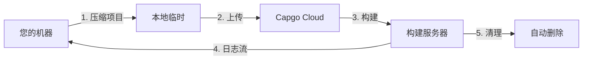

import { Steps, Card, CardGrid } from '@astrojs/starlight/components';

开始使用 Capgo Cloud Build,并在几分钟内创建您的第一个 iOS 或 Android 原生构建。

## 您需要准备的内容

在开始之前,请确保您具备:

- 一个能够在本地成功构建的 Capacitor 应用
- 已安装 Node.js 20 或更高版本
- 拥有活跃订阅的 Capgo 账户
- 您的应用已在 Capgo 中注册(如果还没有,请运行 `npx @capgo/cli@latest app add`)
- **已配置构建凭证**(证书、密钥库)- 见下文

## 第一次构建之前

<CardGrid>
  <Card title="⚠️ 首先设置凭证" icon="warning">
    **构建前必需:** 您必须配置构建凭证(iOS 证书、Android 密钥库)。

    [设置凭证 →](/docs/cli/cloud-build/credentials/)
  </Card>
</CardGrid>

## 快速开始

<Steps>

1. **设置构建凭证**

   在构建之前,您需要在本地保存凭证:

   **iOS:**
   ```bash
   npx @capgo/cli build credentials save \
     --platform ios \
     --certificate ./cert.p12 \
     --p12-password "password" \
     --provisioning-profile ./profile.mobileprovision \
     --apple-key ./AuthKey.p8 \
     --apple-key-id "KEY123" \
     --apple-issuer-id "issuer-uuid" \
     --apple-team-id "team-id"
   ```

   **Android:**
   ```bash
   npx @capgo/cli build credentials save \
     --platform android \
     --keystore ./release.keystore \
     --keystore-alias "my-key" \
     --keystore-key-password "key-pass" \
     --keystore-store-password "store-pass"
   ```

   查看 [完整凭证指南](/docs/cli/cloud-build/credentials/) 了解详情。

2. **验证本地构建**

   首先,确保您的应用能够在本地无错误地构建:

   ```bash
   # 构建您的 Web 资源
   npm run build

   # 与 Capacitor 同步
   npx cap sync

   # 测试本地构建(可选但推荐)
   npx cap open ios    # iOS
   npx cap open android # Android
   ```

3. **使用 Capgo 进行身份验证**

   设置您的 Capgo API 密钥(如果尚未配置):

   ```bash
   npx @capgo/cli@latest login
   ```

   或设置环境变量:
   ```bash
   export CAPGO_TOKEN=your_api_key_here
   ```

4. **运行您的第一个构建**

   从 Android debug 构建开始(最快的测试方式):

   ```bash
   npx @capgo/cli@latest build com.example.app \
     --platform android \
     --build-mode debug
   ```

   您将看到构建进度的实时日志:
   ```
   ✔ Creating build job...
   ✔ Uploading project (15.2 MB)...
   ✔ Build started

   📝 Build logs:
   → Installing dependencies...
   → Running Gradle build...
   → Signing APK...
   ✔ Build succeeded in 3m 42s
   ```

5. **检查构建状态**

   CLI 将自动轮询并显示构建状态。完成后,您将看到:

   - 构建时间
   - 成功/失败状态
   - 应用已提交到 App Store/Play Store(如果配置了凭证)

</Steps>

## 理解构建过程

当您运行构建命令时,会发生以下情况:



1. **本地准备** - 您的项目被压缩(排除 `node_modules` 和点文件)
2. **上传** - zip 文件上传到安全的云存储(Cloudflare R2)
3. **构建执行** - 您的应用在专用基础设施上构建
4. **日志流** - 实时日志通过服务器发送事件流式传输到您的终端
5. **自动清理** - 构建产物被删除(Android: 立即,iOS: 24小时)

## 您的第一个生产构建

一旦验证了流程可以工作,创建一个生产构建:

### Android

```bash
npx @capgo/cli@latest build com.example.app \
  --platform android \
  --build-mode release
```

您需要先配置签名凭证。请参阅 [Android 构建配置](/docs/cli/cloud-build/android/)。

### iOS

```bash
npx @capgo/cli@latest build com.example.app \
  --platform ios \
  --build-mode release
```

iOS 构建需要签名证书和配置文件。请参阅 [iOS 构建配置](/docs/cli/cloud-build/ios/)。

## 构建内容

**重要:** Capgo Cloud Build 仅构建应用的**原生部分**(iOS 和 Android 原生代码)。

您需要负责:
- 构建 Web 资源 (`npm run build`)
- 在构建前运行 `npx cap sync`
- 确保所有依赖项都在 `package.json` 中

我们处理:
- 原生 iOS 编译(Xcode、Fastlane)
- 原生 Android 编译(Gradle)
- 代码签名
- 应用商店提交(如果配置)

## 构建时间和费用

构建时间从开始到完成进行测量:

- **Android**: 通常 3-5 分钟(1× 计费倍数)
- **iOS**: 通常 5-10 分钟(2× 计费倍数,因为 Mac 硬件成本)

您只需为实际使用的构建时间付费。没有隐藏费用。

## 常见用例

### CI/CD 集成

添加到您的 GitHub Actions 工作流程:

```yaml
- name: Build native app
  env:
    CAPGO_TOKEN: ${{ secrets.CAPGO_TOKEN }}
  run: |
    npm run build
    npx cap sync
    npx @capgo/cli@latest build ${{ secrets.APP_ID }} \
      --platform both \
      --build-mode release
```

### 本地开发

在提交前本地测试构建:

```bash
# 快速 debug 构建进行测试
npm run build && npx cap sync
npx @capgo/cli@latest build com.example.app \
  --platform android \
  --build-mode debug
```

### 多平台构建

同时为两个平台构建:

```bash
npx @capgo/cli@latest build com.example.app \
  --platform both \
  --build-mode release
```

## 下一步

现在您已经创建了第一个构建:

- [配置 iOS 构建](/docs/cli/cloud-build/ios/) - 设置证书和配置文件
- [配置 Android 构建](/docs/cli/cloud-build/android/) - 设置密钥库和 Play 商店
- [故障排除](/docs/cli/cloud-build/troubleshooting/) - 常见问题和解决方案
- [CLI 参考](/docs/cli/reference/build/) - 完整命令文档

## 需要帮助?

- 查看 [故障排除指南](/docs/cli/cloud-build/troubleshooting/)
- 加入我们的 [Discord 社区](https://discord.com/invite/VnYRvBfgA6)
- 发送电子邮件至 support@capgo.app
