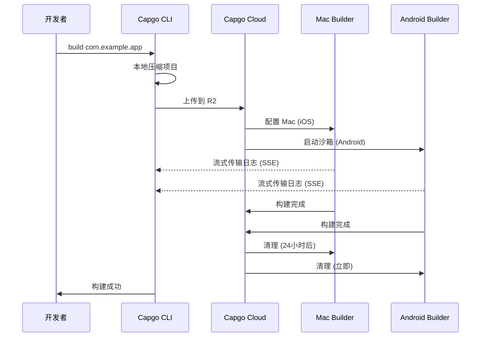

import { Card, CardGrid } from '@astrojs/starlight/components';

🏗️ 在云端构建原生移动应用,并自动提交到 App Store 和 Play Store。

## 概述

`build` 命令允许您在 Capgo 的云基础设施中构建 Capacitor 应用的 iOS 和 Android 版本,类似于 Expo 处理构建的方式。您的应用在专用基础设施上构建,并可以自动提交到应用商店。

**当前状态:** 公开测试版

## 为什么使用云构建?

传统构建原生移动应用需要:
- **Mac 硬件** 用于 iOS 构建($1000+ 或昂贵的 CI 分钟数)
- **复杂的 CI/CD** 设置,包括缓存和凭证
- **维护开销** 用于 Xcode、Android Studio 和 SDK

使用 Capgo Cloud Build,您可以获得:
- ✅ **无需 Mac** - 从任何机器构建 iOS 应用
- ✅ **零设置** - 无需 CI/CD 配置
- ✅ **久经考验** - 基于 3 年的内部生产使用
- ✅ **安全** - 无日志存储,自动清理
- ✅ **仅原生** - 您的 JavaScript 保持私密

## 快速开始

```bash
npx @capgo/cli@latest build com.example.app
```

就是这样!您的应用将在云端构建,您将看到实时日志。

## 文档部分

<CardGrid>
  <Card title="⚠️ 首先设置凭证" icon="warning">
    **构建前必需:** 在本地保存您的 iOS/Android 凭证。

    [设置凭证 →](/docs/cli/cloud-build/credentials/)
  </Card>

  <Card title="入门指南" icon="rocket">
    在几分钟内创建您的第一个原生构建。

    [阅读指南 →](/docs/cli/cloud-build/getting-started/)
  </Card>

  <Card title="iOS 构建" icon="seti:apple">
    配置证书并为 App Store 构建。

    [配置 iOS →](/docs/cli/cloud-build/ios/)
  </Card>

  <Card title="Android 构建" icon="seti:android">
    设置密钥库并为 Play Store 构建。

    [配置 Android →](/docs/cli/cloud-build/android/)
  </Card>

  <Card title="故障排除" icon="warning">
    常见构建问题的解决方案。

    [获取帮助 →](/docs/cli/cloud-build/troubleshooting/)
  </Card>
</CardGrid>

## 命令参考

### 基本用法

```bash
npx @capgo/cli@latest build [appId] [options]
```

### 示例

为两个平台构建:
```bash
npx @capgo/cli@latest build com.example.app
```

仅为 iOS 构建:
```bash
npx @capgo/cli@latest build com.example.app --platform ios
```

在 debug 模式下为 Android 构建:
```bash
npx @capgo/cli@latest build com.example.app --platform android --build-mode debug
```

从特定目录构建:
```bash
npx @capgo/cli@latest build com.example.app --path ./my-app
```

### 选项

| 选项 | 类型 | 默认值 | 描述 |
|--------|------|---------|-------------|
| `appId` | string | capacitor.config | 应用程序 ID(例如,com.example.app) |
| `--path <path>` | string | 当前目录 | 项目目录的路径 |
| `--platform <platform>` | string | both | 目标平台: `ios`、`android` 或 `both` |
| `--build-mode <mode>` | string | release | 构建模式: `debug` 或 `release` |
| `--build-config <config>` | string | - | 作为 JSON 字符串的附加构建配置 |
| `-a, --apikey <apikey>` | string | - | API 密钥(或使用 `CAPGO_TOKEN` 环境变量) |
| `--supa-host <url>` | string | https://api.capgo.app | 自定义 Supabase 主机 URL |
| `--supa-anon <key>` | string | - | 自定义 Supabase anon 密钥 |

## 工作原理



### 构建过程

1. **本地准备** - 您的项目在本地压缩(排除 `node_modules`、点文件)
2. **上传** - Zip 文件上传到安全的云存储(Cloudflare R2)
3. **构建执行**:
   - **iOS**: 配置专用 Mac 机器,Fastlane 构建并签名
   - **Android**: 创建安全沙箱,Gradle 编译并签名
4. **日志流** - 通过服务器发送事件实时传输日志(不存储!)
5. **自动清理**:
   - **iOS**: 机器被释放时 24 小时后删除文件
   - **Android**: 构建后立即删除所有内容

## 我们的专业知识

Capgo Cloud Build 不是新的基础设施 - 我们已经在内部使用了 **3 年**:

- ✅ **自定义 Fastlane** - 专门为 Capacitor 应用构建
- ✅ **数千次构建** - 在生产中久经考验
- ✅ **Capacitor 专家** - 深入了解重要的事项
- ✅ **仅原生** - 您的 JavaScript 永远不会接触我们的服务器

## 安全与隐私

- **无日志存储** - 日志仅流式传输到您的终端,永不保存
- **无构建产物存储** - 应用直接发送到 App Store/Play Store,我们不保留任何内容
- **凭证自动删除** - 仅在构建期间使用,之后删除(最多 24 小时)
- **隔离构建** - 每个构建在隔离中运行
- **您的代码保持私密** - 我们只构建原生部分,JavaScript 保留在本地

## CI/CD 集成

在任何地方都可以工作 - GitHub Actions、GitLab CI 或任何 CI/CD 平台:

```yaml
- name: Build native app
  env:
    CAPGO_TOKEN: ${{ secrets.CAPGO_TOKEN }}
  run: |
    npm run build
    npx cap sync
    npx @capgo/cli@latest build com.example.app \
      --platform both \
      --build-mode release
```

无需:
- Mac 运行器
- Android SDK 安装
- Xcode 安装
- 复杂的缓存
- 凭证管理

## 定价

构建时间根据实际使用情况计费:

- **Android**: 1× 倍数 (~$0.XX 每分钟)
- **iOS**: 2× 倍数 (~$0.XX 每分钟,因为 Mac 硬件)

**典型成本:**
- Android debug: 3 分钟 × 1× = ~$X.XX
- iOS release: 7 分钟 × 2× = ~$X.XX

只为您使用的部分付费。没有最低限制,没有意外费用。

## 与其他解决方案的比较

| 功能 | Capgo Cloud Build | GitHub Actions (Mac) | Expo EAS |
|---------|------------------|---------------------|----------|
| **本地需要 Mac** | ❌ 否 | ✅ 是 | ❌ 否 |
| **设置复杂度** | ⭐ 单个命令 | ⭐⭐⭐ 复杂的 YAML | ⭐⭐ 配置文件 |
| **Capacitor 原生** | ✅ 优化 | ⚠️ 通用 | ❌ 仅 Expo |
| **代码隐私** | ✅ 永不存储 | ⚠️ 在运行器中 | ⚠️ 已上传 |
| **成本 (iOS)** | 💰 2× 基础 | 💰💰💰 10× 昂贵 | 💰💰 高级 |

## 构建内容

**重要:** Capgo 仅构建**原生部分**。

✅ **我们构建:**
- iOS 原生代码(Swift、Objective-C、Xcode 项目)
- Android 原生代码(Java、Kotlin、Gradle 项目)
- 代码签名和应用商店提交

❌ **您构建(本地):**
- JavaScript、HTML、CSS (`npm run build`)
- Capacitor 同步 (`npx cap sync`)
- 您的 Web 资源

这种分离确保:
- **更好的安全性** - 您的应用逻辑保持私密
- **更快的构建** - 无重复的 Web 构建
- **明确的责任** - 您控制您的代码

## 限制

公开测试期间的当前限制:

- **构建超时**: 最多 10 分钟
- **上传超时**: 上传 URL 1 小时
- **iOS 机器**: 需要 24 小时租期,Mac 上的构建将排队以确保最佳使用
- **访问**: 仅公开测试版

## 开始使用

准备好无忧构建了吗?

<CardGrid>
  <Card title="创建您的第一个构建" icon="rocket">
    第一个云构建的分步指南。

    [开始使用 →](/docs/cli/cloud-build/getting-started/)
  </Card>

  <Card title="加入公开测试版" icon="star">
    Cloud Build 处于公开测试阶段。加入我们的社区以获取访问权限。

    [加入 Discord →](https://discord.com/invite/VnYRvBfgA6)
  </Card>
</CardGrid>

## 了解更多

- [入门指南](/docs/cli/cloud-build/getting-started/) - 创建您的第一个构建
- [iOS 配置](/docs/cli/cloud-build/ios/) - 设置 iOS 构建
- [Android 配置](/docs/cli/cloud-build/android/) - 设置 Android 构建
- [故障排除](/docs/cli/cloud-build/troubleshooting/) - 常见问题和解决方案
- [博客: 介绍 Cloud Build](/blog/introducing-capgo-cloud-build/) - 功能公告

## 需要帮助?

- 📚 [故障排除指南](/docs/cli/cloud-build/troubleshooting/)
- 💬 [Discord 社区](https://discord.com/invite/VnYRvBfgA6)
- 📧 电子邮件: support@capgo.app
