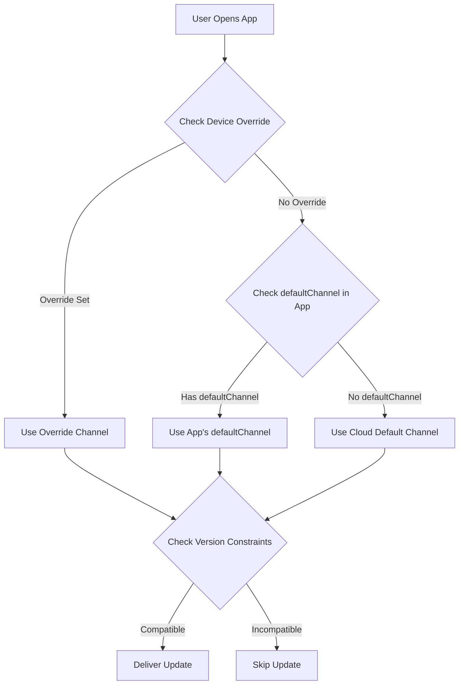

import { Aside } from '@astrojs/starlight/components';

本指南介绍如何根据用户的原生应用版本自动向用户交付最新兼容的包。**类似于 Ionic AppFlow 的方式**。这确保了简化的更新管理和更快的发布，同时防止了兼容性问题。

<Aside type="tip" title="从 Ionic AppFlow 迁移吗?">
  如果您正在从 Ionic AppFlow 迁移，本指南对您特别重要。AppFlow 自动将更新与原生版本匹配，而 Capgo 提供相同的功能并具有更多控制和灵活性。有关分步迁移说明，请参阅 [AppFlow 迁移指南](/docs/upgrade/from-appflow-to-capgo)。
</Aside>

## 概述

Capgo 的版本定位系统使您能够:

- **根据原生应用版本自动向用户交付兼容的更新**
- **防止破坏性更改到达不兼容的应用版本**
- **同时管理多个应用版本**，无需复杂逻辑
- **无缝地向特定用户段推出更新**

### 版本定位为什么重要（特别是对于 AppFlow 用户）

如果您熟悉 **Ionic AppFlow**，您知道确保用户仅接收兼容更新有多么重要。AppFlow 自动将实时更新包与原生应用版本匹配，防止不兼容的 JavaScript 交付到较旧的原生代码。

**Capgo 提供相同的安全保证**，并具有额外功能:
- 对版本匹配的更细粒度控制
- 多种策略（渠道、semver、原生限制）
- 更好的版本分布可视性
- API 和 CLI 控制以及仪表板管理

这种方法在以下情况下特别有用:
- 您的应用有来自不同主要版本的用户（例如 v1.x、v2.x、v3.x）
- 需要在推出破坏性更改的同时保持向后兼容性
- 想要防止较新的包破坏较旧的原生代码
- 逐步将用户从一个版本迁移到另一个版本
- **从 AppFlow 迁移**并想保持相同的更新安全性

## 它是如何工作的

Capgo 使用多层方法将用户与兼容更新匹配:

1. **原生版本约束**: 防止包传递到不兼容的原生版本
2. **基于渠道的路由**: 将不同的应用版本路由到不同的更新渠道
3. **语义版本控制**: 自动阻止跨主要/次要/补丁边界的更新
4. **设备级覆盖**: 针对特定设备或用户组

### 版本匹配流程



## 策略 1: 基于渠道的版本路由

这是**管理破坏性更改和主要版本更新的推荐方法**。类似于 AppFlow 的交付模型。

### 示例场景

- **App v1.x** （100,000 用户） → `production` 渠道
- **App v2.x** （50,000 用户，带有破坏性更改） → `v2` 渠道
- **App v3.x** （10,000 测试版用户） → `v3` 渠道

### 实现

#### 步骤 1: 为每个主要版本配置渠道

```typescript
// v1.x 构建的 capacitor.config.ts
import { CapacitorConfig } from '@capacitor/cli';

const config: CapacitorConfig = {
  appId: 'com.example.app',
  appName: 'Example App',
  plugins: {
    CapacitorUpdater: {
      autoUpdate: true,
      defaultChannel: 'production', // 或省略为默认
    }
  }
};

export default config;
```

```typescript
// v2.x 构建的 capacitor.config.ts
const config: CapacitorConfig = {
  appId: 'com.example.app',
  appName: 'Example App',
  plugins: {
    CapacitorUpdater: {
      autoUpdate: true,
      defaultChannel: 'v2', // 自动路由 v2 用户
    }
  }
};
```

```typescript
// v3.x 构建的 capacitor.config.ts
const config: CapacitorConfig = {
  appId: 'com.example.app',
  appName: 'Example App',
  plugins: {
    CapacitorUpdater: {
      autoUpdate: true,
      defaultChannel: 'v3', // 自动路由 v3 用户
    }
  }
};
```

#### 步骤 2: 创建渠道

```bash
# 为每个主要版本创建渠道
npx @capgo/cli channel create production
npx @capgo/cli channel create v2
npx @capgo/cli channel create v3

# 启用自我分配以便应用可以切换渠道
npx @capgo/cli channel set production --self-assign
npx @capgo/cli channel set v2 --self-assign
npx @capgo/cli channel set v3 --self-assign
```

#### 步骤 3: 上传版本特定的包

```bash
# 对于 v1.x 用户（来自 v1-maintenance 分支）
git checkout v1-maintenance
npm run build
npx @capgo/cli bundle upload --channel production

# 对于 v2.x 用户（来自 v2-maintenance 或 main 分支）
git checkout main
npm run build
npx @capgo/cli bundle upload --channel v2

# 对于 v3.x 用户（来自 beta/v3 分支）
git checkout beta
npm run build
npx @capgo/cli bundle upload --channel v3
```

<Aside type="tip" title="自动路由">
  当用户打开应用时，他们会根据安装的应用包中的 `defaultChannel` 自动连接到其指定的渠道。无需 JavaScript 代码更改！
</Aside>

### 优点

- **零代码更改** - 渠道路由自动发生
- **明确的分离** - 每个版本都有自己的更新管道
- **灵活的定位** - 将更新推送到特定版本组
- **安全的推出** - 破坏性更改永远不会到达不兼容的版本

## 策略 2: 语义版本控制

使用 Capgo 的内置语义版本控制来防止跨版本边界的更新。

### 禁用跨主要版本的自动更新

```bash
# 创建阻止主要版本更新的渠道
npx @capgo/cli channel create stable --disable-auto-update major
```

此配置意味着:
- 应用版本 **1.2.3** 的用户将收到到 **1.9.9** 的更新
- 用户将**不会**自动收到版本 **2.0.0**
- 防止破坏性更改到达较旧的原生代码

### 粒度控制选项

```bash
# 阻止次要版本更新（1.2.x 不会得到 1.3.0）
npx @capgo/cli channel set stable --disable-auto-update minor

# 阻止补丁更新（1.2.3 不会得到 1.2.4）
npx @capgo/cli channel set stable --disable-auto-update patch

# 允许所有更新
npx @capgo/cli channel set stable --disable-auto-update none
```

<Aside type="caution" title="需要语义版本控制">
  此策略仅在您为应用版本遵循语义版本控制 (semver) 时有效。确保您的版本号遵循 `MAJOR.MINOR.PATCH` 格式。
</Aside>

## 策略 3: 原生版本约束

指定包的最小原生版本要求以防止传递到不兼容的设备。

### 使用 nativeVersion 延迟条件

上传包时，您可以指定最小原生版本:

```bash
# 此包需要原生版本 2.0.0 或更高版本
npx @capgo/cli bundle upload \
  --channel production \
  --native-version "2.0.0"
```

<Aside type="note" title="它是如何工作的">
  原生版本 1.x 的设备将**不会**收到此包。只有 2.0.0 或更高版本的设备才会获得它。这对于需要新原生 API 或插件的更新是完美的。
</Aside>

### 用例

1. **需要新的原生插件**
   ```bash
   # 包需要在 v2.0.0 中添加的摄像头插件
   npx @capgo/cli bundle upload --native-version "2.0.0"
   ```

2. **破坏性的原生 API 变更**
   ```bash
   # 包使用新的 Capacitor 6 API
   npx @capgo/cli bundle upload --native-version "3.0.0"
   ```

3. **渐进式迁移**
   ```bash
   # 仅在最新原生版本上测试包
   npx @capgo/cli bundle upload \
     --channel beta \
     --native-version "2.5.0"
   ```

## 策略 4: 自动降级防护

防止用户接收比其当前原生版本更早的包。

### 在渠道设置中启用

在 Capgo 仪表板中:
1. 转到**渠道** → 选择您的渠道
2. 启用**"禁用原生下的自动降级"**
3. 保存更改

或通过 CLI:
```bash
npx @capgo/cli channel set production --disable-downgrade
```

### 示例

- 用户的设备: 原生版本 **1.2.5**
- 渠道包: 版本 **1.2.3**
- **结果**: 更新被阻止（将是降级）

这在以下情况下很有用:
- 用户从应用商店手动安装了较新版本
- 您需要确保用户始终拥有最新安全补丁
- 您想防止回归错误

## 策略 5: 设备级定位

覆盖特定设备或用户组的渠道分配。

### 强制特定版本进行测试

```typescript
import { CapacitorUpdater } from '@capgo/capacitor-updater'

// 强制测试版用户使用 v3 渠道
async function assignBetaTesters() {
  const deviceId = await CapacitorUpdater.getDeviceId()

  // 检查用户是否是测试版用户
  if (isBetaTester(userId)) {
    await CapacitorUpdater.setChannel({ channel: 'v3' })
  }
}
```

### 仪表板设备覆盖

在 Capgo 仪表板中:
1. 转到**设备** → 查找设备
2. 单击**设置渠道**或**设置版本**
3. 覆盖为特定渠道或包版本
4. 设备将从覆盖源接收更新

<Aside type="tip" title="测试更新">
  使用设备覆盖在将更新推出给所有用户之前在您自己的设备上测试更新。
</Aside>

## 完整的 AppFlow 风格工作流程

这是结合所有策略的完整示例:

### 1. 初始设置（应用 v1.0.0）

```bash
# 创建具有 semver 控制的生产渠道
npx @capgo/cli channel create production \
  --disable-auto-update major \
  --disable-downgrade
```

```typescript
// capacitor.config.ts
const config: CapacitorConfig = {
  plugins: {
    CapacitorUpdater: {
      autoUpdate: true,
      defaultChannel: 'production',
    }
  }
};
```

### 2. 发布破坏性更改（应用 v2.0.0）

```bash
# 为新版本创建 v2 渠道
npx @capgo/cli channel create v2 \
  --disable-auto-update major \
  --disable-downgrade \
  --self-assign

# 为 v1 维护创建 git 分支
git checkout -b v1-maintenance
git push origin v1-maintenance
```

```typescript
// v2.0.0 的 capacitor.config.ts
const config: CapacitorConfig = {
  plugins: {
    CapacitorUpdater: {
      autoUpdate: true,
      defaultChannel: 'v2', // 新用户获得 v2 渠道
    }
  }
};
```

### 3. 向两个版本推送更新

```bash
# 更新 v1.x 用户（错误修复）
git checkout v1-maintenance
# 进行更改
npx @capgo/cli bundle upload \
  --channel production \
  --native-version "1.0.0"

# 更新 v2.x 用户（新功能）
git checkout main
# 进行更改
npx @capgo/cli bundle upload \
  --channel v2 \
  --native-version "2.0.0"
```

### 4. 监控版本分布

使用 Capgo 仪表板跟踪:
- v1 对 v2 有多少用户
- 每个版本的包采用率
- 每个版本的错误或崩溃

### 5. 弃用旧版本

一旦 v1 使用量下降到阈值以下:

```bash
# 停止上传到生产渠道
# 可选: 删除 v1 维护分支
git branch -d v1-maintenance

# 将所有剩余用户移至默认
# （他们需要通过应用商店更新）
```

## 渠道优先级

当存在多个渠道配置时，Capgo 使用此优先级顺序:

1. **设备覆盖** (仪表板或 API) - 最高优先级
2. **云覆盖**通过 `setChannel()` 调用
3. **defaultChannel** 在 capacitor.config.ts 中
4. **默认渠道** (云设置) - 最低优先级

<Aside type="note" title="优先级示例">
  如果用户的应用有 `defaultChannel: 'v2'` 但您在仪表板中将其设备覆盖为 `'beta'`，他们将收到来自 `'beta'` 渠道的更新。
</Aside>

## 最佳实践

### 1. 总是为主要版本设置 defaultChannel

```typescript
// ✅ 好: 每个主要版本都有显式渠道
// v1.x → production
// v2.x → v2
// v3.x → v3

// ❌ 坏: 依赖动态渠道切换
// 所有版本 → production，手动切换
```

### 2. 使用语义版本控制

```bash
# ✅ 好
1.0.0 → 1.0.1 → 1.1.0 → 2.0.0

# ❌ 坏
1.0 → 1.1 → 2 → 2.5
```

### 3. 维护独立分支

```bash
# ✅ 好: 每个主要版本的独立分支
main (v3.x)
v2-maintenance (v2.x)
v1-maintenance (v1.x)

# ❌ 坏: 所有版本的单个分支
```

### 4. 推出前测试

```bash
# 首先在 beta 渠道上测试
npx @capgo/cli bundle upload --channel beta

# 监控问题，然后升级到生产
npx @capgo/cli bundle upload --channel production
```

### 5. 监控版本分布

定期检查您的仪表板:
- 用户是否升级到较新的原生版本？
- 旧版本是否仍然获得高流量？
- 您应该弃用旧渠道吗？

## 与 Ionic AppFlow 的比较

对于从 **Ionic AppFlow** 迁移的团队，以下是 Capgo 版本定位的比较:

| 特性 | Ionic AppFlow | Capgo |
|---------|---------------|-------|
| **基于版本的路由** | 基于原生版本自动 | 通过 `defaultChannel` + 多种策略自动 |
| **语义版本控制** | 基本支持 | 高级支持 `--disable-auto-update` (主要/次要/补丁) |
| **原生版本约束** | AppFlow 仪表板中的手动配置 | CLI 中内置的 `--native-version` 标志 |
| **渠道管理** | Web UI + CLI | Web UI + CLI + API |
| **设备覆盖** | 有限的设备级控制 | 通过仪表板/API 的完全控制 |
| **自动降级防护** | 是 | 通过 `--disable-downgrade` 是 |
| **多版本维护** | 手动分支/渠道管理 | 使用渠道优先级自动化 |
| **自我托管** | 否 | 是（完全控制） |
| **版本分析** | 基本 | 每个版本的详细指标 |

<Aside type="note" title="AppFlow 奇偶性及以上">
  Capgo 提供 **AppFlow 提供的所有版本定位功能**以及额外的控制机制。如果您依赖 AppFlow 的自动版本匹配，您会发现 Capgo 同样安全但更灵活。
</Aside>

## 故障排除

### 用户未收到更新

检查以下内容:

1. **渠道分配**: 验证设备在正确的渠道上
   ```typescript
   const channel = await CapacitorUpdater.getChannel()
   console.log('Current channel:', channel)
   ```

2. **版本约束**: 检查包是否有原生版本要求
   - 仪表板 → 包 → 检查"原生版本"列

3. **Semver 设置**: 验证渠道的 `disable-auto-update` 设置
   ```bash
   npx @capgo/cli channel list
   ```

4. **设备覆盖**: 检查设备是否有手动覆盖
   - 仪表板 → 设备 → 搜索设备 → 检查渠道/版本

### 包交付到错误的版本

1. **查看 defaultChannel**: 确保 `capacitor.config.ts` 中的正确渠道
2. **检查包上传**: 验证包已上传到预期渠道
3. **检查原生版本**: 确认 `--native-version` 标志使用正确

### 破坏性更改影响旧版本

1. **立即修复**: 将受影响的设备覆盖到安全包
   - 仪表板 → 设备 → 多选 → 设置版本
2. **长期修复**: 创建版本控制渠道并维护独立分支
3. **预防**: 推出前始终在代表性设备上测试更新

## 从 Ionic AppFlow 迁移

如果您正在从 **Ionic AppFlow** 迁移，版本定位在 Capgo 中的工作方式非常相似，具有增强的灵活性:

### 概念映射

| AppFlow 概念 | Capgo 等效 | 注意 |
|-----------------|------------------|-------|
| **部署渠道** | Capgo 渠道 | 相同的概念，更强大 |
| **原生版本锁定** | `--native-version` 标志 | 更细粒度的控制 |
| **渠道优先级** | 渠道优先级 (override → cloud → default) | 更透明的优先级 |
| **部署目标** | 渠道 + semver 控制 | 可用的多个策略 |
| **生产渠道** | `production` 渠道 (或任何名称) | 灵活的命名 |
| **基于 Git 的部署** | 来自分支的 CLI 包上传 | 相同的工作流程 |
| **自动版本匹配** | `defaultChannel` + 版本约束 | 使用多种策略增强 |

### AppFlow 用户的关键区别

1. **更多控制**: Capgo 为您提供多种策略 (渠道、semver、原生版本)，可以组合
2. **更好的可见性**: 仪表板显示版本分布和兼容性问题
3. **API 访问**: 对版本定位的完全编程控制
4. **自我托管**: 使用相同版本逻辑运行您自己的更新服务器的选项

### 迁移步骤

1. **将您的 AppFlow 渠道映射到 Capgo 渠道** (通常 1:1)
2. 在 `capacitor.config.ts` 中**为每个主要版本设置 `defaultChannel`**
3. **配置 semver 规则**如果您想要版本边界处的自动阻止
4. 使用 `--native-version` 标志**上传版本特定的包**
5. 在 Capgo 仪表板中**监控版本分布**

<Aside type="tip" title="完整迁移指南">
  有关完整的迁移说明（包括 SDK 替换和 API 映射），请参阅 [AppFlow 到 Capgo 迁移指南](/docs/upgrade/from-appflow-to-capgo)。
</Aside>

## 高级模式

### 按版本的渐进式推出

```typescript
// 逐步将 v1 用户迁移到 v2
async function migrateUsers() {
  const deviceId = await CapacitorUpdater.getDeviceId()
  const rolloutPercentage = 10 // 从 10% 开始

  // 对设备 ID 进行哈希以获得确定性百分比
  const hash = hashCode(deviceId) % 100

  if (hash < rolloutPercentage) {
    // 用户在推出组中 - 迁移到 v2
    await CapacitorUpdater.setChannel({ channel: 'v2' })
  }
}
```

### 按版本的功能标志

```typescript
// 根据原生版本启用功能
async function checkFeatureAvailability() {
  const info = await CapacitorUpdater.getDeviceId()
  const nativeVersion = info.nativeVersion

  if (compareVersions(nativeVersion, '2.0.0') >= 0) {
    // 启用需要 v2.0.0 的功能+
    enableNewCameraFeature()
  }
}
```

### 跨版本 A/B 测试

```typescript
// 在同一原生版本内运行 A/B 测试
async function assignABTest() {
  const nativeVersion = await getNativeVersion()

  if (nativeVersion.startsWith('2.')) {
    // 仅对 v2 用户进行 A/B 测试
    const variant = Math.random() < 0.5 ? 'v2-test-a' : 'v2-test-b'
    await CapacitorUpdater.setChannel({ channel: variant })
  }
}
```

## 总结

Capgo 为版本特定的更新交付提供多种策略:

1. **基于渠道的路由**: 通过 `defaultChannel` 自动版本分离
2. **语义版本控制**: 防止跨主要/次要/补丁边界的更新
3. **原生版本约束**: 需要包的最小原生版本
4. **自动降级防护**: 不要向较新的原生版本交付较早的包
5. **设备覆盖**: 用于测试和定位的手动控制

通过结合这些策略，您可以实现 AppFlow 风格的自动更新交付，具有更多的灵活性和控制。选择最适合您的应用版本控制和部署工作流程的方法。

有关特定功能的更多详细信息:
- [破坏性更改指南](/docs/live-updates/breaking-changes) - 详细的渠道版本控制策略
- [渠道管理](/docs/live-updates/channels) - 完整的渠道配置参考
- [更新行为](/docs/live-updates/update-behavior) - 原生版本延迟和条件
